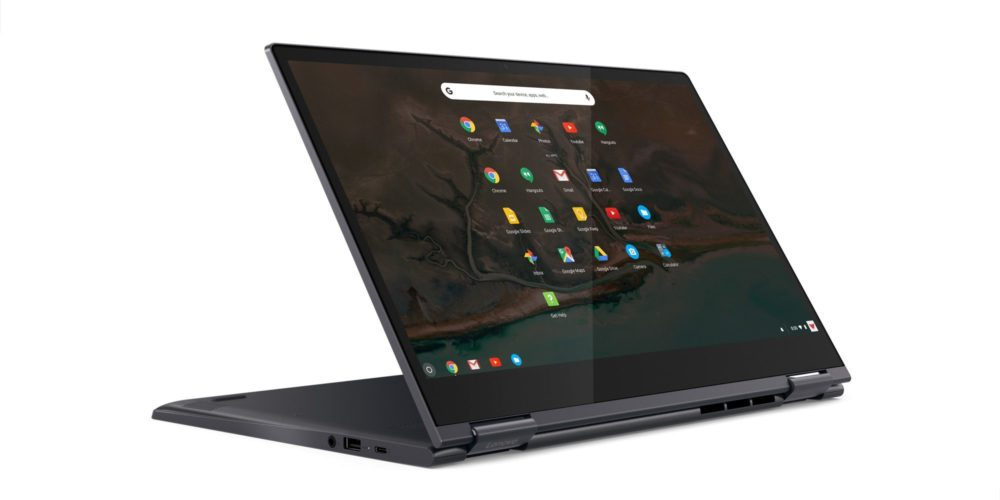

Back in August, the [Lenovo Yoga Chromebook 630 debuted with a 15.6-inch FullHD display](https://www.aboutchromebooks.com/news/lenovo-yoga-chromebook-c630-price-availability-4k/) and the promise of a 4K option. The base model went on sale in October but since then... there was no mention or availability of the 4K version from Lenovo. That just changed as you can now directly order this 2-in-1 Chromebook with a 3840 x 2160 touchscreen for $899.99.

Lenovo itself didn't make an announcement about the new option. Instead, a [commenter at Chrome Unboxed caught sight of it](https://chromeunboxed.com/4k-lenovo-yoga-chromebook-c630-available-order/) earlier today. [Lenovo's website](https://www.lenovo.com/us/en/laptops/yoga/yoga-c-series/Yoga-Chromebook/p/88YGCC61096) says that any orders placed today ship out "in more than 5 weeks", so it's possible that it only just ramped up the production run.

Regardless, if you're willing to part with $900, you can get one of the most powerful Chromebooks along with an ultra-high resolution screen: The first 4K display on a Chromebook.

Inside are the same bits of hardware in the 1080p model currently selling for, but out of stock, $719.99. That means you get this configuration:

- 8th-Generation Intel Core i5-8250U processor (which uses a fan for cooling)
- Integrated Intel UHD Graphics 920
- 8 GB of memory
- 128 GB of eMMC storage
- Bluetooth 4.1
- 802.11ac Wi-Fi (2 x 2 MIMO)
- 720p HD camera
- 2 USB Type-C ports, 1 USB Type-A port
- MicroSD card slot
- Backlit keyboard (an upgrade from the 1080p model sold at Best Buy)

Essentially, you're paying $180 for the higher resolution display, which isn't bad but it's not something most users probably need either. If you have access to 4K video content, it might be worth the upgrade.

Overall, the 1080p model with the same configuration has received mainly positive reviews with the exception of some Best Buy models exhibiting some backlight screen bleed, so if you do nab one of these from Lenovo, that would be the first thing I'd check for on that 4K display.
