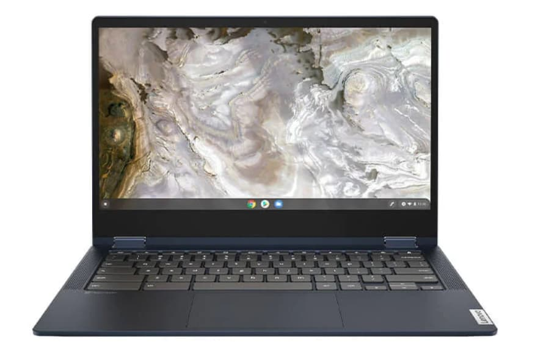

I've been lucky enough to review both the [Lenovo Pentium-powered Chromebook 5i](https://www.aboutchromebooks.com/news/lenovo-ideapad-5i-chromebook-review-a-potent-pentium-powered-laptop/) and the [Core i3 Chromebook](https://www.aboutchromebooks.com/news/lenovo-flex-5i-chromebook-review/)[Flex 5i](https://www.aboutchromebooks.com/news/lenovo-flex-5i-chromebook-review/) recently. Both are well-built Chrome OS devices with more performance than I expected. Honestly, I don't think you can go wrong with either one. A sale going on right now, however, drops the price difference between the two to just $10. [At $449.99, Lenovo's Core i3 Chromebook](https://www.lenovo.com/us/en/p/laptops/lenovo/lenovo-edu-chromebooks/ideapad-flex-5i-chromebook-gen-6/82m70010ux) [Flex 5i](https://www.lenovo.com/us/en/p/laptops/lenovo/lenovo-edu-chromebooks/ideapad-flex-5i-chromebook-gen-6/82m70010ux) is a great value.

Normally priced at $539.99 This 2-in-1 device is a great option if you liked the price of the clamshell model, which typically retails for $439.99. The extra $10 gets you the ability to use Lenovo's Core i3 Chromebook Flex 5i in various modes: laptop, tent, or presentation. And it supports a USI stylus, although that's not included.

Obviously, you're also getting bumped up from the Intel Pentium Gold 7505, [which is a surprisingly good performer](https://www.aboutchromebooks.com/news/hands-on-lenovo-ideapad-5i-chromebook-first-impressions/), to an 11th-generation Intel Core i3 processor. That chipset keeps the same two-core, four-thread CPU, but ups the maximum clock speed to 4.1 GHz and has 50 percent more on-chip cache. You can easily expect around 20 percent more performance as a result, [based on my comparisons between the two](https://www.aboutchromebooks.com/news/hands-on-lenovo-ideapad-5i-chromebook-first-impressions/).

However, life is full of compromises and this deal has its share of them.

The clamshell 5i comes with 128 GB of local eMMC storage and a 14-inch 1080p touchscreen with 300 nits of brightness. The Core i3 Chromebook Flex 5i halves the local storage and the 13.3-inch 1080p isn't quite as bright at 250 nits.

Lenovo Chromebook Flex 5i

Both models come with 4 GB of memory, so that's a wash. Each has a pair of USB Type-C ports, a single USB Type-A, and a microSD card slot. However, the Flex 5i does include mini DisplayPort output as well if that's important to you.

If this Lenovo Core i3 Chromebook Flex5i deal is right for you, [Lenovo sells it directly at the sale price](https://www.lenovo.com/us/en/p/laptops/lenovo/lenovo-edu-chromebooks/ideapad-flex-5i-chromebook-gen-6/82m70010ux) when you use promo code **BFNOWDB6**. Note that if you want this model with 8 GB of memory and 128 GB of storage, Costco does sell that configuration, [currently priced at $499.99](https://www.costco.com/lenovo-flex-5-13.3%22-2-in-1-touchscreen-chromebook---11th-gen-intel-i3-1115g4---1080p.product.100744753.html)
