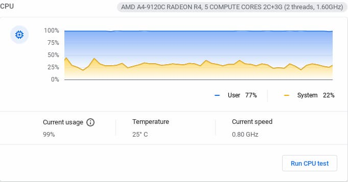

After sleeping on [yesterday's Chrome OS 91 Stable update that locked some users out of their Chromebooks](https://www.aboutchromebooks.com/news/another-chrome-os-91-stable-channel-update-has-borked-users-chromebooks/), I have thoughts. Some of these are for you, the readers, and some are for Google if they're reading. Even if Google isn't, I wanted to share some Chromebook strategies as part of a "lessons learned" from the recent Chrome OS 91 Stable update bug situations.

## What the heck happened with Chrome OS 91 Stable?

First, a quick recap for those unaffected, although you too can gain something from what follows.

Last month, Google pushed out [a small update to the Chrome OS 91 Stable Channel that impacted certain devices in a very specific way](https://www.aboutchromebooks.com/news/these-chromebooks-have-a-reported-performance-issue-after-latest-chrome-os-91-update/). The CPU on these updated machines was stuck on a slow clock speed and at 100%, making the Chromebooks very sluggish.

Yesterday, another small update completely locked people out of their Chromebooks. The options to get working were (and still are) to [factory reset the device and lose all of your local data](https://www.reddit.com/r/chromeos/comments/oniply/warning_the_latest_stable_update_is_stopping/) or wait for Google to push a fix. The former option is still the only one available.

Even after a factory reset, technically a Powerwash and Revert to the prior version of Chrome OS, there's still an issue for some. They lose any Linux data that they've backed up. I suspect this issue is related to the prior update from last month. Users can get Linux back but their restore isn't working, likely because of a change in the Linux container when trying to get Linux back.

So, what have we learned or what could we learn from all of this?

## Chromebooks do not store all data in the cloud

I wanted to make this point first because there is misinformation out there. I've read far too many irresponsible articles claiming that Chromebooks don't have local storage. And I've heard retailers tell customers that all Chromebook data is in the cloud.

**_This. Is. Not. True._**

At least by default, this isn't true. Obviously, Chromebooks have local storage. Open your Files app and you can see it. More importantly, any user data stored in the default Documents folder is just a local instance. And it's the only instance, meaning if you have to Powerwash and Revert your Chromebook, anything in the Documents folder will be erased.

## There is no native way to backup your Downloads folder

You can dig around in the Chrome OS settings but you won't find a native method to back up this local data automatically. The only "backup" you can do really isn't one at all: You can manually copy files from the Downloads folder to an external drive.

Essentially, you should treat the Documents folder as temporary storage for any data. I've taken this approach for a few years and it has served me well. I literally delete everything in the Documents folder just before I shut down my Chromebook each night.

Of course, that assumes I have no very important files in Documents, which isn't always the case for me. It probably isn't for you either. Continue on to see what I suggest.

## Store any data you (think you) need somewhere else

From time to time there are files that I know or think I'll need again. But I don't keep those in the Downloads folder of my Chromebook. At the end of the day, if I haven't already, I move them somewhere else. I personally put mine in the cloud [using ProtonDrive](https://protonmail.com/blog/proton-drive-early-access/), which is an encrypted cloud service I get with my paid encrypted ProtonMail account. [You can get one here if you're interested](https://www.kqzyfj.com/click-100349785-13792311), and save on an annual plan.

_**Sidenote**: I've been migrating away from Gmail for some time now. It's not that I don't trust Google with my mail. I just don't need my Inbox scanned for ad purposes. And I sometimes do consulting work for companies that compete with Google. These are under NDA so I don't want Google to access those communications. By using a third-party cloud solution in privacy-centric Switzerland that can't access my data, I feel more comfortable._

Regardless of where you externally copy the data you really need, make sure you're **not** relying on the Downloads folder. You could lose that data not just from a bad Chrome OS update but also from a hardware failure. It's not worth the risk.

## Consider changing your default download location to Google Drive

If you don't want to manually copy data from your Downloads folder to another place, why not consider using Google Drive for some or all of your downloaded file storage? I'd recommend the "for some" option unless you don't mind cluttering up Drive with every little file you download. But that's just me. You have to make your own choice.

Enabling this simple. Just go into your Chrome browser (not Chrome OS) and click the three-dot menu at the top right. From here, choose Settings, Advanced, Downloads in that order. You'll see an option to set the default location for all downloads. Click it and choose Google Drive. You can even choose, or create, a particular folder on Drive for this purpose. Or you can go hog wild and select the option to choose where to save your downloads each time. I find this annoying but again, you do you.

## All Chromebook users should get control over Chrome OS updates

One of the best aspects of Chrome OS is also one of the worst. Software updates are quietly downloaded in the background and applied to a second hard drive partition. When you restart after an update, your Chromebook boots into the part of the drive that's been updated. All of your local data comes along for the ride as it's a separate userspace.

Obviously, this is a great selling point for Chromebooks: Updates are relatively seamless and pain-free. Until they're not.

This is why I [suggested in 2019 that Google give all users more control over Chrome OS updates](https://www.aboutchromebooks.com/news/its-time-for-chromebook-users-to-have-more-control-over-chrome-os-automatic-updates/). And by more control, I mean when to boot into that updated partition. Right now it's an automatic process: After an upgrade is received, your only options are to Restart or simply not shut down and restart. Neither is ideal in every situation such as when the Chrome OS 91 stable update caused issues.

I'd like to see an option added to revert back to the _prior_ Chrome OS instance, i.e. the one used before the update was installed. This option has to preserve local data, of course.

And it might surprise you that managed Chromebooks actually have some additional control over updates. Some IT departments in businesses and schools, for example, don't keep their managed Chromebooks on the most current version of Chrome OS. They stay behind a release or two just to ensure web app and tool compatibility. Users can't get any software updates that the IT department doesn't want them to have.

They do this because they **_can_**; it's a feature of managed Chromebooks. The rest of us? We can't do that. And we should be able to.

## Let's learn from the aftermath

OK, if you've read this far, I hope you've learned a little more about how Chrome OS handles local data. More importantly, I hope you've learned how **_you_** should handle local data on your Chromebook.

There are ways to restore that data in worst-case situations but you have to plan ahead. And that's no different from any other computing platform. Until we can (if we ever can) manage our own Chrome OS software updates, it's up to you to protect local Chromebook data.

_Updated at 3:30pm, July 20, 2021, to reflect that Google doesn't scan email for ad purposes._
