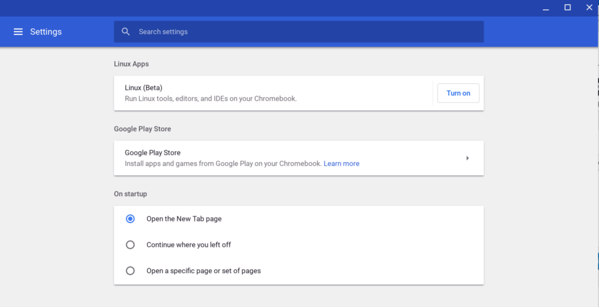
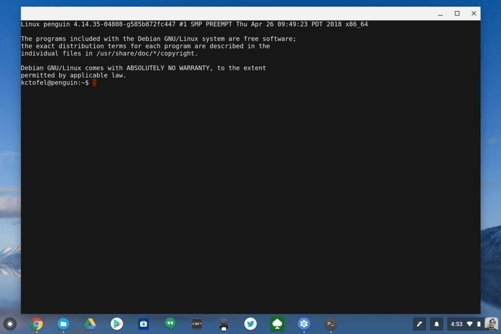

As we get closer to next week's Google I/O event, we're also getting closer to Linux app support becoming generally available on Chromebooks and Chromeboxes. My Pixelbook was updated to 68.0.3416.0 today (platform version 10635.0.0) and I see a new option in the Chrome OS Settings for Linux apps running in a container.

Tapping it shows an option to enable this beta feature.

Even better is that when I turned the Linux app beta support on, the Pixelbook downloaded and installed the Terminal app; for some reason that never happened before for me although others have seen it.

This is far more user friendly than the original method to use a flag for enabling Linux support and running a few commands to create a work space. However, I doubt Google is done tweaking the user experience, so it could very well change before Linux app support hits the Stable Channel, including [containerized apps delivered through Chrome extensions](https://www.aboutchromebooks.com/news/project-crostini-for-chromebooks-explained-in-15-minutes-video/).

Regardless, this feature helps bridge the final "app gap" with Chromebooks, which already supports Android apps. By bringing full-fledged Linux apps to Chrome OS, developers and photo buffs can download Integrated Development Environments ([like I did](https://www.aboutchromebooks.com/news/first-look-running-full-linux-apps-on-a-chromebook-with-project-crostini/)) and photo editing tools if web and Android apps aren't cutting it.
