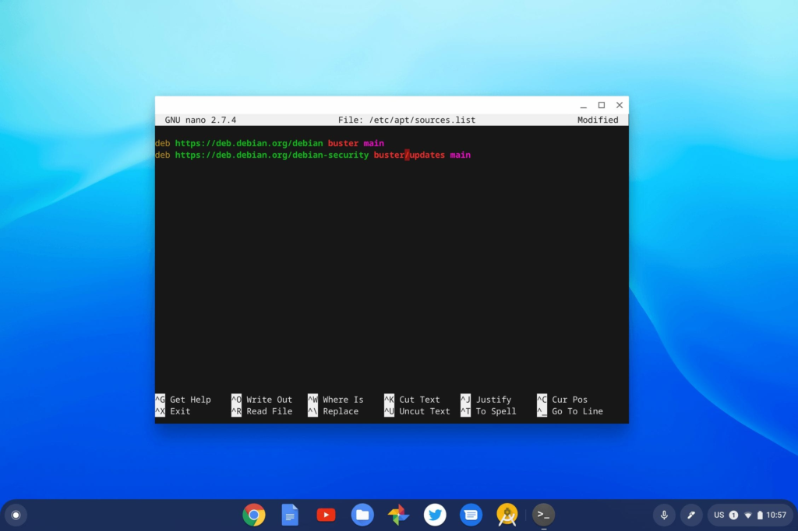

It's a big week in the Linux world as [Debian 10 Buster is expected to arrive on July 6](https://lists.debian.org/debian-devel-announce/2019/06/msg00003.html). What does that have to do with Chromebooks? [Thanks to Project Crostini, Chrome OS devices can run Linux](https://www.aboutchromebooks.com/tag/crostini/), using the current default version of Debian 9 Stretch.

While Linux boxes around the world will likely slam upgrade servers this weekend, Chromebooks won't. That's because Google isn't yet ready to upgrade the default Crostini container from the Stretch version of Debian. That doesn't mean you can't upgrade on your own though; more on that in a bit. ;)

Google has known that Buster was coming, of course. And the developer team has already opened (and closed) some bugs in order to support this Linux upgrade on Chromebooks.

But [the main open bug is to actually support Buster in Crostini](https://bugs.chromium.org/p/chromium/issues/detail?id=930901) and it's been open since February. Back in April, the bug was assigned to the Chrome OS 78 release. Unfortunately, the release target was removed a few weeks ago, so there's no set version to address the upgrade to Buster just yet.

I suspect there are some specific elements regarding running a Linux container in a VM, which is how Crostini works. There are several Chrome OS functions tied to the VM and container. Consider something as simple as sharing files or folders between Chrome OS and Linux, for example. If Debian 10 Buster has file system changes -- this is just an example, I'm not saying that it does -- work would be required to support the shared folders.

So we probably won't see an official Crostini container update from Stretch to Buster for a good three months, if not more.

However...

If you want to upgrade your Linux container from Stretch to Buster, it's not a difficult process. Just be forewarned that some Chrome OS-specific features may not work at first, or at all. One example is audio playback in Linux, as noted by Mace Moneta, [who commented on a prior blog post](https://www.aboutchromebooks.com/news/chrome-os-76-will-disable-crostini-linux-backups-by-default/#comment-22186):

> The only issue I encountered was that the default user account needs to be a member of the pulse-access group, or you don’t get audio. You can do that with:  
> sudo usermod -a -G pulse-access $USER  
> and then shutdown/restart the container (right-click on the Terminal icon and select ‘Shutdown Linux’).

If you're feeling adventurous and want to go it alone with a manual upgrade from Stretch to Buster - knowing full well the risks and your responsibility for taking them - a few steps are all that you need. Put another way: This is easy to do but could cause issues, so you're doing so at your own risk.

First, you'll want to make a backup of your current sources.list file with this command: _cp /etc/apt/sources.list /etc/apt/sources.list\_backup_

Next, using your text editor of choice, you want to edit the sources.list file so that Stretch is replaced with Buster as shown:

Once you save the sources.list file, simply type these commands, follow the prompts to update or upgrade and the Buster files will be downloaded and installed.

- sudo apt-get update
- sudo apt-get upgrade
- sudo apt-get dist-upgrade

I ran through the process on a test machine and it took about 15 minutes to complete; yours may vary based on the speed of your internet connection, of course.

I haven't noticed any issues in my Terminal, nor in any of my Linux apps. My downloaded Linux files are still available both in the Terminal and in the Chrome OS Files app. I haven't done extensive testing, however.

So, the safest, and probably smartest, thing to do is to wait for Chrome OS to officially support Debian 10 Buster. That's why I upgraded a test machine; if you're using Linux on your Chromebook for anything other than kicking around the tires, I'd hold off until we the Chromium team works their magic.
