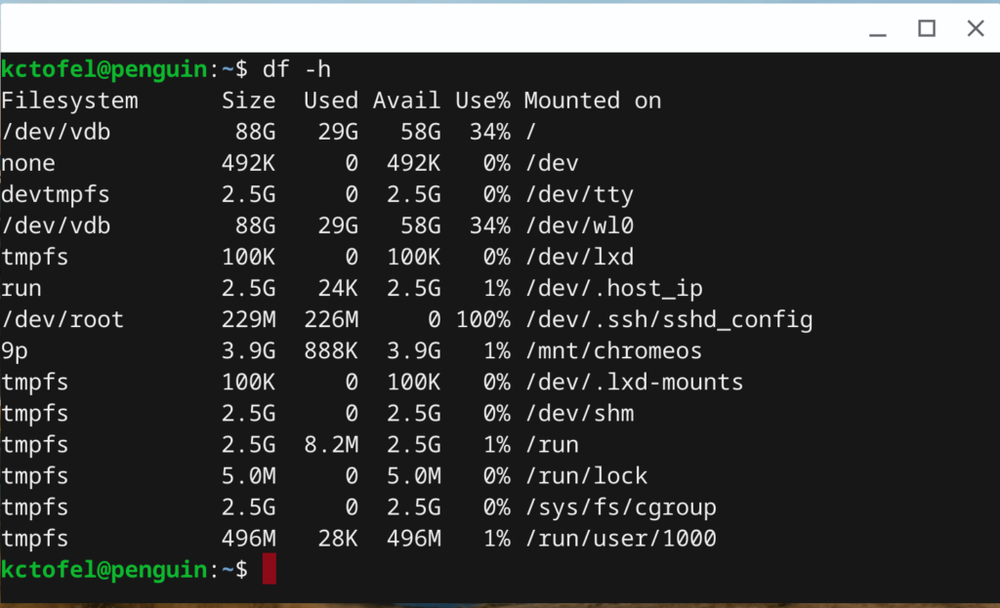

Back in March, I reported on an effort that would [enable resizing of the Linux partition for Crostini-supported Chromebooks](https://www.aboutchromebooks.com/news/chrome-os-75-linux-disk-resize-project-crostini/). At that time, I expected the feature to land in Chrome OS 75. I've checked for the feature [now that Chrome OS 75 is available (again)](https://www.aboutchromebooks.com/news/chrome-os-75-stable-channel-version-rollout-resumes-on-a-limited-basis/) and it's nowhere to be seen. That's because it was recently pushed back to Chrome OS 78.

[This developer comment made just yesterday](https://bugs.chromium.org/p/chromium/issues/detail?id=858815#c22) confirms the move, with hopes for the functionality for version 78:

> move to 78, by then we should either be done or call what we have good enough.

The original target for Linux disk resizing was Chrome OS 73, so clearly, this feature is either a challenge to implement, moved lower on the priority list, or perhaps some combination of both factors.

For those not familiar with the current disk sizing when enabling Linux on a Chromebook, the system defaults to a size equal to 90% of the available disk space at the time. Given that Chrome OS doesn't expand by multiple gigabytes of storage capacity with each release, this isn't a bad approach.

However, other aspects need to be considered: Storage of large media files, for example, or enabling Google Drive synchronization with the Chrome OS Files app for offline file access. And then there are Android apps, so of which - particularly games - can require one or two gigabytes of space.

So far, I haven't run into any storage issues on my Pixel Slate with 128 GB of data capacity. But it's easy to see that the Linux container is using up the bulk of my tablet's storage: As I understand it, _/dev/vdb_ is the Crostini container with Linux, which is 88 GB in size with 58 GB free.

At some point, unless the Linux partition can automatically decrease, I'll need to manually resize this space to reclaim it for other purposes.

Some of the coding for this functionality is done, but it's not ready yet. It appears that we'll have to wait for Chrome OS 78, expected to land on the Stable Channel on October 29th of this year. If I hit it before then, I'll have to find an alternative solution and will let you know if I find one and how it works out.
