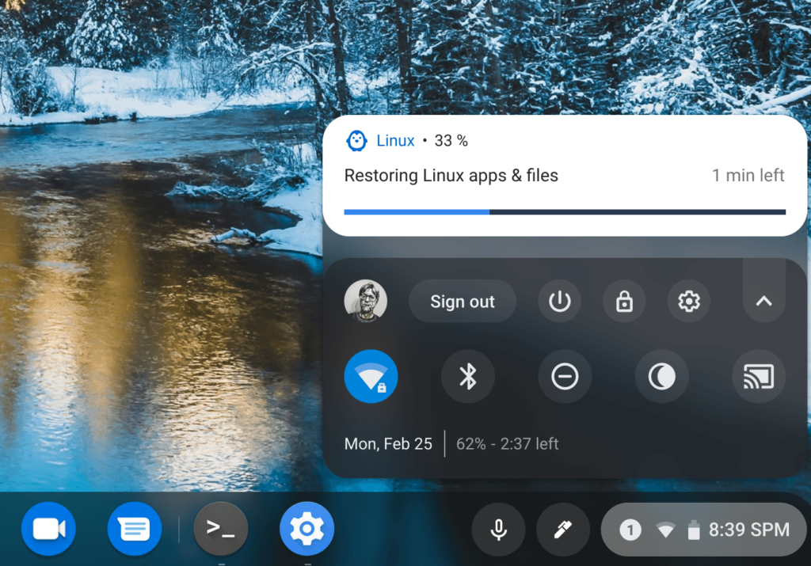

Is a Project Crostini Linux container taking up way too much of your Chromebook's storage space?

The good news is that plans have been in the works since March of last year to allow you to [reclaim some of that space by shrinking or resizing the Linux storage](https://www.aboutchromebooks.com/news/chrome-os-75-linux-disk-resize-project-crostini/). The bad news is that after [being pushed back](https://www.aboutchromebooks.com/news/linux-disk-resizing-chromebooks-chrome-os-78-project-crostini/) twice since the feature is being put off again; [this time until Chrome OS 81](https://bugs.chromium.org/p/chromium/issues/detail?id=858815#c43).

You'd think this would be a relatively simple thing to implement but in reality, it's not. That's because the Chrome OS filesystem has evolved in the past year and due to [expected support for a particular file type for older Linux kernels never worked out](https://bugs.chromium.org/p/chromium/issues/detail?id=858815#c37).

I'd rather the Chromium team take their time for a well designed and implemented solution so as not to break any functionality. Plus there's the challenge of having enough free storage to restore a container backup.

As a result, it means the effort is now targeted at Chrome OS 81, expected to hit the Stable Channel on or around March 24.

On the plus side, [Chrome OS 81 already has a new experimental flag for Linux disk resizing](https://bugs.chromium.org/p/chromium/issues/detail?id=858815#c45), per a code commit on January 12:

If you're not sure why Linux takes up so much storage space, it's due to the way the container was initially implemented, with the thought that most Chromebook data would be stored in the cloud:

> Currently we just set the maximum size the disk image can have to 90% of the free space available when crostini is initially installed. There has been talk of finding ways to allow this cap to be increased after installation or overcommitting free disk space to avoid leaving the user with an excessively small disk image.

I expect the first implementation of Linux disk resizing to be a manual process once enabled. However, there has been a discussion of a follow-up feature that will dynamically and/or automatically resize the Linux partition, helping to free up that precious storage space on your device.
