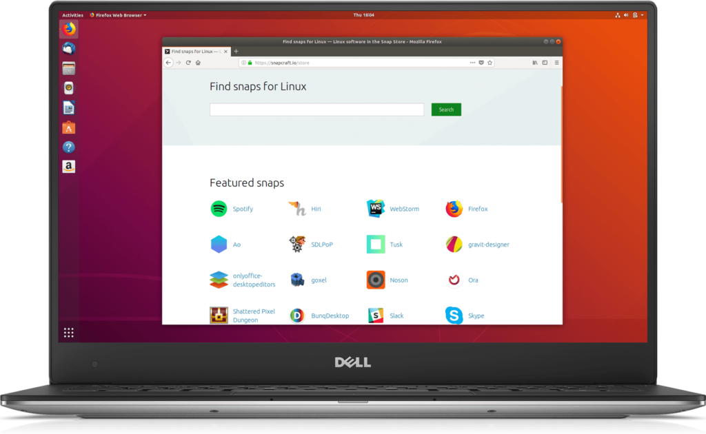
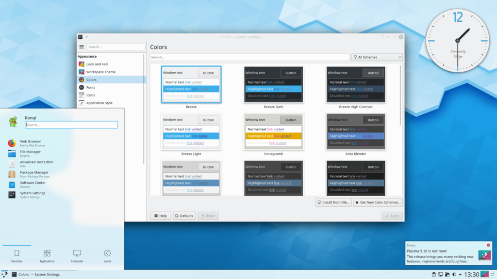
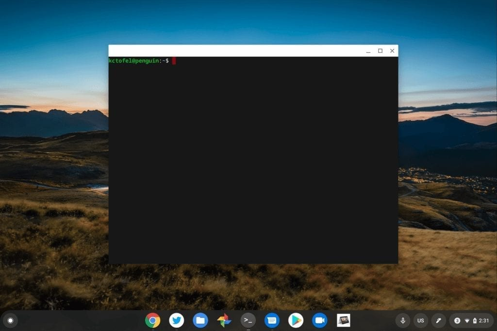
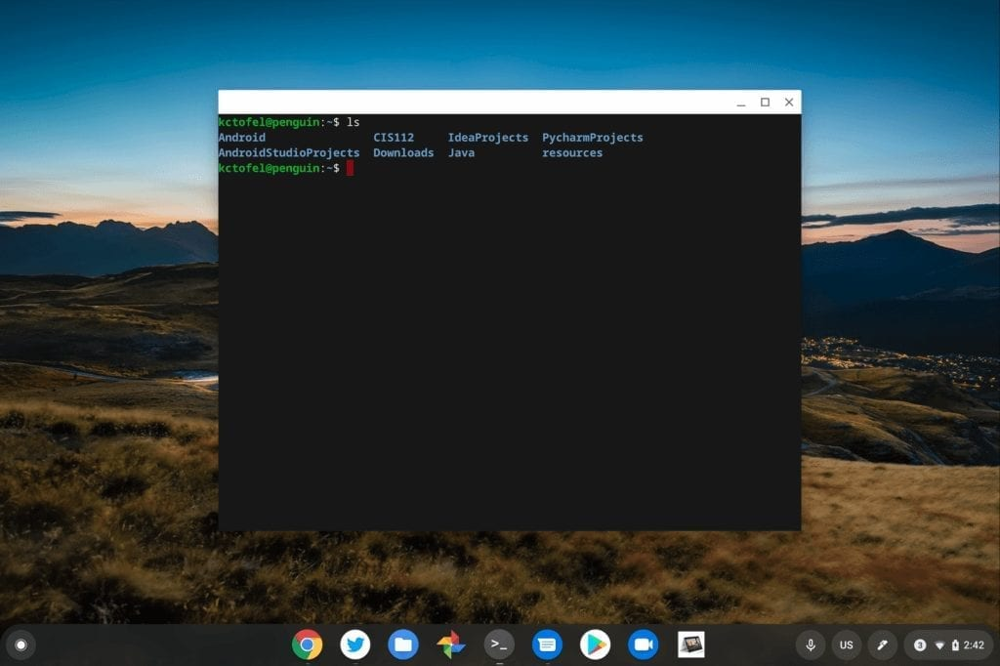
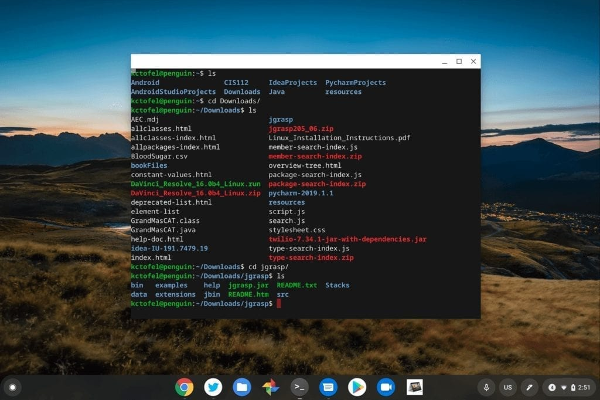
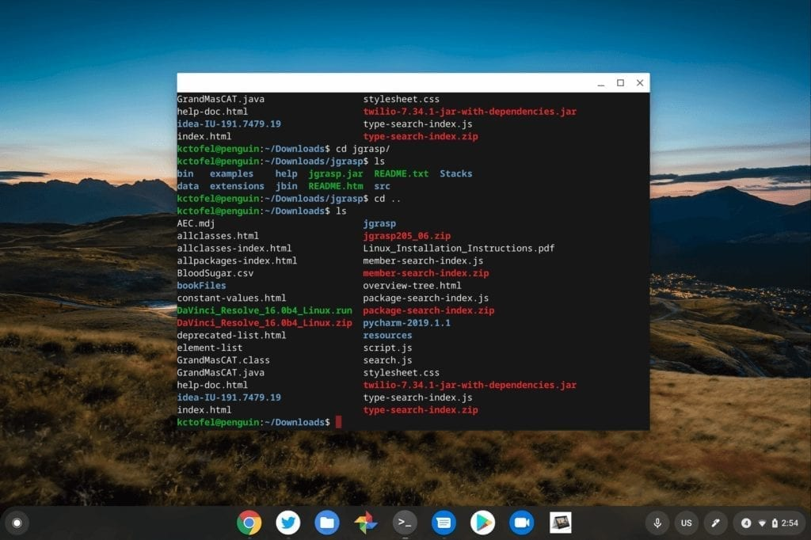
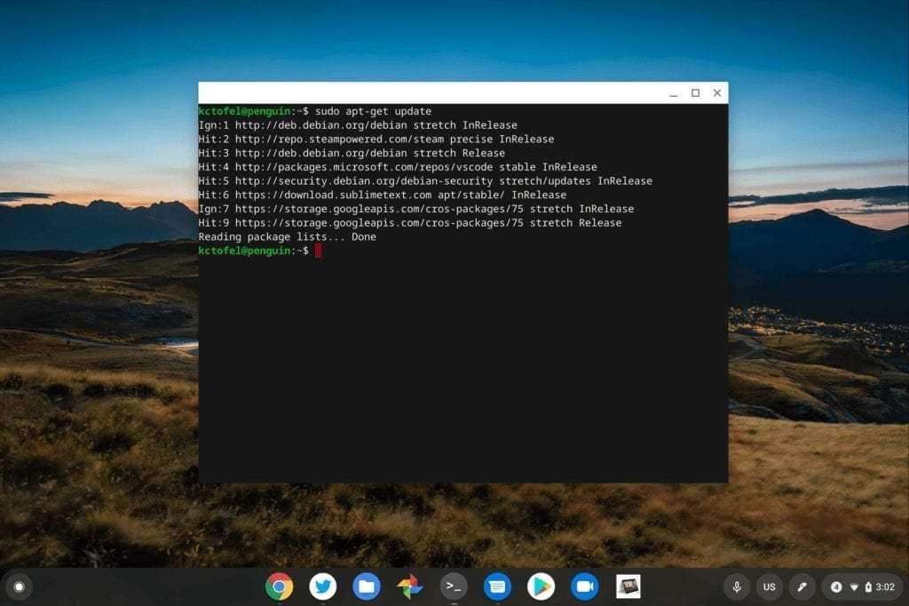
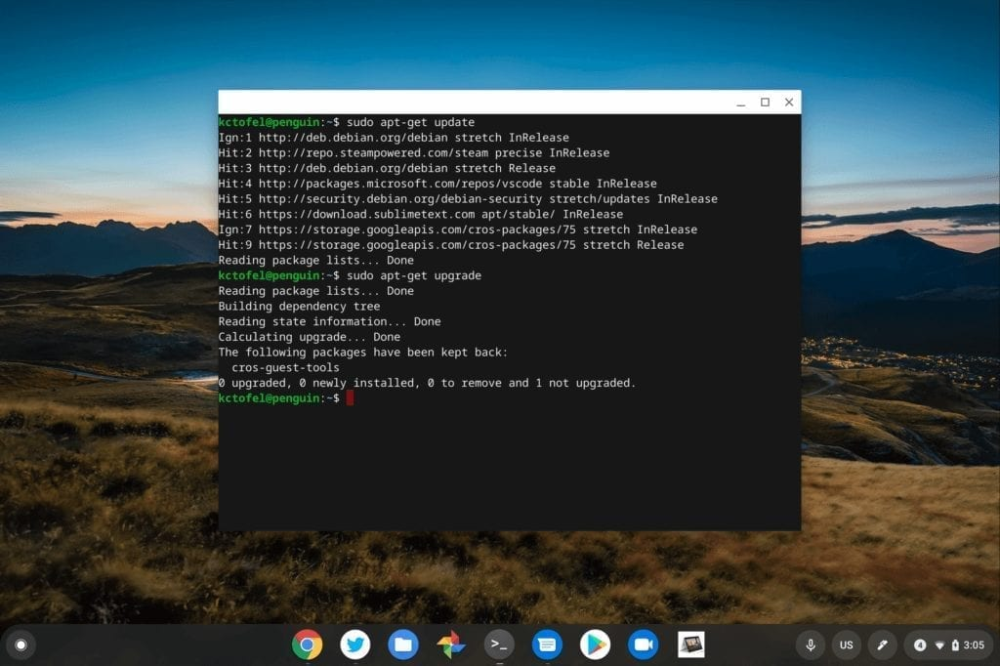

[Linux on Chromebooks officially arrived with Chrome OS 69](https://www.aboutchromebooks.com/news/chrome-os-69-stable-release-project-crostini-linux-apps/) last year, so the feature has been available on supported devices for six Chrome OS versions now. It's still gaining features and fixes but at this point, many people who may have never used Linux in the past have the option on their Chromebook.

So where does one start with Linux on a Chromebook?

I'll be writing up a series of posts to help answer that question, starting today with the basics of the Linux command line. You may not need all of these commands as [Linux becomes even more integrated with Chrome OS](https://www.aboutchromebooks.com/news/what-linux-backup-restore-for-chromebooks-user-interface-chrome-os-74/), but they're good to know regardless. In the future, I'll share some more advanced useful Linux features, some of the apps you might want to use for certain instances and more.

To level-set everyone, here's a high-level explanation of what you actually have - and what you don't - when it comes to Linux on a Chromebook.

When most non-Linux users think about the open-source platform, they imagine something that doesn't quite look like Windows nor macOS but can be similar. Perhaps it's something like this:

Ubuntu on a Dell XPS

Or maybe it's like this:

xfce desktop interface

Or even this:

KDE-Plasma desktop interface

My point here is twofold. First, there are several top-notch graphical user interfaces for Linux systems. And second, you're not getting any of them with Linux on a Chromebook. Instead, you get... this:

Linux command line on a Chromebook in Terminal

Feeling let down? I get it, but don't worry: [Traditional graphical-based Linux apps will run just fine on a Chromebook](https://www.aboutchromebooks.com/news/how-to-code-on-a-chromebook-crostini-pixel-slate/); I use several to code, for example. And there are ways to completely avoid the dreaded command line interface provided with the Chrome OS Terminal app. Even so, there are a few basic Terminal commands that you should probably know.

To see what's stored on your Linux "drive", you'll want to know the _cd_ and _ls_ commands. "cd" stands for "change directory", so without a graphical file manager, it's how you navigate to different directories and folders in Linux. (Don't worry if this sounds daunting: You can [navigate and manipulate Linux files to some extent directly in the Chrome OS Files app](https://www.aboutchromebooks.com/news/project-crostini-linux-files-now-automatically-mount-in-chrome-os-files-app/)). And the "ls" command lists what files and folders are in your current directory.

Here I've typed the _ls_ command in my Terminal app and it shows the eight folders I currently have in my home directory. Bonus tip: Folders appear in blue while regular files appear in white.

Now that I can see my Linux folders, the _cd_ command is used to navigate to one of them. In this case, I typed _cd Downloads/_ followed by the trusty _ls_ command to list the contents within my downloads folder.

Second bonus tip: You often don't have to type the full name of a file or folder; just type the first few letters and hit the **_Tab_** key on your keyboard for auto-completion. I typed _cd Do_ and hit **_Tab_** in the above case. Here are the results:

Note that there are a bunch of regular files (in white), a few compressed files (in red), and even five sub-folders. For me to get into one of those sub-folders, I use the _cd_ command again: _cd jgrasp_ will move me into my jgrasp folder and the _ls_ shows what's there:

From here, I can run the appropriate command to start my jgrasp app to code in Java, but let's not get ahead of ourselves.

The real question is: How do we move back up from a sub-folder?

That's just a small addition to the _cd_ command: Type two periods after _cd_ and you'll move back up one folder level.

If you know exactly which directory you want to open, you can also just type it after the _cd_, although I didn't do that in this case. Here I'll jump back up a level my Downloads folder and then show the directory contents with _ls_:

With these two basic but powerful commands, you can navigate around your data files in Linux. Again, you can view these in the Files app of Chrome OS or you can even install a graphical file manager interface, but we'll go over that in the future.

There's one more set of useful commands to make sure your Linux environment is up to date, as well as to install apps if you choose to do that from the command line. In some cases, you can just download an app, or package, in Chrome OS and [use the Files app to install it](https://www.aboutchromebooks.com/news/how-to-install-debian-linux-packages-in-project-crostini-chrome-os-files-app/). However, that's not always the case.

All of the following commands are part of the Advanced Package Tool, or apt, included with Linux on a Chromebook. There are a bunch of commands but I'll cover the few that will get you going.

The _apt-get update_ command will check your Linux files for any updates or patches. Note that you'll have to first type _sudo_, which stands for "super user, do", i.e.; you're essentially running the command as an administrator.

Here's what it looks like on my Chromebook after checking for updates:

After checking for updates, the _apt-get upgrade_ command (again with sudo in front of it) will download and install them.

In my case, there aren't any updates available; if there were, the Terminal would show the total file sizes of the updates and prompt me to install them by typing a Y.

Lastly, at least for basic use, the apt commands can be used to download and install Linux apps on your Chromebook. For this example, I'll download a version of that mathematics puzzler, 2048, which is a game I still love to play. I can install it by typing _sudo apt-get install 2048-qt_. Essentially the "install" part tells Linux I want to install something and whatever is after that is the name of the app, or package, to install.

You can view all of the apps that Debian Linux - which is the version that comes by default on a Chromebook - manages [on the Debian website here](https://packages.debian.org/stable/). Of course, you can search for any Debian-supported Linux apps as well on the web.

After running the installation command, Linux tells me the size of the download and installation, prompting me to type **Y** if I want to install. Which I do.

After typing **Y** to continue, the files are downloaded and installed. Success!

But wait, how do we actually run it? All I have to do is type the app name, regardless of what directory I'm in, which in this case is 2048-qt. Boom!

That's a little knowledge to get you started with Linux on a Chromebook. And if you want to learn more about any Linux command, you can usually type "help" after it. Here's an example after typing _apt help_:

There's much more to learn, of course, and if you're interested, stay tuned for additional posts in this series. If you have a specific Linux command, app or function you'd like to know about in the future, please don't hesitate to mention it in the comments.

Next time around, I'll call attention to some Linux applications that either don't have a solid Chrome OS equivalent or might be better for some people than a web-based app.
