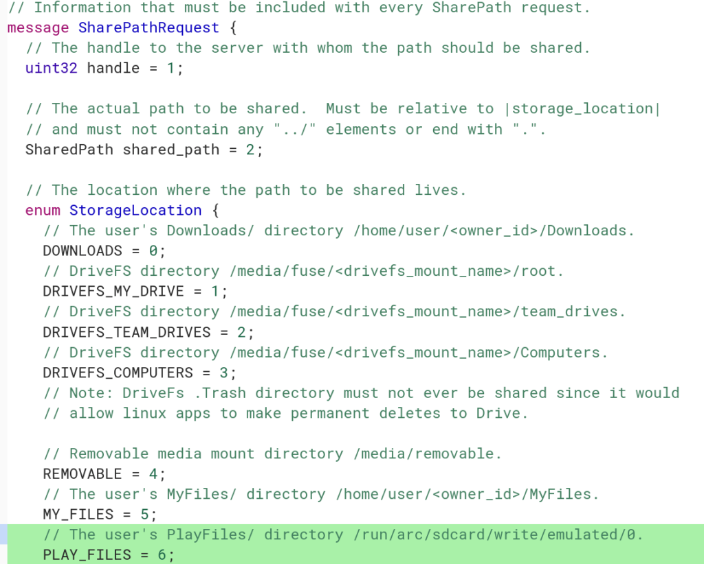

The native Chrome OS Files app is getting access to yet another set of data: This time it's [Play Files from the Android (or ARC++ if you want to use the official name) on Chrome OS](https://chromium-review.googlesource.com/c/chromiumos/platform2/+/1338781) based on this recent code commit, which is targeted to be included in Chrome OS 72. This follows other recent changes that provided a way to [share Chrome OS folders, Google Drive, Team Drive and Google Drive computers with Linux](https://www.aboutchromebooks.com/news/project-crostini-share-google-drive-team-drives-computer-linux-chromebook/).

This code highlighted in green shows the new addition and support for Linux access to Play Files on a Chromebook:

I'm not sure what I'd use this for, but folks who use a bunch of Android apps on their Chromebook -- I'm not really one of those -- maybe they want to share downloaded media files from an Android app with Linux. Or perhaps photos taken on an Android phone will be able to sync to this directory on a Chromebook where you could open the images in a desktop-class image editor. Of course, sharing Documents is a possible use case as well: Start a basic document in Google Docs for Android and later edit or add to it in a full word processing application within Linux.

Regardless, this function is in the works but not quite ready yet as the implementation is in a prototype stage based on comments in the changelog.

How about it: Do you want the ability to have Linux to access Android Play Files on your Chromebook, and if so, why?
