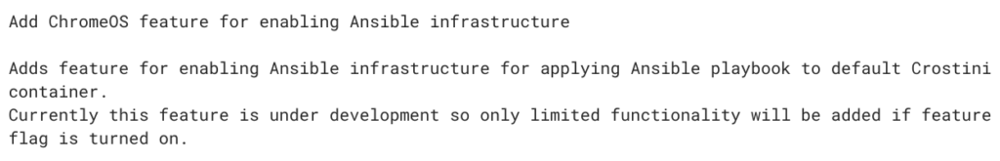

This seems to be a big week for Chromebooks in the enterprise. First, we heard the [joint announcement between Google and Dell](https://www.aboutchromebooks.com/news/google-chrome-enterprise-devices-dell-latitude-5400-5300-chromebook/) for [new, high-end Latitude Chromebooks](https://www.aboutchromebooks.com/news/dell-latitude-5300-5400-chromebook-enterprise-price-specifications/). And now I've found some code commits indicating that Project Crostini wasn't just about adding Linux to address a Chrome OS "app gap" but also to add new services for enterprise users.

There are at least [a dozen recent Chromium code commits that mention both "crostini" and "Ansible"](https://chromium-review.googlesource.com/q/ansible). Not knowing what the latter was, I did some searching and quickly found that [Red Hat Ansible](https://www.ansible.com/) is an open-source project to automate IT through these main areas:

- Provisioning
- Configuration Management
- App Deployment
- Continuous Delivery
- Security & Compliance
- Orchestration

No, these aren't the kind of things that consumer Chromebook users care about but they're a huge time and budget drain in the enterprise.

Here are a few of the code commits, I noticed that mention Ansible.

This one from June [sets the stage for integrating Ansible into the Linux container of Chrome OS](https://chromium-review.googlesource.com/c/chromium/src/+/1660434):

For context, this is how Ansible describes the playbook for application management:

> Ansible allows you to write 'Playbooks' that are descriptions of the desired state of your systems, which are usually kept in source control. Ansible then does the hard work of getting your systems to that state no matter what state they are currently in. Playbooks make your installations, upgrades and day-to-day management repeatable and reliable.

Credit: Ansible

This very recent code commit suggests how [Crostini will work with Ansible playbooks when there is Linux software to be upgraded or installed](https://chromium-review.googlesource.com/c/chromium/src/+/1773072):

There are several other code commits, but you get the idea. As I read it, IT admins that manage Chrome OS devices in the enterprise will be able to push Linux software installation and updates to Crostini containers on managed Chromebooks. It's possible additional Ansible use cases could be used as well.

Assuming I'm correct, this would be a huge benefit in the workplace. Companies don't want to pay their employees to self-install and update software individually. That's typically a centralized function of IT. Not only does it save time, but it provides software consistency across the company: You build an image, or in this case an Ansible playbook, and every user in a particular job function has all of the tools they need.
