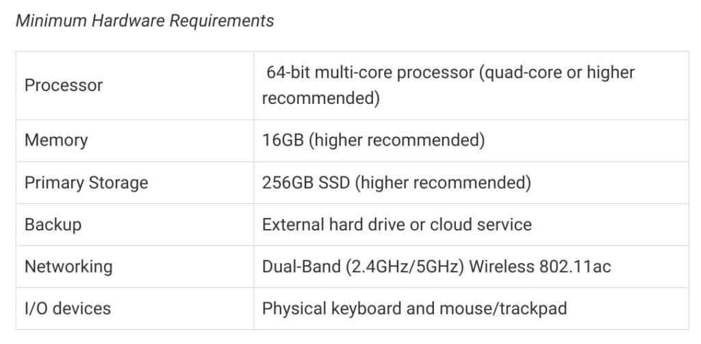
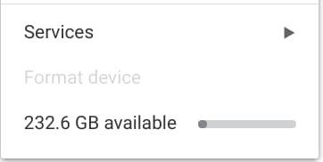
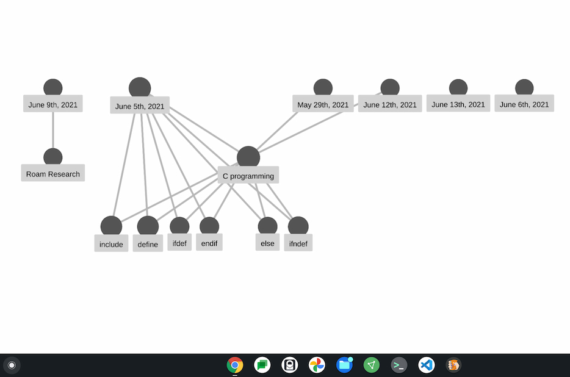

Starting this fall, I'll be pursuing a [Masters in Computer Science at Georgia Tech](https://omscs.gatech.edu/). And just like I did with my [recent undergraduate Computer Science coursework](https://www.aboutchromebooks.com/news/how-my-chromebook-is-getting-me-through-computer-science-college-classes/), I'm thinking to try using my Chromebook for class. It might be a stretch and I'm **_not_** suggesting that a Chromebook is the best tool for this task. But I think Linux on Chromebooks just might get me through the program.

I'm considering this for two reasons.

First, I'm on a budget and would prefer not to buy a new computer just for the Masters program.

Second, I want to see how far Linux on Chromebooks can take me down this path. I realize that most Chromebook owners aren't walking this path with me. (Although if you are pursuing a Masters in Computer Science, let me know!) But this could show many people that the ability to run Linux apps on a Chromebook is more useful and powerful than they might think.

I've already checked the [minimum hardware requirements for the program](https://sco.gatech.edu/hardware-requirements/), which are as follows:

My daily Chrome OS driver is still the [Acer Chromebook Spin 13 with 16 GB of memory I bought in 2019](https://www.aboutchromebooks.com/news/acer-chromebook-spin-13-with-16-gb-ram-should-you-buy-one/). And that amount of memory meets the minimum requirement. So too does the Intel Core i5 processor inside.

External SSD for my Chromebook

I'm a bit short on the local storage as this Chromebook only has 128 GB of SSD storage.

However, I have a 256 GB external Samsung SSD lying around from an old project and I already have it hooked up to my Chromebook. I still need to format and run a little maintenance on it but it's showing up in the Chrome OS Files app. And I can share that storage with Linux.

Even better: There's [a method to run the Linux container on an external drive with Chromebooks](https://www.aboutchromebooks.com/news/chromebook-run-linux-from-usb-drive/). I've [looked into it](https://bugs.chromium.org/p/chromium/issues/detail?id=827705) but haven't tried it yet. I definitely will soon.

In terms of being able to code on a Chromebook? Well, that's not really a problem as I've already proven. I started out doing Java code using Linux on Chromebooks and later added Python, JavaScript & React, and Node.js.

My full stack To Do app with HTML, CSS, React, Node.js and cloud-based ElephantSQL

I'm currently writing in C code on my Chromebook since I'll need C skills for some of the classes. I figure I should use the next two months to prep for the program as best I can.

The tougher aspect will be using libraries and applications that chug through massive amounts of data. It appears I'll need [MATLAB](https://www.mathworks.com/help/matlab/matlab_env/start-matlab-on-linux-platforms.html) and [OpenCV](https://docs.opencv.org/3.4/d7/d9f/tutorial_linux_install.html), both of which are available or can be compiled for Linux, for example.

I'm thinking I'll see this challenge with my Artificial Intelligence and Machine Learning classes specifically. Having the larger external SSD storage will help, but ideally, more memory would be beneficial. So too would a dedicated GPU. Maybe eGPUs will be a Chrome OS thing by then?

Of course, I have to take notes too. I'm one of those people that's really helped by note-taking.

I've already evaluated a bunch of tools such as Notion, Roam Research, Obsidian, and others. I won't say which I'm leaning towards because frankly, it doesn't matter: They're all available as either web and/or Linux apps. So they all run just fine on my Chromebook.

Here's a knowledge graph of some of my note topics in one of the apps to visualize how I'm using it:

Even if all else fails in some very specific use cases, I've got a plan B: Use the Chromebook for the 90% that I think I can use it for and use virtual machines in the Georgia Tech Computing Center.

It's not ideal, particularly since this is an online, remote program. But it lets me use the Chromebook I have, thanks to Linux support, without splurging on a new computer costing $1,500, $2,000, or more. Frankly, that's what I'm trying to avoid because I have a pretty decent Linux machine hiding in my Chromebook.
