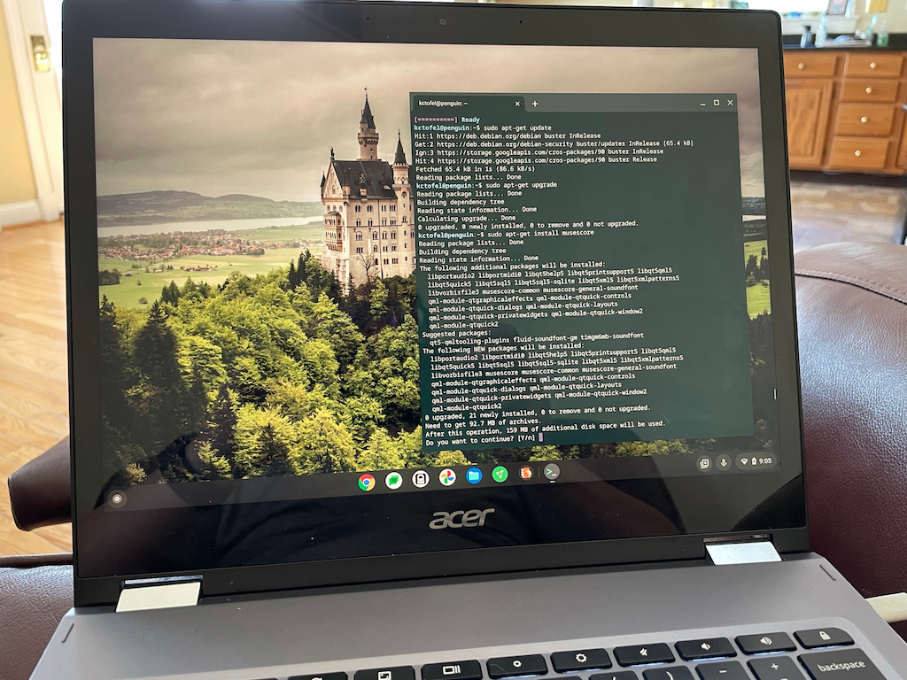

I've previously written an overview with [five reasons to run Linux on Chromebooks](https://www.aboutchromebooks.com/news/5-reasons-you-might-want-to-run-linux-on-your-chromebook/), but there are tons of specific examples I could share. One arrived just this morning as one of my former Computer Science teachers reached out, asking if MuseScore could run on a Chromebook.

I had an answer back to her in minutes, along with installation instructions, showing her the versatility of Linux on Chromebooks.

She had done some research and found the old Crouton method of using Linux. While that could work, it's an old, non-supported dual-boot solution. _(Update: Technically, Crouton is supported internally at Google by an employee. However, it's not supported for end-users by Google itself. And it's also a "chroot" solution, not dual-boot as I previously noted. Thanks, Pat!)_

Instead, I explained that Linux on Chromebooks is natively and officially supported by Google. And it's easy to install from the Settings in Chrome OS:

MuseScore is a music composition and notation application; not something I've used before. But that really doesn't matter.

I went to the [MuseScore website](https://musescore.org/en) and saw it supports just about every "flavor" of Linux. I opened up the Terminal app on my Chromebook to access the Linux container and typed `sudo apt-get install musescore`.

After about of minute of downloads and installation messages, I had MuseScore on my Chromebook, complete with a Launcher icon.

Of course, installing a Linux app on a Chromebook doesn't mean it will work 100% of the time or have full functionality.

I was concerned that MuseScore might not play back sounds, so I did a very quick test by composing my own score. And by "composing my own score", I mean adding three random notes. ;)

Playback worked fine and now she has a solution for her digital music composition needs, all thanks to Linux on Chromebooks.

Again, there are **_tons_** of single-app examples that I could share to exemplify this often underappreciated Chromebook versatility. I use this functionality in my [Computer Science coding classes](https://www.aboutchromebooks.com/news/linux-on-chromebooks-just-might-get-me-through-a-masters-in-computer-science/), for example.

But the general idea is the same: Linux apps are a viable option to adding more capabilities to Chrome OS. So don't be shy about trying them!
