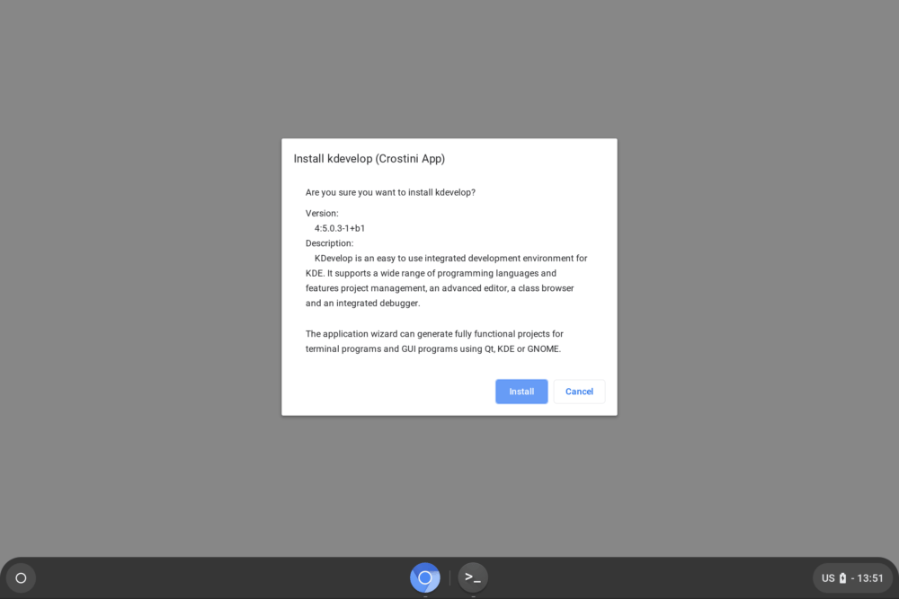

Back in September, I pointed out a Chrome OS bug report that had planned to provide [more detailed information on a Linux application before actually installing it on a Chromebook](https://www.aboutchromebooks.com/news/chrome-os-will-show-debian-package-details-when-installing-in-the-files-app/). Work has continued on that effort and I recently captured a screenshot to show how it will look in Chrome OS:

This screenshot isn't from my Pixel Slate; the feature hasn't been released yet so I don't have access to it. Instead, this is a work-in-progress capture from the Chromium team as the functionality continues to develop.

As a result, the final implementation _could_ look different. But I'm pretty doubtful that much if anything will change from this image. The original feature description was to add "a details pane in the file manager’s .deb install dialog to provide package name, version, and a description of the package," which is exactly what this dialog box provides.

The idea here is that when using the native Files app to install a Debian package -- essentially a Linux app -- users will know more about what it is they're actually installing before they click that Install button, making the experience a little more user-friendly and informative.

I'll be watching for this feature in the next release of the Chrome OS 73 Dev Channel since there's a feature freeze date on February 22 for this version. If the dialog box doesn't make the cut, look for this addition in Chrome OS 74.
