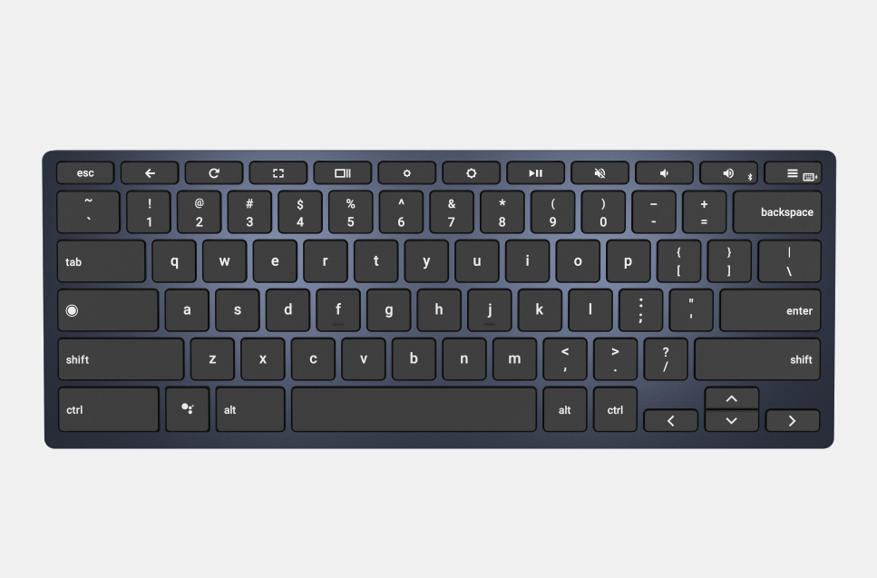

The above image is a Logitech K480 wireless keyboard that's currently available. I'm only showing it because I've stumbled on to information that strongly suggests there will be a new model called the Logitech Slim Multi-Device ChromeOS Edition K580. Sorry, no pics of it yet, just some basic information.

I noticed [a new keyboard referenced as the Kata in the Chromium commit logs](https://chromium-review.googlesource.com/c/chromiumos/overlays/chromiumos-overlay/+/1711157):

At first glance, all I could glean was that this keyboard, like the [Pixel Slate](https://www.aboutchromebooks.com/reviews/google-pixel-slate-review/) and [Brydge keyboards](https://www.aboutchromebooks.com/news/brydge-c-type-usb-c-bluetooth-keyboard-chromebook-chrome-os-chromebox-tablet-order-price-availability/), will use the newer Chrome OS layout. Then I noticed the vendor IDs, which are unique. And guess who has [vendor ID 046d](https://devicehunt.com/view/type/usb/vendor/046D)? Logitech.

So that led me a little further down the trail. On a hunch, I hit up the FCC database and searched for recent Logitech filings. Sure enough, there's a [wireless and USB keyboard application grant from June 24](https://apps.fcc.gov/oetcf/eas/reports/ViewExhibitReport.cfm?mode=Exhibits&RequestTimeout=500&calledFromFrame=N&application_id=xG%2B4DmFxF0xlJYIc87XEoQ%3D%3D&fcc_id=JNZYR0073). The device under test isn't shown in any images - they're held back in confidence until later this year - but at least I confirmed that Logitech is making some kind of wired and wireless keyboard.

Undaunted, I hit up a database of Bluetooth device certifications and found the confirmation I was looking for: There are two recently certified keyboards and one of them is for Chrome OS. In fact, the Bluetooth certification was published earlier today.

That's all I know for now. Logitech will launch a Chrome OS-specific version of the K580 keyboard that will work with either USB or Bluetooth. One nifty feature, according to the FCC docs I read, is that it will have a rechargeable battery so that when you're using the K580 over USB, the battery is topped off for Bluetooth usage.

No idea on price (I anticipate lower than the $99 Brydge Type-C shown below), availability or what it will look like - although it could take design cues from the K480 based on the model number. Stay tuned for another keyboard option for the Pixel Slate, other Chrome OS tablets or Chromeboxes.

