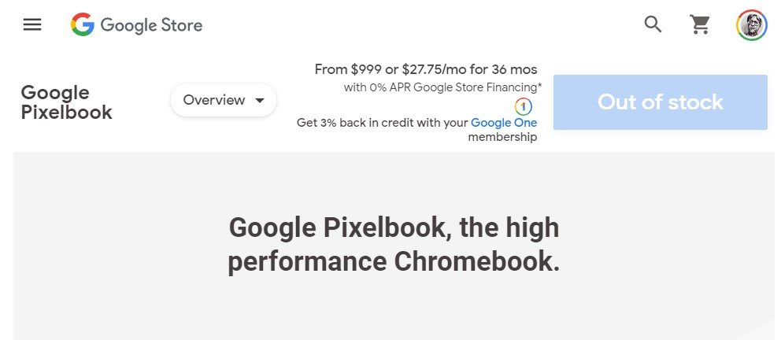
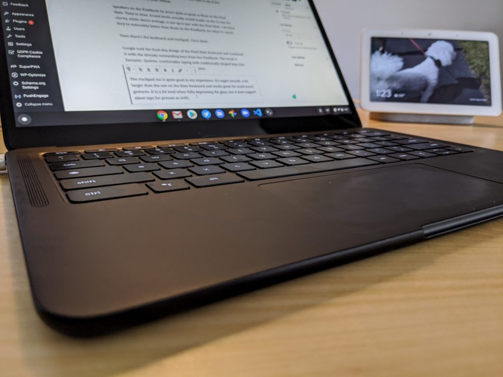

If you haven't seen the news yet, [the Pixelbook is no longer in stock at the Google store, first reported over the weekend by 9to5 Google](https://9to5google.com/2020/09/21/pixelbook-out-of-stock/). Indeed, hitting the Pixelbook link at the store shows you a big Pixelbook Go, front, and center. And [Google officially told Engadget](https://www.engadget.com/google-pixelbook-out-of-stock-190724187.html) that it's pointing buyers to the Pixelbook Go, which offers "similar high-performance elements in a familiar form factor." It sounds like if you want a Pixelbook, you'll need to find remaining inventory from a third-party.

Two few things come to mind here, as I've owned every MadeByGoogle Chromebook there is, starting with the original Chromebook Pixel in 2013, its 2015 successor, the Pixelbook from 2017, the [Pixel Slate](https://www.aboutchromebooks.com/reviews/google-pixel-slate-review/), and [last year's Pixelbook Go](https://www.aboutchromebooks.com/news/pixelbook-go-review-a-premium-price-validated-by-a-premium-device/). The latter was [my pick for Chromebook of the year in 2019](https://www.aboutchromebooks.com/news/my-pick-for-2019-chromebook-of-the-year/), by the way; it's a great device at a more reasonable price point than its predecessors.

First is just a small observation about Google's statement. I agree in general that the Pixelbook Go offers similar high-performance elements. But it's not a true replacement for any of the other MadeByGoogle Chromebooks. It's not a convertible device and it doesn't have pen support. Granted, the two Chromebook Pixel models didn't support digital ink either, but that's more about stylus technology than a product strategy.

Second is my very arguable opinion that the Pixelbook product line from 2013 through now has accomplished what it set out to do. I know there will be people out there disappointed that the Pixelbook appears to be going away because it might send the message that there won't be a true Pixelbook replacement.

Even if that happens, I'm OK with that, and here's why.

Back in 2013, the original Chromebook Pixel started at $1,299; an _**outrageously**_ expensive price compared to all other Chromebooks up to that point. At the time, it was actually difficult to find a Chromebook that cost you more than $400 or so. They were mostly what I'd consider entry-level devices with 720p displays and Intel Celeron or Pentium processors. You'd even see a scant 2 GB of memory on some models.

So Google was trying to show people that a high-end Chromebook could offer more performance with a Core i5 processor and a premium experience with that 2,560 × 1,700 resolution, 3:2 ratio display. Yes, it would cost you for that, but that's to be expected. Even so, there were some terrible attributes about that first device: Up to 5-hour battery life was the one I remember the most. I ended up buying the $1,449 model which added integrated LTE.

Next came the 2015 Chromebook Pixel and it lost the LTE option. However, it did get improved battery life of up to 12 hours and doubled up on the memory, providing 8 GB of RAM. This was also the first time you could order a Pixelbook with a Core i7 processor, which had a $1,299 price tag compared to the very capable $999 base model.

Two years later, we saw a redesign of the device in the current Pixelbook. It was sleeker, added USB-C charging, gained higher capacity storage options [including one with a fast NVMe drive](https://www.aboutchromebooks.com/news/pixelbook-emmc-or-ssd-storage/). It also gained stylus support plus the typical processor upgrades. And Google did it at the same $999 base price, which I think was great even though many tech outlets still felt it was too much to pay for a Chromebook.

You know all about the Pixelbook Go from last year with its $649 starting price, achieved partially by cutting some features out that perhaps Google determined most consumers don't want.

That history lesson aside, what has happened to the Chromebook market at-large over that time?

It's become a broader range of Chromebook choices from sub-$300 entry level devices to $500 or $600 mid-rangers on up to true Pixelbook competitors for at or well under $1,000.

Just look at some of these relatively choices with original MSRPs **_at or below_** the $999 Pixelboook price that offer at least as much, if not more:

- Lenovo Chromebook Yoga C630 with 4K display: $899
- Samsung Galaxy Chromebook with 4K OLED display: $999
- [Asus Chromebook Flip C436](https://www.aboutchromebooks.com/news/asus-chromebook-flip-c436-specifications-release-date-price-ces-2020/): $799
- [Acer Chromebook Spin 713](https://www.aboutchromebooks.com/news/acer-chromebook-spin-713-vs-13-hands-on/): $629

I could list more from recent choices from Dell and HP too, but you get the point. Google's own Chromebook line, now 7 years old, can say "mission accomplished", even if there was never another MadeByGoogle Chromebook ever to be offered.

I don't think Google is out of this market completely, by any means. We know [the company won't be focused on Chrome OS tablets](https://www.aboutchromebooks.com/news/made-by-google-exit-tablet-business-pixel-slate-chrome-os-chromebooks/) based on the Pixel Slate; still, [a great device that was vastly improved with a few software updates](https://www.aboutchromebooks.com/news/with-chrome-os-improvements-and-a-200-discount-the-pixel-slate-is-worth-a-second-look/). And of course, if a Pixelbook Go meets your needs, Google is still selling those.

But the Pixelbook leaving after three years with few leaks or chatter about a replacement in the near future?

I think that's fine. Just like every Pixelbook and Chromebook Pixel model, it helped push highly capable Chromebooks forward to the point where we went from no high-end choices to more than enough good options.
