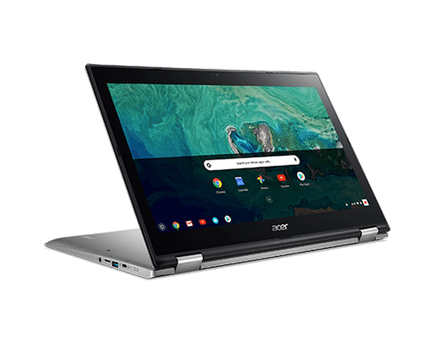

Last month, [Acer introduced the Chromebook Spin 15](https://www.aboutchromebooks.com/news/acer-introduces-chromebook-spin-15-covertible-and-chromebook-15/), which it said was the largest convertible Chromebook ever. The company also said device availability was planned for July, but this morning, I found a l[isting for it in the Acer online store](https://us-store.acer.com/acer-spin-15-laptop-cp315-1h-p1k8). As expected, it will cost $449.99.

The only model showing in the Acer store is the Pentium N4200 configuration with 15.6-inch, 1920x1080 touchscreen display that folds over 360-degrees, a Gorilla Glass trackpad, 4 GB of memory and 64 GB of integrated storage. Like all new Chromebooks now, the Acer Chromebook Spin 15 does support the Google Play Store, so you get Android app support.

There are a total of 4 USB ports with two of them being USB 3.1 Type-C and another one of those _apparently_ supports Thunderbolt 3.1 over USB, which I believe is a first for Chromebooks: I recently noted why [no Chrome OS devices had Thunderbolt support](https://www.aboutchromebooks.com/opinion/why-dont-chromebooks-have-thunderbolt-3-support/) up to now, so I'm leery of this having Thunderbolt. Acer didn't mention Thunderbolt in its [press release for the Spin 15](https://www.prnewswire.com/news-releases/acer-debuts-big-screen-flexibility-with-first-15-inch-convertible-chromebook-300653382.html). There are also two full-sized USB 3.0 Type ports. The fanless Chromebook is expected to get 13 hours of battery life.

Although the images for this Chromebook clearly show Chrome OS, there is some mention of Windows 10 in the specs, which I believe is an error. Chrome OS is mentioned near the bottom of the spec sheet and all of the internal hardware lines up with what Acer announced when it introduced the Chromebook Spin 15. Still, if you decide to order, you may want to first verify with Acer that this is a Chromebook -- it may make sense to verify the Thunderbolt support too if that's important to you.
