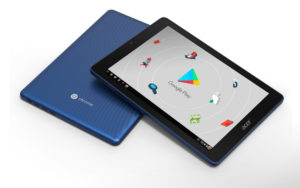

Like many, I was super excited in April with the launch of the [Acer Chromebook Tab 10](https://www.acer.com/ac/en/US/content/series-features/acerchromebooktab10), the first Chrome OS tablet. I still think [these tablets will be game changers](https://www.aboutchromebooks.com/opinion/why-chrome-tablets-will-be-a-game-changer/), but only if we can actually buy and use them. Based on inventory checks, it appears the tablet won't be for sale this month as planned: [Acer original said US availability was April](https://www.acer.com/ac/en/US/press/2018/360016), but we're now about halfway through May and the device is nowhere to be seen, [save on video](https://www.aboutchromebooks.com/news/acer-chromebook-tab-10-shows-up-in-a-quick-video-hands-on/) at a Google EDU event.

Instead, different channel checks show availability in June, although one online retailer is showing July as the more likely month for their receipt of inventory. Acer could begin direct sales on its own site sooner of course, but it's close to missing its May date for the product.

[ShopBLT has a nice live inventory tool](http://www.shopblt.com/item/acer-nx.h0baa.001-chromebook-tab-10-d651n/acer_nxh0baa001.html) and it appears to be getting 500 devices both in July and August and although a handful could be available in June. And by handful, they're expecting a total of just seven tablets next month against 25 pre-orders already taken. Note that I've seen their inventory change often as I've tracked it for the past few weeks.

Promevo doesn't list live inventory but [says it has stock yet the tablet will be shipping in June](https://shop.promevo.com/index.php/acer-chromebook-tab-10-d651n.html). We'll have to watch and see if that changes in the coming weeks.

Lastly, [Neobits allows you to add the new tablet to your cart](http://www.neobits.com/acer_nx_h0baa_001_acer_chromebook_tab_10_d651n_p12218296.html?atc=gbp&gclid=CjwKCAjwiurXBRAnEiwAk2GFZpRlEmFItEic-YRCeCXQdX5pRDV0zn_mmsN9j0hBIOXu_hprQb5IyhoCGeoQAvD_BwE) but specifically says you'll be waiting a while -- more than eight weeks -- to get your device, as of today.

While the inventory of these, or other retailers, could change at any time, I haven't seen any evidence that suggests the sudden presence of tablet availability.

Before any wireless device can be sold in the U.S., for example, it has to be tested and approved by the FCC. And I haven't found confirmation that the Acer Chromebook Tab 10 has its approval yet. Once that happens -- provided the supply chain has ramped up for production -- we could quickly see the tablet for sale. Until then, it's a waiting game.
