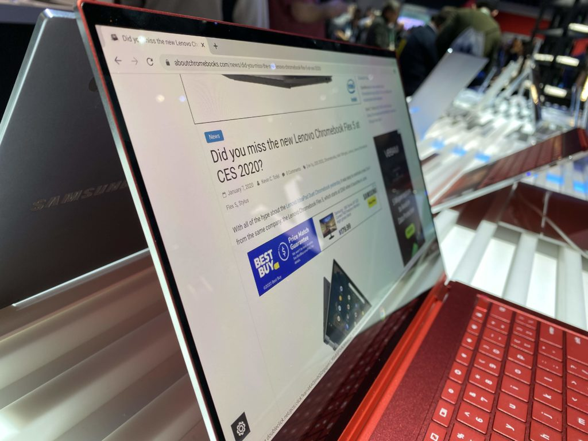

**Update**: [Best Buy has changed the release date from N/A to April 6](https://www.bestbuy.com/site/samsung-galaxy-13-3-4k-ultra-hd-touch-screen-chromebook-intel-core-i5-8gb-memory-256gb-ssd-fiesta-red/6398115.p?skuId=6398115).

Back in February, I noted that [Best Buy was showing an April 6 release date for the Samsung Galaxy Chromebook](https://www.aboutchromebooks.com/news/samsung-galaxy-chromebook-release-date-lte-configuration/). That date was later removed from the product listing and Samsung told me that it hadn't yet announced a release date. Today, reports are coming in that yes indeed: You will be able to purchase the Samsung Galaxy Chromebook on April 6 for $999.

[The Verge posted the news at 12:01 am on Monday](https://www.theverge.com/2020/3/30/21197611/samsung-galaxy-chromebook-google-release-date-april), and although there's no cited source, I suspect Samsung gave them the official word, along with an embargoed time to go public with it.

[Announced at CES 2020 in January](https://www.aboutchromebooks.com/news/samsung-galaxy-chromebook-specifications-release-date-price-ces-2020/), the Samsung Galaxy Chromebook is probably the most anticipated new Chrome OS device right now, save for the similar but less expensive [Asus Chromebook Flip C436](https://www.aboutchromebooks.com/news/asus-chromebook-flip-c436-specifications-release-date-price-ces-2020/). Both of these Chromebooks are designed as part of Intel's Project Athena efforts, providing powerful computing experiences and long battery life in thin and light form factors.

Samsung's version is the first with an OLED 4K display and includes a built-in stylus akin to the S-Pen from its popular Galaxy Note phone line.

When I got my [hands-on with the Galaxy Chromebook](https://www.aboutchromebooks.com/news/samsung-galaxy-chromebook-hands-on-yes-its-as-nice-as-it-looks/), I was wowed by the screen noting, "It’s easily the best I’ve seen on a Chromebook thanks to the AMOLED panel. Blacks are what you’d expect; they’re not there."

That feature alone makes this Chromebook worth considering, even at $999. Of course, it doesn't hurt that you'll also get a 10th-gen Core i5-10210U  processor, 8 GB of memory and 256 GB of fast NVMe storage.

Is anyone getting their credit card ready for April 6?
