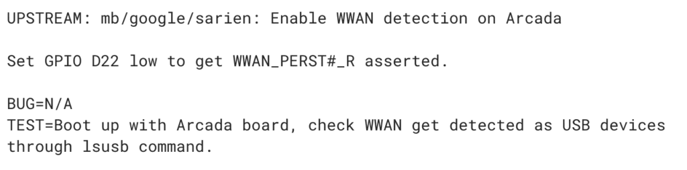
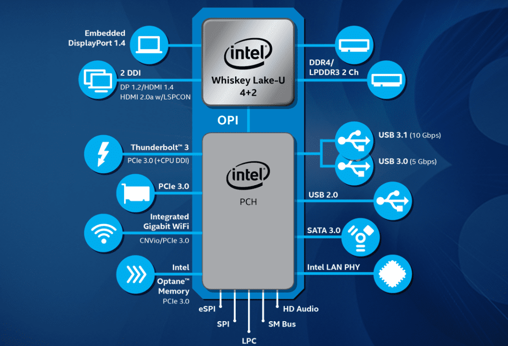

Chrome OS enthusiasts are buzzing with excitement over Sarien, one of the latest boards likely to become a Chromebook as noted extensively by the observant gang at Chrome Unboxed over the past few days. If you haven't heard about Sarien, I recommend you hit their site for the initial bits of info, such as [test code suggesting either a tablet or detachable,](https://chromeunboxed.com/sarien-could-be-the-next-flagship-detachable-chromebook/) Wacom screen support indicating the [likelihood of a stylus, and the thought that Dell may be the hardware partner](https://chromeunboxed.com/new-chromebook-detachable-sarien-wacom-screen-stylus/).

I started nosing around code related to Sarien -- and Arcada, which is a Sarien variant -- and found something that many Chromebook users are clamoring for: [Early tests to detect a WWAN (or LTE) device.](https://chromium-review.googlesource.com/c/chromiumos/third_party/coreboot/+/1363383)

These boards are likely to use either Intel's Coffee Lake or Whiskey Lake chips based on code snippets, and that was already known. And Intel says Whiskey Lake does support LTE, so it may not sound like this is a big deal.

However, Whiskey Lake chips typically don't have an integrated modem so "LTE support" doesn't mean every Whiskey Lake device will include LTE; it's an option through an internal USB interface. You can see that there's no integrated modem in Intel's marketing materials for Whiskey Lake

This code then suggests at the very least there will be an LTE option potentially available for the Chromebooks -- or Chrome tablets -- that are built on these boards, similar to the [Samsung Chromebook Plus v2 with LTE](https://www.aboutchromebooks.com/news/samsung-chromebook-plus-v2-lte-available-price-599/), shown above.

It's also worth noting that [Intel worked with HP](https://www.anandtech.com/show/13434/intel-custom-amber-lake-y-with-lte-modem) to include its [XMM 7560 LTE Advanced Pro modem](https://redirect.viglink.com/?format=go&jsonp=vglnk_154947425655712&key=08a8dcb30b28eed5c1da2bd64b4ca559&libId=jrtgwu1d0101045l000DAgw8umkko&loc=https%3A%2F%2Fwww.anandtech.com%2Fshow%2F13434%2Fintel-custom-amber-lake-y-with-lte-modem&v=1&opt=true&out=https%3A%2F%2Fwww.intel.com%2Fcontent%2Fwww%2Fus%2Fen%2Fwireless-products%2Fmobile-communications%2Fxmm-7560-brief.html&ref=https%3A%2F%2Fwww.anandtech.com%2Fshow%2F13509%2Fhp-launches-ultra-thin-hp-spectre-13-x360&title=Intel%27s%20Customized%20SoC%20for%20HP%3A%20Amber%20Lake-Y%20with%20On-Package%20LTE%20Modem&txt=Intel%20XMM%207560%20LTE%20Advanced%20Pro) directly on the chipboard for the leather HP Spectre Folio Windows tablet. That takes time and money, with hopes of a large number of sales to make it worth the effort. I don't think that's going to be the case here, mainly because Chromebook sales are much lower than Windows devices and because of the code reference to USB for WWAN. Obviously, that could change.

Regardless of the implementation, early signs suggest that either Sarien, Arcada or both will come with an LTE option in case [Instant Tethering to an Android phone isn't your thing](https://www.aboutchromebooks.com/news/google-expands-instant-tethering-connection-to-15-chromebooks-and-30-android-phone-models/).
