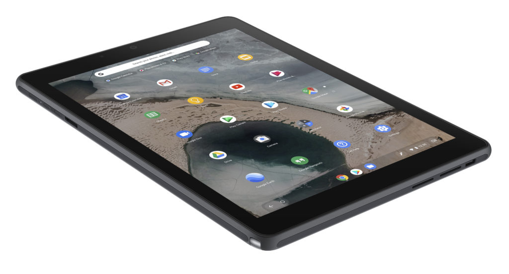

It appears that introducing, and [then killing the Celeron Pixel Slate](https://www.aboutchromebooks.com/news/google-pixel-slate-celeron-unavailable-permanently-discontinued/) may have had a bigger negative impact on Google's tablet strategy than first thought. According to my pal JR Raphael, [Google is no longer planning any of its own tablets](https://www.computerworld.com/article/3404206/googles-officially-done-making-tablets.html) and will focus solely on the laptop and 2-in-1 form factors for Chrome OS:

> A Google spokesperson directly confirmed all of these details to me. The news was revealed at an internal company meeting on Wednesday, and Google is currently working to reassign employees who were focused on the abandoned projects onto other areas. Many of them, I'm told, have already shifted over to the laptop side of that same self-made hardware division.

There's now the obvious question about any Pixel Slate successors or other, smaller Chrome OS tablets such as the [Flapjack devices, which are expected to be in the 8- and 10.1-inch sizes](https://www.aboutchromebooks.com/news/flapjack-chrome-os-tablets-benchmarks-performance-specifications/).

I've looked in the Chromium commit logs and still see progress on Flapjack as of now. That means either these are Chrome OS tablets for a Google hardware partner or they were meant to be Made By Google devices and nobody told the developers yet. I suspect the former case is likely because of some specific features I've seen for these but I'll dig around some more and report back when I confirm my thoughts.

ASUS Chromebook Tablet CT100

If you're in the market for a Chrome OS tablet, this doesn't mean you won't have new choices in the future. Google will continue to develop tablet-specific features for Chrome OS. And it will still support them since the Pixel Slate will receive software updates through June, 2024.

However, you're out of luck if you want a Google-branded Chrome tablet. Look to Acer, Asus, HP and others such as Dell, Lenovo and Samsung to continue that product line.
