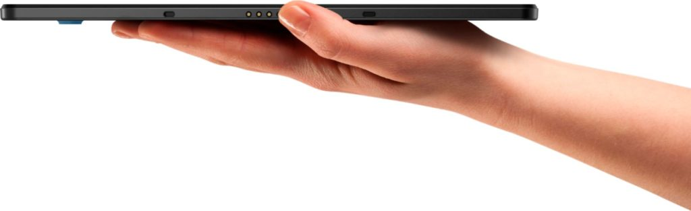
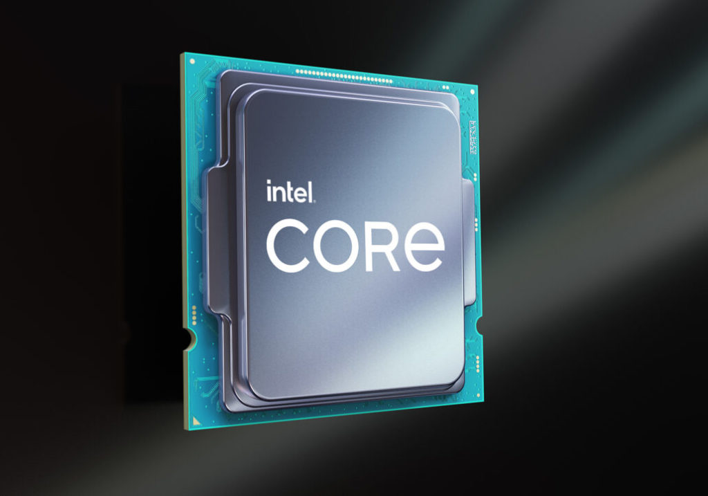

_**Update**: **Although the MediaTek Kompanio 1300T has a very similar architecture to the MT8195 chip that's expected in Chrome OS devices in the next few months, it is a different chip. And as such, MediaTek tells me the 1300T is targeted for Android tablets, not Chrome OS tablets. The original post follows but you can [see detailed information here](https://www.aboutchromebooks.com/news/i-was-wrong-the-mediatek-kompanio-1300t-isnt-for-chrome-os-tablets-at-all/).)**_

Last week [the MediaTek Kompanio 1300T for Chrome OS tablets was announced](https://corp.mediatek.com/news-events/press-releases/mediatek-introduces-the-kompanio-1300t-platform-to-enhance-premium-computing-experiences-in-tablets) and I've been thinking about the news since then. On the one hand, this is good news: Any more efficient silicon that can speed up Chrome OS tablets is a good thing. On the other hand, it makes sense to keep some measure of perspective and manage expectations.

Here's the good news. The MediaTek Kompanio 1300T is the new name of the [MediaTek MT8195 announced last year for Chrome OS devices.](https://www.aboutchromebooks.com/news/chromebooks-mediatek-mt8192-mt8195-vs-qualcomm-snapdragon-7c-8c/) I suspect the "T" in the chipset name means this is a version specifically for tablets.

Indeed, MediaTek's press release only mentions tablets, although a slightly different variant, or even the same chip under another name, could be used for Chromebooks.

When the MT8195 was introduced, I said this in reference to the then-upcoming Qualcomm Snapdragon 7c:

> "It’s built on TSMCs 6nm process, so there are immediate power efficiency gains available simply based on the transistor density. Like the Snapdragon 7c, it has 8 CPU cores. Unlike the 7c are the configuration and ARM architecture. The M8912 has four high-power Cortex-A78 cores and four of the same Cortex-A55 cores as the 7c."

The more dense MediaTek Kompanio 1300T packed with more transistors will use less energy and speed up performance. And the step up to a newer version of the ARM architecture can bring more efficiencies and speed. Again, this is all good!

And then I think back to that song by The Who: "Won't get fooled again". I say that because I feel like Charlie Brown trying to kick the football that Lucy holds every time we have a new ARM chipset for Chromebooks and Chrome OS tablets. Lucy pulls the football at the last second and we're all left wanting more from our devices with the next-generation ARM processors.

Case in point: There was much ado about the Qualcomm Snapdragon 7c compute platform inside Chromebooks about a year ago. It all sounded good on paper.

In the end though? You got the [performance around an Intel Celeron or Pentium](https://www.aboutchromebooks.com/news/snapdragon-7c-chromebook-test-roughly-equivalent-to-the-pentium-silver-n5030/) albeit with some extra battery life.

There's a market for devices with those experiences, for sure. But until we have ARM processors that can power Chromebooks and Chrome OS tablets like mid-range or even high-end Intel Core processors, there's not really that much to be excited about here.

Put another way, Apple's M1 chip is leaps and bounds better than what any other ARM licensee and chip designer is even close to putting into products.

Sure, you can't outfit a Chromebook or Chrome OS tablet with that M1, but my point is this: The other ARM chipmakers are really just following their expected evolution path. There's no "magic" here that will profoundly change the market in the world of Chrome OS.

To wit: [Chrome Unboxed found some solid Geekbench evidence of the MediaTek Kompanio 1300T](https://chromeunboxed.com/upcoming-mediatek-arm-chromebooks-are-faster-than-a-qualcomm-snapdragon-865/), showing a nice gain in single and multicore scores over the Snapdragon 7c. The MediaTek numbers show scores averaging around 880 and 2900, respectively.

Those compare favorably with Geekbench scores for the Snapdragon 7c, which scored [594 and 1654 in a Qualcomm-commissioned report](https://static1.squarespace.com/static/590e6d22db29d6aee92503bd/t/6047a1fa52b3da7d6c17ec08/1615307258808/HTVA-qc-snapdragon-7c-perf-analysis-rev5.pdf). For comparison, Geekbench scores of the Intel Pentium Silver N5000 are reported as 425 and 1195.

So, it's likely the MediaTek Kompanio 1300T will offer more performance than a last-gen Pentium Silver. How about when it comes to the next step up, an Intel Core i3?

I did some digging around and found a recent Geekbench score for a [four-core 8th-gen Intel Core i3 and it scored 1411 and 4900](https://browser.geekbench.com/v5/cpu/9126468).

Those numbers are artificial benchmarks, yes, but they're much higher than the upcoming MediaTek CPU scores.

Yet that Intel processor launched _just over three years ago_ and has half the cores as the octa-core MediaTek Kompanio 1300T.

As a said, these numbers are artificial benchmarks and my stance on those hasn't changed: They're just a general indication of potential performance. We won't know how Chrome OS tablets with MediaTek's new silicon will perform for a few months yet because that's when the first devices using them will arrive. And another factor is what we'll pay for that performance.

So I'd be wary of PR hype and keep expectations in check on this news. Maybe "conservatively optimistic" is the best mindset at this point.

While the overall progress is promising and a step forward, I don't see these chips being the Intel killers that some Chrome OS fans are hoping for. We've been down this road before and hopefully, we won't get fooled again.

Updated on August 2, with information abo_ut the 1300T meant for Android tablets, not Android tablets._
