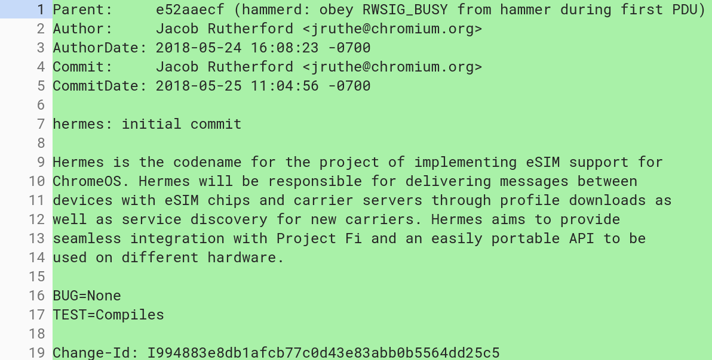

It's hard to find a Chromebook with integrated LTE these days, even though a few years ago, Google's own Chromebook Pixel and a few other models had an always available connection. That could be changing thanks to Project Hermes, which is definitely meant to support [eSIM capabilities on Chromebooks](https://chromium-review.googlesource.com/c/chromiumos/platform2/+/1073626) and appears likely to work with Project Fi.

The news comes by way of [a code commit spotted by XDA Developers](https://www.xda-developers.com/esim-project-fi-chrome-os/) on Thursday. In the screenshot they posted, there is specific mention of Project Fi support. However, the code commit message was changed a few days ago to remove the mention of Fi.

By adding eSIM support to Chrome OS, people could buy Chromebooks with built-in LTE radios but not need to insert a SIM card. The eSIM would be remotely provisioned -- theoretically on any carrier partner -- to enable LTE service. This saves the hassle of getting and inserting a SIM card from a carrier, plus it can add flexibility to easily change LTE service providers. I had the LTE service for my original Chromebook Pixel and it was fantastic to be able to connect nearly anywhere when not near a Wi-Fi hotspot.

As far as the Project Fi support mention. It's very possible that the developers didn't want to tip Google's hand on this potential feature support. I think that's the case since I see code referencing a file called [_SmdpFiImpl_](https://chromium-review.googlesource.com/c/chromiumos/platform2/+/1073626/19/hermes/smdp_fi_impl.h#14), which has Fi in the name. And SMDP is mentioned throughout the [GSMA spec for eSIM implementation](https://www.gsma.com/newsroom/wp-content/uploads//SGP.22_v2.2.pdf) as a reference to Subscription Manager Data Preparation.

Regardless, Project Fi and a wireless connection "built in" to future Chromebooks opens up even more usability.

Imagine making or receiving Voice over LTE phone calls through an updated Fi service. Or getting and responding to texts right from your Chromebook. Checking missed calls and voicemails is possible too.

Would this replace your phone service so you don't have to carry a handset? I wouldn't go that far. A phone is always on while a Chromebook is typically closed and shut down when traveling about. However, I could see Google extend Project Fi to allow calls to and from the same number on both a phone and Chromebook so you don't have to manage multiple phone numbers in this case.

I'll keep an eye on Project Hermes over the coming weeks and months to provide additional updates. Even if Fi doesn't make the cut for this effort, just the idea of making it easier to use LTE-enabled Chromebooks is a big plus.
