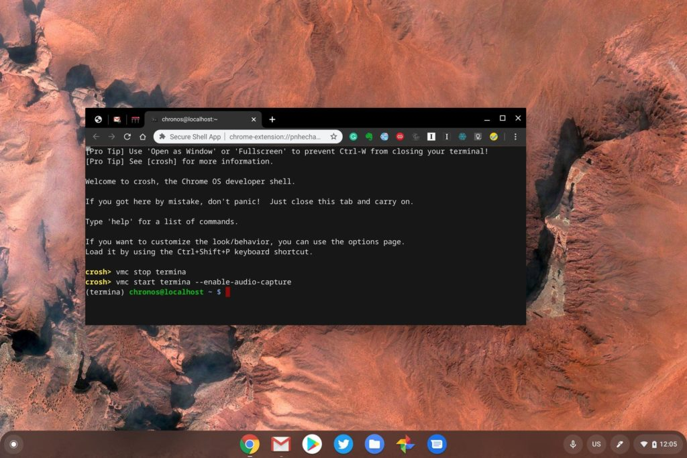
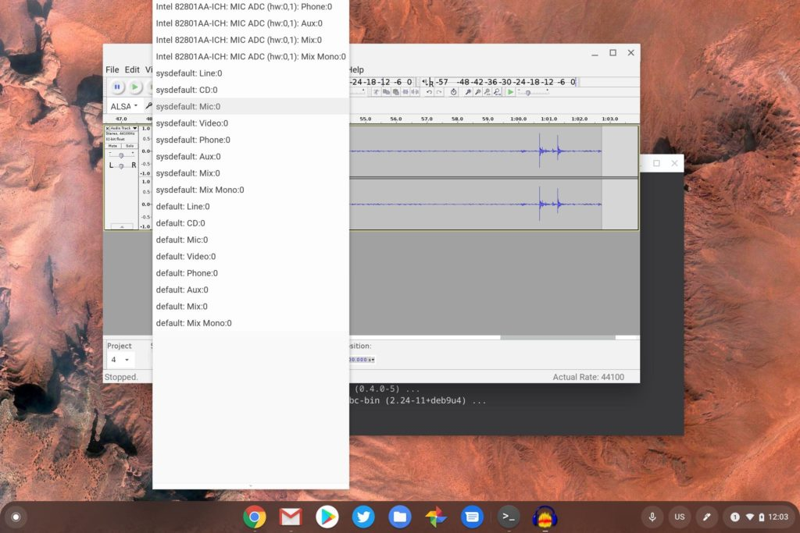

At long last one of the major features I've missed from Linux on Chrome OS has arrived. And nobody even told us. I'm talking about audio capture in a Linux container on Chromebooks. You can actually use it now on the [Chrome OS 79 Stable Channel that launched a few weeks ago](https://www.aboutchromebooks.com/news/chrome-os-79-stable-channel-update-arrives-heres-what-you-need-to-know/).

Normally experimental new features are hidden behind a Chrome OS flag but audio capture hasn't even reached that stage yet. Instead, you have to start Termina, the virtual machine where your Linux containers run on a Chromebook, with a command line flag.

To enable audio capture through either your Chromebook's built-in microphone or a USB mic, go in the Chrome browser and press the _ctrl - alt - T_ keyboard combination. This should open up what's known as the crosh shell.

Next type the _vmc stop termina_ command to shut down any currently running Termina VM. Then restart termina with this command: _[vmc start termina --enable-audio-capture](https://chromium.googlesource.com/chromiumos/docs/+/master/containers_and_vms.md#Is-audio-capture-e_g_microphone_supported)_. Then, simply launch your Terminal app.

Enable audio capture in Chrome OS

Once you do, Linux apps will have access to any internal or external microphones.

I tested this with [Audacity](https://www.audacityteam.org/), an open-source audio application I've used for podcasting since 2006. I did have to choose the right audio input from the many listed options, but once I found the correct one -- sysdefault: Mic 0 worked for my Samson USB mic -- I was able to record and save audio.

This method to enable audio capture won't be needed for long thankfully. It was added as a way to test the feature. A Chrome OS experimental flag will arrive in a future version of Chrome OS; I wouldn't be surprised if it found its way into Chrome OS 80 since it's a relatively small change to add a flag.

Eventually, [just like GPU hardware acceleration](https://www.aboutchromebooks.com/news/chrome-os-76-will-make-it-easier-to-enable-gpu-acceleration-on-chromebooks/), audio capture in Linux on Chromebooks will be enabled by default, although I wouldn't expect that scenario for a few Chrome OS software versions yet.
