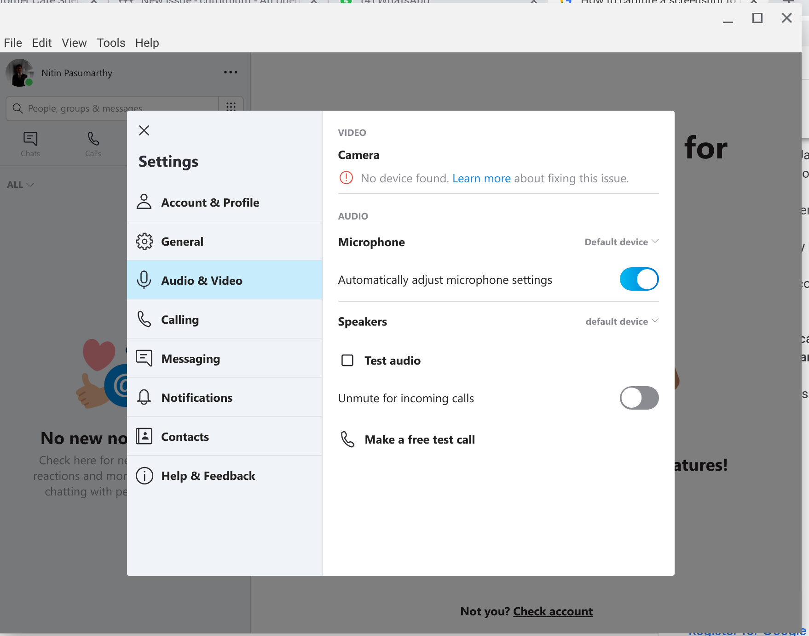

I've been paying close attention to the efforts bringing both sound and camera access to Linux apps in Project Crostini on Chromebooks. A few recent internal comments over the past few weeks make it pretty clear: Don't expect, for example, to record audio or have a Skype video chat in Linux any time soon. It appears that the Chromium team is taking a very measured approach when adding these features into Crostini.

On the audio side, the first step will add stereo playback only. That means no microphone access at that point for recording audio. When asked about audio recording in [the bug to track audio support](https://bugs.chromium.org/p/chromium/issues/detail?id=781398), a developer from the team offered this reply:

> The first version will be stereo playback only. Microphone access will come later, we want to make sure the access controls are just right before we allow untrusted code to use the microphone.

The focus on security makes sense. I'd rather have a completely trusted system for the Linux container to access hardware components on a Chrome OS device.

Once microphone access does arrive, you should be able to have audio chats in an app such as Skype or Hangouts within the Linux container. Video chat though? That appears to be even further out on the calendar, although there's no definitive timeline or release date.

I say that because of another dev team comment; this one from [a more recently reported bug](https://bugs.chromium.org/p/chromium/issues/detail?id=907701). Someone installed Skype for Linux on their Pixelbook and pointed out that the app can't access the microphone -- as noted above -- nor the camera. 

Here's the Chromium dev team member's response:

> we're working on audio support already (issue 781398). camera support isn't on the roadmap atm though, and prob will be a few releases before we look into it.
> 
> camera will probably be more work as i don't think we have any way of virtualizing or muxing streams (like we can with audio).

The "camera support isn't on the roadmap" is most telling and the "prob will be a few releases before we look into it" bit means this could be several months out since Chrome OS gets a major update roughly every 6 or so weeks.

That's a bit disappointing, but again, the measured approach is because of security: If Crostini was a fully independent Linux instance in a dual-boot situation, both the audio and video would be far easier to support. Since Crostini runs in a sandboxed container for security purposes, implementations have to consider total system security.

I was looking forward to these features, mainly because I use Skype and Audacity for recording two podcasts a week. It sounds like I'll be using a different machine for that at least until winter is over.
