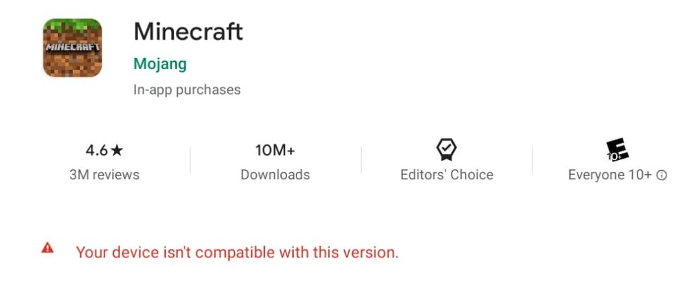
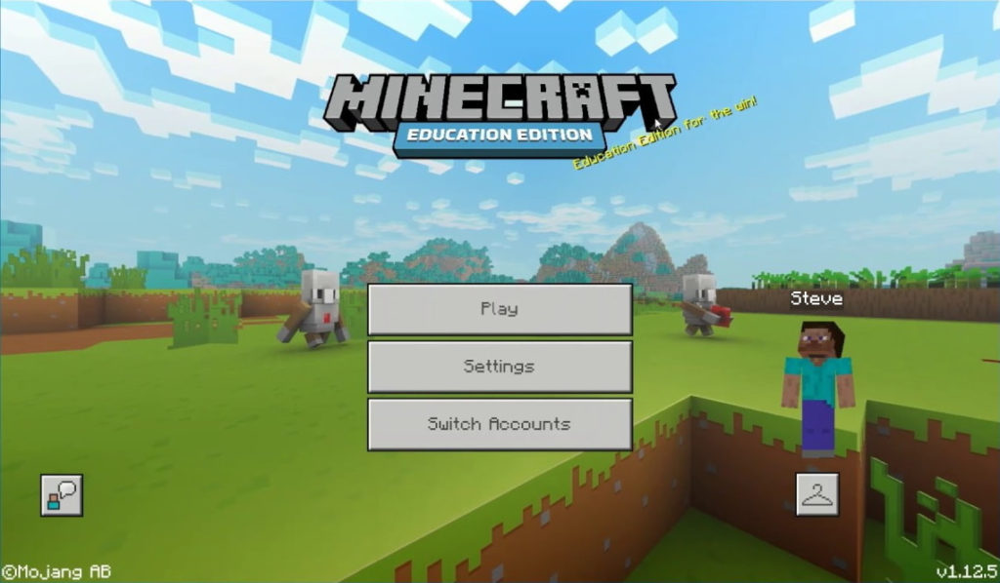

I get a lot of people asking how to best run Minecraft on a Chromebook and there are several ways to do it. You could run the Android version, although [that version seemed to disappear for most Chromebooks in June](https://chromeunboxed.com/minecraft-android-chromebook-chrome-os-google-pixelbook-go/).

Or you could run the Linux version, which isn't the easiest to install. There's a better way, thanks to [Microsoft releasing the Minecraft Education Edition for Chromebooks today](https://minecrafteducation.zendesk.com/hc/en-us/articles/360044728212), although you'll need to student Office 365 account. Lucky me: Thanks to my Computer Science classes at the local community college, I have one!

[The download is free in the Google Play Store for your Chromebook](https://play.google.com/store/apps/details?id=com.mojang.minecraftedu) and Microsoft has made it easy for IT admins to broadly roll out the popular gaming software across an entire organization. Of course, there's that restriction for Office 365 accounts:

> An Office 365 education account is required to play Minecraft: Education Edition on all platforms, including Chromebook. To learn more, see [Office 365 and Minecraft: Education Edition](https://minecrafteducation.zendesk.com/hc/en-us/articles/360001427808-Office-365-Education-and-Minecraft-Education-Edition-). We will soon be adding the ability to sign into Minecraft: Education Edition using your Google credentials if you have [linked the two accounts](https://support.google.com/a/answer/6363817?hl=en).

For those with limited free local storage available, be forewarned: Microsoft recommends having at least 350 to 500 MB for the app and Minecraft worlds. You'll also need to be on Chrome OS 83 or newer for the Minecraft Education Edition.

Note too that the Minecraft Education "normally runs about one full version behind the Minecraft Bedrock production version," [per Microsoft's FAQs](https://minecrafteducation.zendesk.com/hc/en-us/articles/360001641227-FAQ-Game-Features).

Clearly, even though Minecraft is a hit on gaming devices and PCs, Microsoft is trying the leverage the ability to use Minecraft to teach STEM in the classroom. And these days, most classrooms aren't buying PCs, at least not in the U.S. They're buying Chromebooks. So doubling down on the Minecraft Education Edition for Chrome OS laptops is a smart move for the company.

