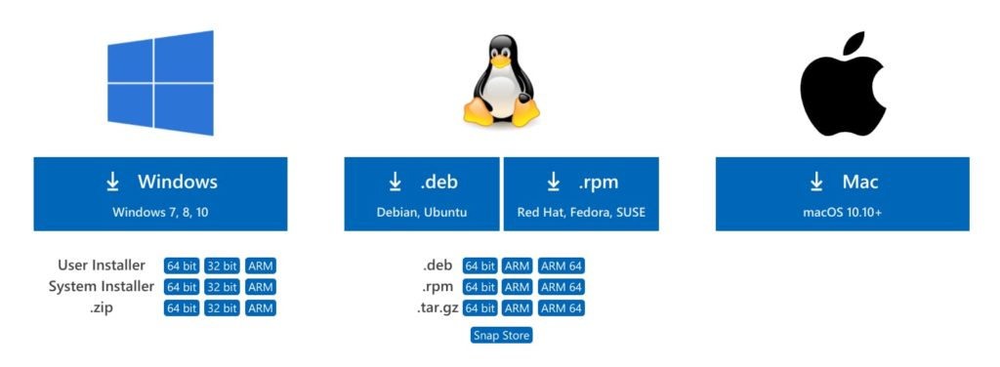
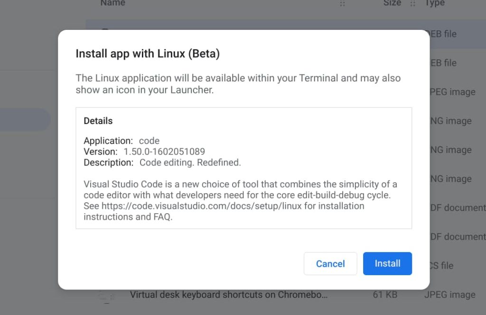

Back in March of 2019, I answered a reader question about [getting Microsoft Visual Code installed on a Chromebook](https://www.aboutchromebooks.com/news/reader-question-how-to-get-microsoft-visual-code-working-in-linux-on-an-arm-based-chromebook/). I use Visual Code and it's easy to install to the Linux container... unless your Chromebook has an ARM processor. There have been community builds of Microsoft's development software for ARM devices but with its latest software update, [Microsoft is officially supporting Visual Code on Chromebooks and other devices with ARM chips](https://code.visualstudio.com/updates/v1_50#_linux-arm-builds).

The news is tucked in to the September 2020 release notes for Visual Studio Code v. 1.5, and I verified it on [Microsoft's own download page](https://code.visualstudio.com/Download):

Installing Visual Studio Code on an ARM Chromebook is no different than [installing any other Linux package](https://www.aboutchromebooks.com/news/how-to-install-linux-apps-on-a-chromebook-without-ever-touching-linux/).

First, choose to download the .deb file for either ARM or ARM 64, depending on if your Chromebook uses a 32- or 64-bit ARM chip. Once the package is downloaded as a .deb file, navigate to it in your Chrome OS Files app and right-click the file to see your options. One of those will be "Install to Linux". Click that option to see package details and then click Install. Chrome OS should pop up a notification once the install is complete on the Linux partition of your Chromebook.

That's it! You should have a Visual Studio Code icon available in your Launcher that will open the application. If you're ever in a Linux terminal on your Chromebook, you can also enter the command `code` to launch it as well.

I've tried most of the major code editors available for Linux on my Chromebook and I keep coming back to Visual Studio Code time and time again. I won't say it's the best for anyone who codes, of course. However, on a Chromebook, it seems to be the most nimble of the pack and has enough features and extensions to help me [get through my Computer Science classes at the local community college](https://www.aboutchromebooks.com/news/can-you-learn-to-code-in-a-college-computer-science-program-with-a-chromebook/).
