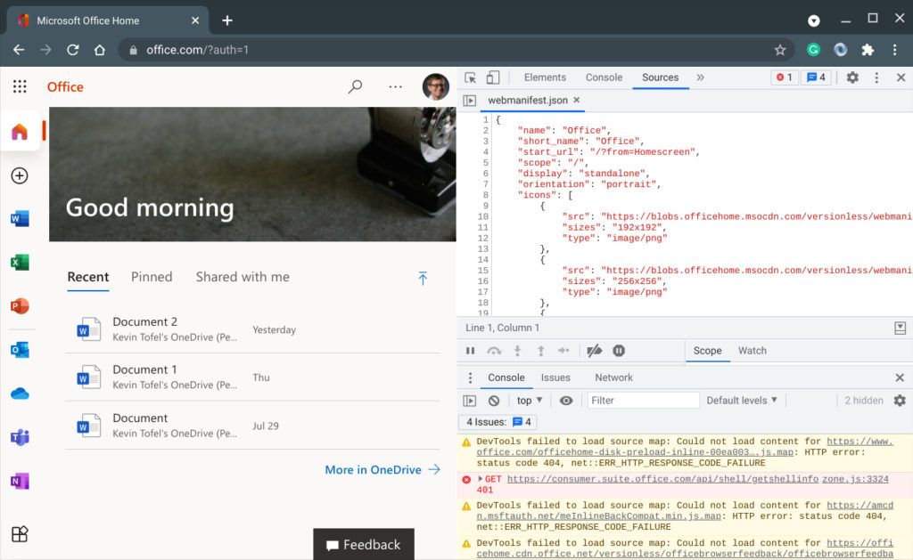
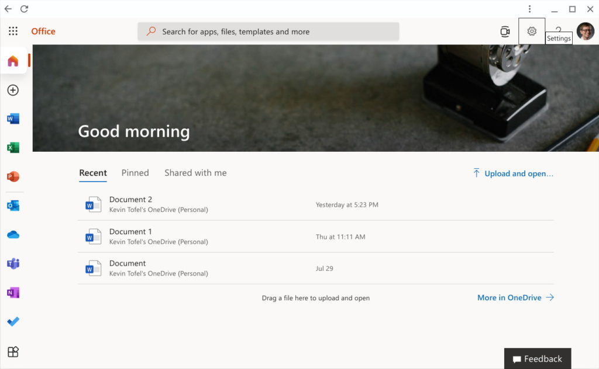
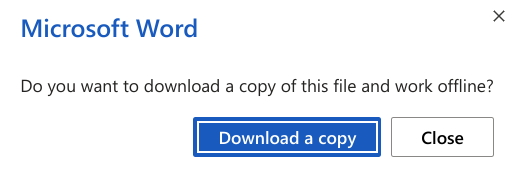
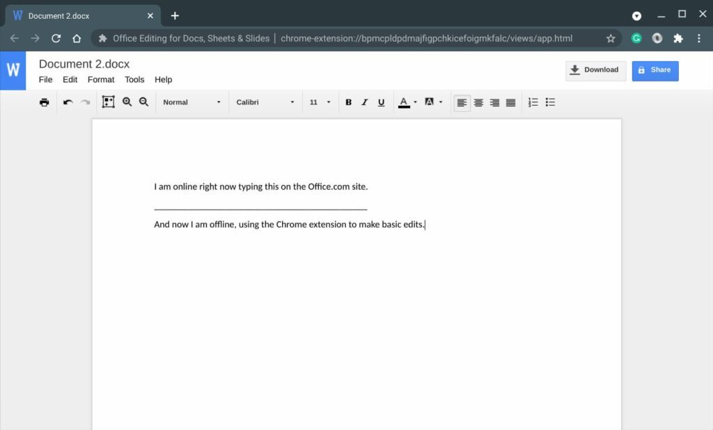

_**Update**: This post now includes a statement from a Google spokesperson that can be viewed at the end of the post._

Back in late June, there were reports that [Microsoft may be planning to move Office users on](https://windowsunited.de/chrome-os-microsofts-office-apps-funktionieren-nicht-mehr/) Chromebooks to the web. Some Chromebook users were seeing in-app messaging suggesting this. At the time, [I dismissed those reports](https://www.aboutchromebooks.com/news/microsoft-is-pushing-chromebooks-to-run-office-on-web-not-exactly/) as not all Chromebook users of the Office Android apps were seeing such messaging. It turns out I was wrong. Microsoft is dropping Chromebook support for Office Android apps next month.

I found this out after an email conversation with Microsoft's PR department yesterday. I had reached out because a reader of the site pinged me on Twitter, saying he had just seen the message that began appearing for some Chromebook users.

https://twitter.com/littvay/status/1430110307079368721

## Goodbye Chromebook support for Office Android apps

Last night, I received a response to my request, with a Microsoft spokesperson confirming the company's plans: A transition will begin next month on Chromebook support for Office Android apps. Instead of Android, Office on the web will be the way to use Microsoft's productivity suite on a Chromebook:

> "In an effort to provide the most optimized experience for Chrome OS/Chromebook customers, Microsoft apps (Office and Outlook) will be transitioned to web experiences (Office.com and Outlook.com) on September 18, 2021. This transition brings Chrome OS/Chromebook customers access to additional and premium features. Customers will need to sign in with their personal Microsoft Account or account associated with their Microsoft 365 subscription. More information is available here.”

To further clarify, sources tell me that Office on Android isn't going away.

Of course, that makes sense, given how many Android phones are in the market, every one of them being a [potential revenue source for Microsoft 365; the new branding for Office 365 and additional apps](https://www.microsoft.com/en-us/microsoft-365/blog/2021/08/19/new-pricing-for-microsoft-365/). And although Android users could use the web for Microsoft's Office apps, just like Chromebook users will, the apps are better optimized for phone screen sizes.

Chromebooks typically have 11.6- to 17-inch displays (yes, [there's a 17-inch Chromebook now](https://www.aboutchromebooks.com/news/early-look-at-the-17-3-inch-acer-chromebook-317/)), where responsive and scalable web apps likely make more sense from a support standpoint. Deciding to make this transition means Microsoft doesn't have to spend time and effort optimizing the small-screen Android productivity apps for the larger displays on Chromebooks.

## Hello Office web apps. What does this mean?

At this point, I'm sure most Chromebook owners reading this aren't happy. And I can understand that. Some people simply prefer native applications over web-based solutions. One of the main reasons is because the web equivalent of an app isn't always equivalent to that of a native app. There could be missing functionality, for example, or the inability to use the web app when offline.

I don't have any official comment from Microsoft to share on that front, but I did do some limited research on my own. I used my own Chromebook that has the Android version of Office installed and I also accessed Office365.com in my browser.

Instead of testing like-for-like comparisons of every feature, I looked specifically into using both solutions when offline. I did that mainly because I think that will be the most immediate pain point, whether real or perceived, on Chromebooks.

To nobody's surprise, I was able to use Office for Android on my Chromebook while offline. However, even though Microsoft began offering PWA's, or Progressive Web Apps, for its Office applications in 2019, I ran into issues using the web version.

For one thing, I didn't see a way to install the PWA at first, which typically appears in the Chrome browser as an option if a PWA is available. Update: **Update**: Thanks to a commenter suggesting I already had the PWA installed, I removed it and re-tested it. The PWA installation process was typical for a Chromebook.

And yet, it appears there is a PWA available. I opened up the Developer Tools in Chrome and found the [PWA-required manifest file](https://web.dev/install-criteria/) suggesting this:

When looking through the manifest file, I see the required criteria for PWA installation. So I checked the browser menu and found an "Open in Office" option; I would have expected an "Install" option like most other PWAs on my Chromebook. By choosing "Open in Office", the service appeared in its own app-like window as any other PWA would.

## The current experience isn't great for Chromebook users

At this point, I had the PWA app on my Chromebook and was able to pin the Office app icon to my system tray.

Note that it's still a messy implementation though. I can create a new document in the PWA perfectly fine. Accessing an existing document opens it in the browser, i.e. outside of the PWA.

Unfortunately, this doesn't work at all on a Chromebook when offline. At least not as of today. Clicking my new Office icon yields an error page because currently, the PWA is attempting to reach Microsoft's servers. Will that change between now and the September 18th transition? I certainly hope so but I have no news to share on that front at this time.

Indeed, on the support page link provided in Microsoft's statement, it clearly states that to use Office apps on your Chromebook, you should [navigate to the Office web page](http://www.office.com). You have to be online to navigate there.

I did find a method that provides some basic offline access, however.

While online and using Office on the web, I saved a local copy of a Word document. This appeared in the Files app of my Chromebook, as expected.

And by default, Google installs a Chrome extension on every Chromebook called [Office Editing for Docs, Sheets, and Slides](https://chrome.google.com/webstore/detail/office-editing-for-docs-s/gbkeegbaiigmenfmjfclcdgdpimamgkj?hl=en). You may not see it in your list of Extensions, but it's there. It works offline so you can view or edit Office documents locally in your browser.

No, this isn't the same as an Office Progressive Web App. It's not even close, actually.

You'll essentially be using Google Docs to make basic edits to whatever Office files you've downloaded. That means you won't many of the features that Office provides.

But, it's an option until Microsoft (hopefully) chooses to make its Office PWA a first-class citizen on Chromebooks. Perhaps we'll hear something about that officially between now and the transition period.

By the way: If you want a fully native productivity suite that does run locally on your Chromebook, there are other options. I wrote up documentation on [how to install LibreOffice in Linux on your Chromebook right here](https://www.aboutchromebooks.com/news/how-to-install-libreoffice-for-linux-on-a-chromebook-after-downloading-it-as-a-tar-gz-file/). It's not as painful as it looks and LibreOffice is fairly comparable to Microsoft's Office suite.

**Update**: I received the following statement on August 26, 2021, at noon ET from a Google spokesperson:

> "We're pleased to see Microsoft offer Chrome OS users a more optimized experience and embrace the open web. People love Chrome OS because it provides a speedy, secure, and simple computing experience and helps them stay connected while they work, study and stay entertained."

_Updated at 8:10 am ET reflecting the correct PWA installation process._  
_Updated at noon, ET on August 26, 2021, to include an official statement from Google._
