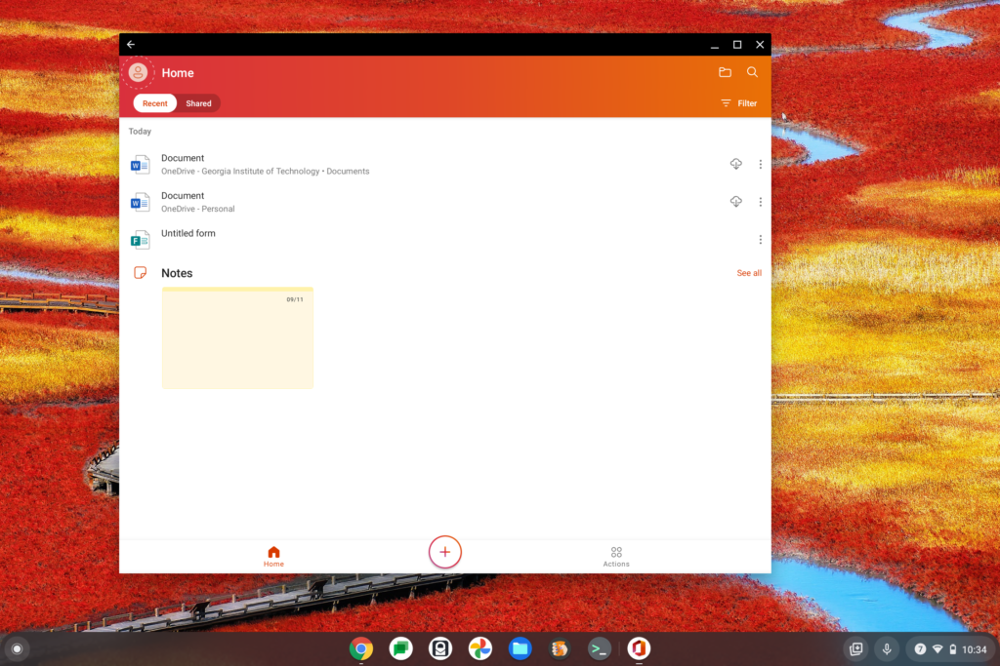
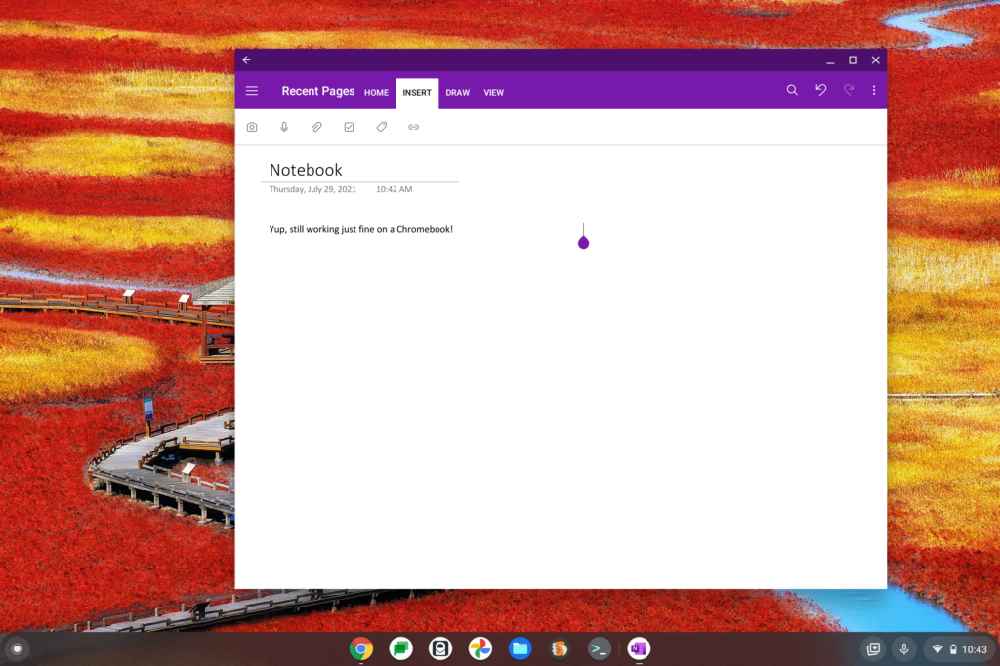

I woke up to several headlines that alluded to a "doom and gloom" situation for Chromebook owners who use the Microsoft Office Android apps on their devices. Based on reports that opening individual Office for Android apps on a Chromebook, Excel specifically, it appears that Microsoft is pushing Chromebooks to run Office on the web. Technically, that's true. But it's not doom and gloom yet from what I can see.

Here's the story as [first reported](https://windowsunited.de/chrome-os-microsofts-office-apps-funktionieren-nicht-mehr/) and then shared on [several](https://mspoweruser.com/microsoft-redirecting-chromebook-office-users-to-office-com/) [sites](https://www.windowscentral.com/microsoft-office-apps-redirecting-chromebook-owners-web). Essentially, someone on a Chromebook opened their Excel Android app and saw this scary message:

> "**Go to Office.com**: This version of the Office app is no longer supported. For the best and most recent experience with this device, go to Office.com"

I verified this when opening the [Excel for Android app on my own Chromebook](https://www.aboutchromebooks.com/news/how-to-install-excel-for-android-on-a-chromebook-incompatible/). That's where the above screenshot came from.

Yes, Microsoft is telling you to go to Office.com which will offer the web versions of its productivity suite. You can install those as a PWA, by the way, if you'd prefer.

But the individual Office apps, such as Word, Excel, and PowerPoint, are also available in the Android version of the Office app. [Microsoft introduced this package of tools back in early 2020](https://www.microsoft.com/en-us/microsoft-365/blog/2020/02/19/new-office-app-android-ios-available/).

And those don't redirect you at all. I checked.

You can happily use them on a Chromebook, although for editing documents, you'll need an Office365 license. That's been a requirement for years, so there's nothing new in that regard.

Aside from the poorly worded popup message, I don't see any evidence that Microsoft is starting to force Chromebooks to run Office apps through a browser. Instead, I see Microsoft consolidating its Android apps to a degree because it would rather people use all of its Office apps, not just a single one such as Excel, for example.

Indeed, back in 2020, Microsoft explained why it combined some of the main Office apps into a single suite:

> "Combining Word, Excel, and PowerPoint in a way that simplifies the experience with fewer apps to download or switch between. It requires far less phone storage than installing individual apps while maintaining virtually all the capabilities of the existing mobile apps people already know and use."

Keep in mind too Microsoft still shows [Office 365 plans as including Android support for its apps](https://www.microsoft.com/en-us/microsoft-365/buy/compare-all-microsoft-365-products), although now they appear as part of Microsoft 365. The company [rejiggered and rebranded these plans last year](https://techcrunch.com/2020/03/30/office-365-becomes-microsoft-365-and-gets-new-personal-and-family-plans/).

Granted, if you're an avid user of the apps such as OneNote or Outlook, those aren't in the Office for Android app. Clearly, if Microsoft is pushing Chromebook users of Office apps to web versions, it would do the same for those too. But it's not. I installed and opened OneNote and guess what? It didn't redirect me. It worked just fine.

Again, I see this messaging as a consolidation of the key Office apps into a single Android portal; not as a heavy-handed push to use Office on the web for Chromebooks. Granted the redirection message could be worded better but even so: The sky isn't falling yet, folks.
