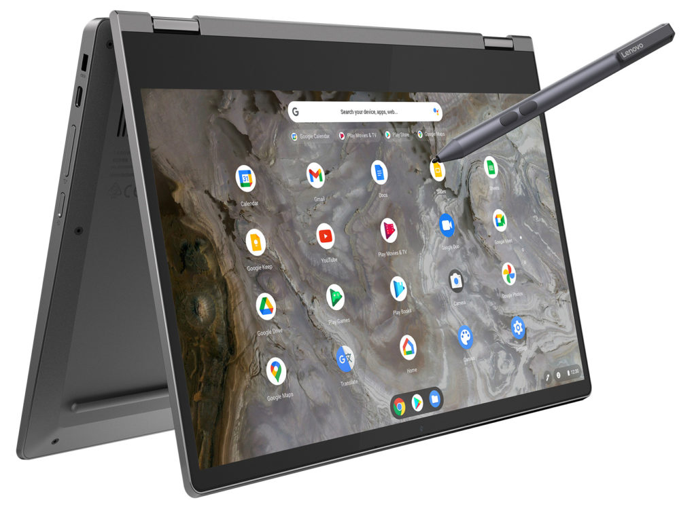
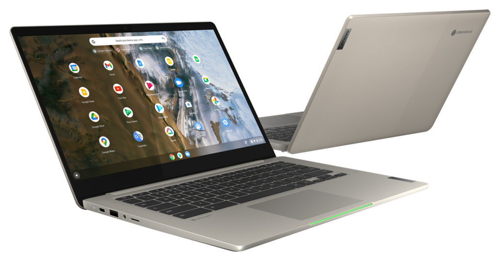
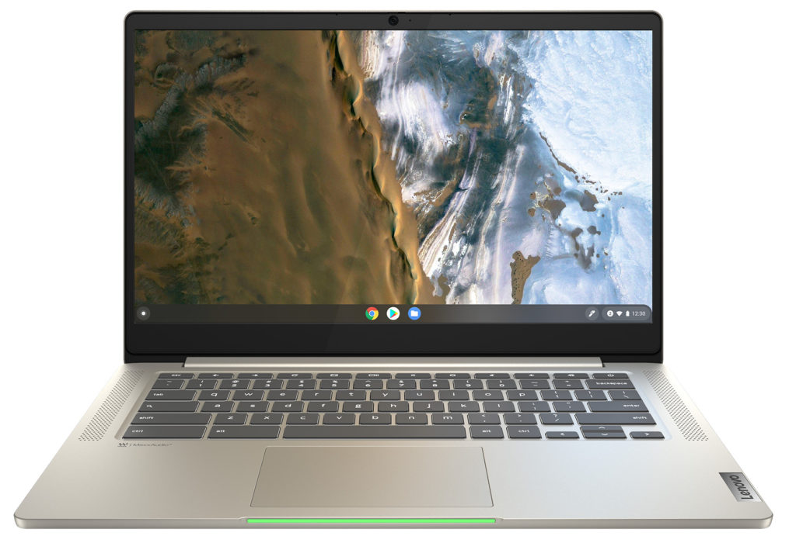

This week at MWC 2021, [Lenovo introduced a pair of Chromebook upgrades](https://news.lenovo.com/pressroom/press-releases/consumer-devices-for-living-a-hybrid-life-simply-mwc/) to its popular mid-range line. The new Lenovo Chromebook 5i and Flex 5i build on the popular formula used for last year's [Lenovo Chromebook Flex 5](https://www.aboutchromebooks.com/news/lenovo-flex-5-chromebook-hands-on-and-first-impressions/) with recent processors and a larger-sized option. Pricing begins at a reasonable $439.99 with availability starting this month.

There are two major differences between the Lenovo Chromebook 5i and Flex 5i, so let's get them out of the way first. By and large, these are very similar machines, save for this pair of unique attributes.

The 5i is a clamshell while the Flex 5i is a fully convertible Chromebook, as you'd guess. However, the two different form factors _**don't**_ use the same sized display.

If you want a convertible, the Lenovo Chromebook Flex 5i uses a 13.3-inch panel, while the standard Chromebook 5i nets you another diagonal inch with its 14-inch panel. And while both displays are 1080p IPS screens, the traditional clamshell model is brighter. The Lenovo Chromebook 5i can hit 300 nits of brightness, while the Flex 5i tops out at 250 nits.

Aside from that, just about everything is the same between the Lenovo Chromebook 5i and Flex 5i.

You're getting a choice of 11th-generation Intel processors from a Pentium up to a Core i5, either 4 or 8 GB of memory and local storage topping out at 512 GB.

Here's a rundown of the specs for each:

<table><tbody><tr><td></td><td>Lenovo Chromebook 5i</td><td>Lenovo Chromebook Flex 5i</td></tr><tr><td>CPU</td><td>Intel Pentium 7505 Intel Core i3 1115G4 Intel Core i5 1135G7</td><td>Intel Celeron 6305 Intel Pentium 7505 Intel Core i3 1115G4 Intel Core i5 1135G7</td></tr><tr><td>Display</td><td>14-inch, 1920 x 1080 IPS touchscreen, 300 nits</td><td>13.3-inch, 1920 x 1080 IPS touchscreen, 360-degree hinge 250 nits</td></tr><tr><td>Memory</td><td>4 or 8 GB of DDR4 RAM</td><td>4 or 8 GB of DDR4x RAM</td></tr><tr><td>Storage</td><td>128, 256, or 512 GB of SSD</td><td>32 or 64 GB of eMMC 128, 256, or 512 GB of SSD</td></tr><tr><td>Connectivity</td><td>WiFi 6, Bluetooth 5.1</td><td>WiFi 6, Bluetooth 5.1</td></tr><tr><td>Input</td><td>Backlit keyboard, multitouch trackpad, touchscreen, 720p webcam with physical privacy shutter</td><td>Backlit keyboard, multitouch trackpad, touchscreen, 720p webcam with physical privacy shutter, USI stylus support</td></tr><tr><td>Ports</td><td>2 x USB Type-C (3.1), 1 x USB Type-A (3.1), microSD card slot, combo headphone/mic jack</td><td>2 x USB Type-C (3.1), 1 x USB Type-A (3.1), microSD card slot, combo headphone/mic jack</td></tr><tr><td>Battery</td><td>Up to 10 hours claimed</td><td>Up to 10 hours claimed</td></tr><tr><td>Weight</td><td>3.13 pounds</td><td>2.98 pounds</td></tr><tr><td>Software</td><td>Chrome OS updates through June 2029</td><td>Chrome OS updates through June 2029</td></tr></tbody></table>

I almost forgot one other slight difference that's interesting.

The Lenovo Chromebook 5i has an LED light bar on the front of the chassis. Lenovo says the idea is to instantly show the battery life by color when opening the device: Green is good, amber is so-so and red means find an outlet soon. It's a nice throwback to the original Chromebook Pixel which had a similar indicator.

While I haven't had a chance to use either of these devices, I suspect Lenovo has a pair of potentially big sellers on its hands. After all, last year's model was a super value with its Core i3 configuration starting at $409.99 and [often on sale for less](https://amzn.to/3gQ3SSY).

The sales success may depend on what you get for the base starting prices of $439.99 for either model. I'm not reading into the specs on the base model pricing here; it's easy to assume you're getting a Celeron or Pentium for that cost.

I suspect, or maybe **_hope_**, that the introductory pricing is more of the mid-level configuration. And if that's the case, we'll see more budget-friendly configurations for everyday usage in the near future. Look for the Flex 5i this month with the clamshell 5i model arriving in July.
