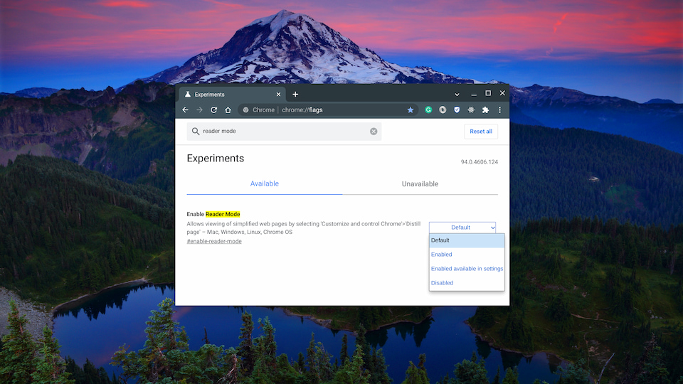
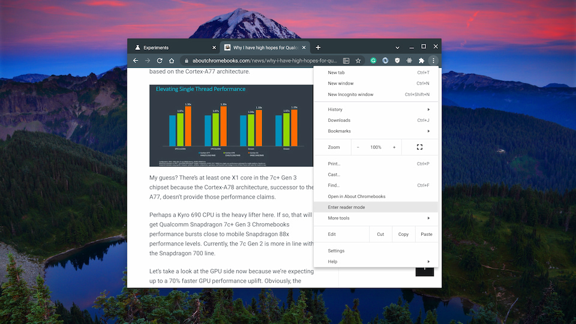
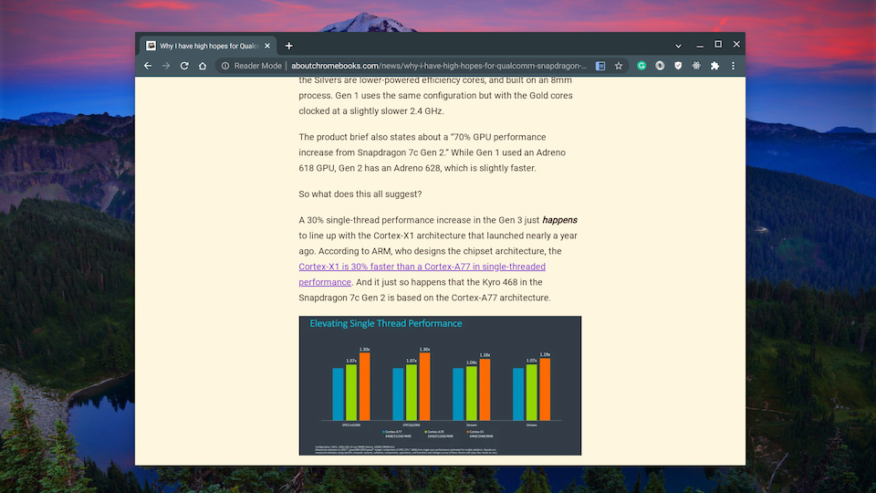
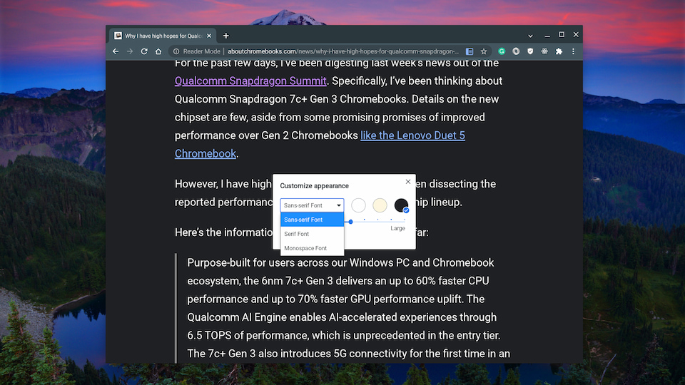

Like most of you, I browse the web. A lot. Probably for 60+ hours a week between work [and school](https://www.aboutchromebooks.com/news/linux-on-chromebooks-just-might-get-me-through-a-masters-in-computer-science/), I'm using a web browser with most of that time reading articles and stories. You might not browse as much as I do; in fact, I hope not. Even if you only surf for a third of that time, my favorite hidden Chrome OS feature makes this a better experience.

This feature is called "Reader Mode" and it's [actually been around since 2019! Essentially, it reduces the clutter from a web page to give](https://www.aboutchromebooks.com/news/chrome-os-75-reader-mode-how-to/) you a clean, relaxing interface. And yet, even arriving more than two years ago, this isn't an easy-to-find feature in Chrome OS. It's still hidden behind an experimental flag.

Luckily, it's easy to enable. Just copy and paste this link in your Chromebook browser: `chrome://flags#enable-reader-mode`. Then choose either of the Enabled options and restart your browser when prompted.

Once your browser restarts, you'll see a new icon in the browser address bar whenever you're on an individual web page. You can see it below, next to the Bookmark star in my browser. And you can also access it from the three-button Chrome browser menu, which is also shown. I personally prefer a single click, so I use the former method and tap the icon.

Both methods work the same, and here's an example result to show you the output:

Since Google originally introduced Reader Mode, it added a way to modify the background color, the text font, and the font size. To change those settings, just tap the "A" that appears above and to the right of the web content.

These settings come in really handy on the smaller screen of Chrome OS tablets, by the way.

It's true that there are third-party services and Chrome extensions that offer the same, if not more functionality. You might be familiar with them already.

But if you just need a distraction-free web experience to read articles, the Chrome OS Reader Mode feature is up to the task. And it might be getting new functionality as well. I've previously covered [another hidden Chrome OS feature](https://www.aboutchromebooks.com/news/chromebook-reading-list-of-saved-sites-is-improved-in-chrome-os-89/) that [brings a Reading List to your Chromebook](https://bugs.chromium.org/p/chromium/issues/detail?id=1109316).

That's available now as well but Google is still tweaking it. The last time I checked, [articles saved to a Reading List would be integrated into a view with Bookmarks and Reader Mode](https://bugs.chromium.org/p/chromium/issues/detail?id=1274847&q=reader%20mode&can=2).

Either way, this is my most-used, favorite experimental feature in Chrome OS. To be honest, I'm not sure why after all this time, it's not an available standard setting!
