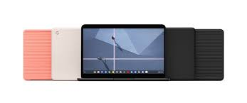
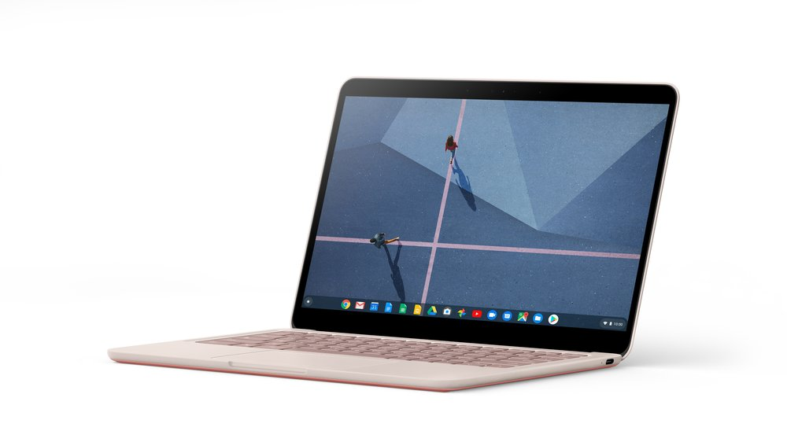
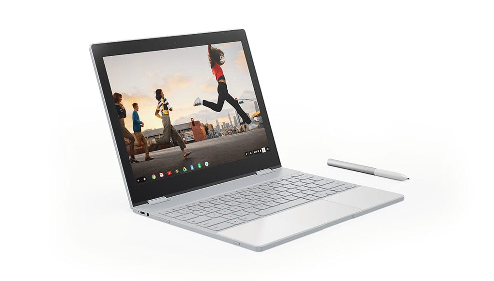
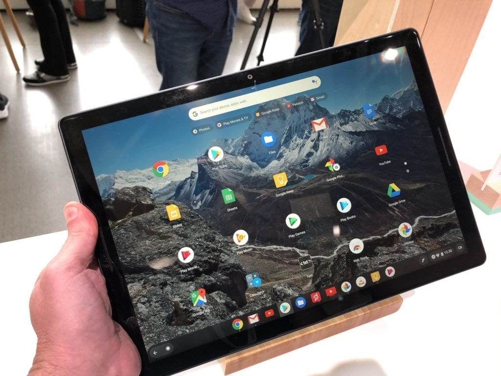
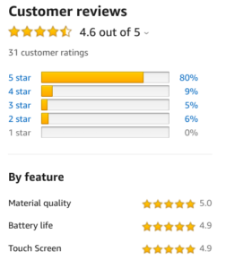

It's been an exciting 2019 in the world of Chromebooks, which comes to an end today. And about two weeks ago on a podcast, I shared what my Chromebook of the year is. But I put off writing about it, mainly because I was finding it difficult to explain why I chose what I did. After much reflection and quiet time during the holiday season, I figured it out.

But first, let me share my pick, which is certainly arguable: I think the best Chromebook for most people, and launched in 2019, is the [Google Pixelbook Go](https://store.google.com/product/pixelbook_go).

Now that doesn't mean everyone should buy a Pixelbook Go. There are good reasons why it's not the best choice for you. Perhaps you prefer a 2-in-1 over a clamshell, want digital stylus support or need a [higher-powered processor for development work in Linux](https://www.aboutchromebooks.com/news/acer-chromebook-spin-13-with-16-gb-ram-should-you-buy-one/). And in any of those, or similar cases, where the Pixelbook Go falls short, the right choice is a different device.

However, the base Pixelbook Go at $649 is sufficient and powerful enough for a majority of typical, mainstream Chromebook users.

So why does the Pixelbook Go not get the respect that I think it deserves? I thought of two reasons: Expectations and perceived value.

I admit I had an issue with the first reason when I saw the Pixelbook Go at its October launch.

Typically, Made By Google Chromebooks are considered the best of the best with the most powerful hardware and displays. That's not the case any longer because, in late 2018, we saw the launch of [Chromebooks with 4K displays](https://www.aboutchromebooks.com/news/lenovo-yoga-chromebook-c630-with-4k-screen-debuts-at-899-99/) and better performing U-Series processors. But we didn't, or at least I didn't, change expectations of what to expect from a Google-made Chromebook.

The second reason is confounding to me because it's the _same_ reason people passed on the original Chromebook Pixel devices and the Google Pixelbook. And yet the pricing of the Pixelbook Go is noticeably lower than either of these models while providing many improvements over them.

For perspective: I paid $1,499 for my Chromebook Pixel with LTE in 2013. I then bought a base Pixelbook for $999 in 2017 and [paid the same for Pixel Slate last year](https://www.aboutchromebooks.com/news/pixelbook-go-launch-pricing-specifications-pixel-slate-laptop/), plus had an additional $199 cost for a keyboard. The cost of entry to the Pixelbook Go is $649.

Sure, it's not a like-for-like comparison, but even if you do upgrade to the same basic specs of the older Pixelbook, the Go is $849, which is $150 less than its predecessor.

And yet most of the Pixelbook Go reviews were along the lines of "it's a great device but you shouldn't buy it because it's too expensive."

Ok, so **_why_** is it more expensive than a comparably equipped Chromebook? That's the question you have to ask to see if the premium is worth it when it comes to perceived value.

Here are my reasons why:

- Lighter and thinner than any similarly sized Chromebook.
- Better design and materials than most Chromebooks
- Speakers that are on par with, if not better than, those found in the Pixel Slate, which easily produce the best sound from any Chromebook.
- Improved hush-keys that are now what I consider the gold standard of Chromebook keyboards.
- Outstanding battery life in such a thin package

Yes, there are some "downgrades" from the Pixelbook when it comes to the Go. You lose the 2-in-1 form factor and stylus support as previously mentioned. The display resolution is lower and the screen aspect ratio is now 16:9. But in every other meaningful way, this is an upgrade from the Pixelbook and it comes at a lower cost.

Putting aside the reviews and my own personal opinion, what do actual customers who bought the Pixelbook Go think of it? Here's how it fares from [Best Buy reviewers for the $649 model](https://www.bestbuy.com/site/google-pixelbook-go-13-3-touch-screen-chromebook-intel-core-m3-8gb-memory-64gb-solid-state-drive-just-black/6382912.p?skuId=6382912):

That's pretty impressive in my book. And it's very telling to me that 91 percent of those buyers would recommend the Pixelbook Go to a friend.

Amazon reviewers don't rate the Pixelbook Go quite as high but of those who purchased the base model, 89 percent gave the device either four or five stars, with the majority choosing the top mark of five stars.

These folks didn't just read reviews of the device because if they did, they'd probably pass on the Pixelbook Go. Instead, they bought it, took a chance and came away more than satisfied by the design, performance, build quality and functionality. They got the aspirational Made By Google Chromebook for less than ever because perhaps the older models were simply priced too high for their budget.

Again, if something or some things in the Pixelbook Go don't cut it for you, looking elsewhere is the right choice. But out of my current stable of devices, which include an iPad Pro 11, HP Laptop 15t with 10th-generation Intel Core i7 (running Linux after removing Windows 10), Pixel Slate, [Acer Chromebook Spin 13 with 16 GB of memory](https://www.aboutchromebooks.com/news/acer-chromebook-spin-13-with-16-gb-ram-should-you-buy-one/), I'm reaching more and more for the Pixelbook Go because it gets the job done and is a joy to use.

I'd love to hear from readers who bought a Pixelbook Go to share their thoughts after using the device for some time.
