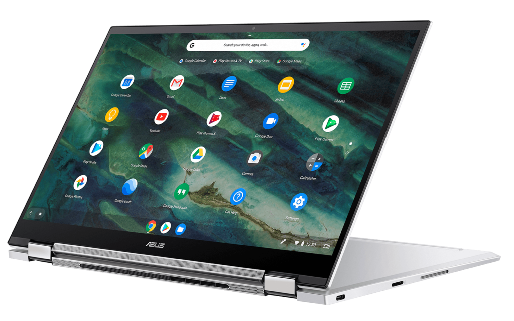
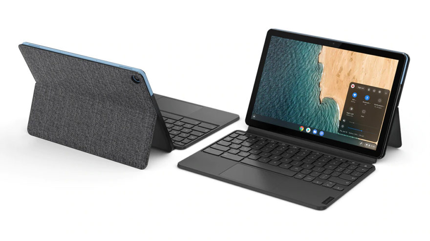

2020 was a terrible year for many important things that I needn't remind you of. But, I think it was a great year for Chromebooks. We saw more [high-end](https://www.aboutchromebooks.com/news/samsung-galaxy-chromebook-specifications-release-date-price-ces-2020/) [options](https://www.aboutchromebooks.com/news/asus-chromebook-flip-c436-specifications-release-date-price-ces-2020/) from companies not named Google, for example. We saw mid-range choices come in a lower prices, even before sales. And we saw a tablet computer show the form-factor's potential that didn't have a horrific launch like the Pixel Slate did. So it's tough to pick my personal Chromebook of the year.

And there were plenty of contenders. My own choices ranged from the [$279 Lenovo Duet Chromebook](https://www.aboutchromebooks.com/news/lenovo-ideapad-duet-chromebook-review-2020/) to the [$629 Acer Chromebook Spin 713](https://www.aboutchromebooks.com/news/acer-chromebook-spin-713-review/), with the [$409 Lenovo Flex 5 Chromebook](https://www.aboutchromebooks.com/news/lenovo-flex-5-chromebook-hands-on-and-first-impressions/) slotting in between the two from a pricing perspective.

You all had thoughts as well. When I asked what you would recommend for 2020 Chromebook of the year, I received a number of comments.

Here are a few, with others happy using older devices, agreeing with one of my top three contenders and even [my pick from 2019, the Pixelbook Go](https://www.aboutchromebooks.com/news/my-pick-for-2019-chromebook-of-the-year/) (although it doesn't qualify for this year's pick):

> If you want premium, I really like the Asus Chromebook Flip 436FA. The i3 feels every bit as fast as the i5 Acer Chromebook Spin 13, and it’s display somehow feels slightly larger. The 128GB PCIe SSD may help give it that extra bit of performance. The fingerprint sensor, back-lit keys, large glass touchpad, and USI stylus are all really nice to use everyday. The separation of the quad speakers sounds great. I often work an eight-hour day with it running only on battery. It’s also very pleasing to the eyes, with the lid open or closed.
> 
> Cajun Moses

Asus Chromebook Flip C436

> My new Acer Chromebook 715 with its full size keyboard, including a number pad and touch screen is my ideal computer. Those familiar with Chromebook already know the amazing capability compared with Windows 10 computers. During Black Friday sales I was able to buy for less than $300 including shipping and 7% sales tax.
> 
> Phil

Acer Chromebook 715

Obviously, a case can be made by anyone that the Chromebook **_they_** chose is the best. And it likely is... for them. So as I said last year with my 2019 pick, this isn't about the "best" Chromebook. We all have different budgets, use-cases, preferences and requirements, so there is no "best" Chromebook for everyone.

Having said that, my pick for 2020 Chromebook of the year is the Lenovo Duet Chromebook.

Now this isn't a device that I use often. [I reviewed it](https://www.aboutchromebooks.com/news/lenovo-ideapad-duet-chromebook-review-2020/), coming away mostly positive about it, and I take it out every now and again. Because of what I do on a Chromebook it really doesn't meet my daily needs.

Yes I can, and have, used it for general purpose browsing, email, streaming video consumption and writing blog posts. But I also write code on a daily basis, so I need something with more horsepower and a larger display, or at least, better large display support. I also need [strong Linux performance for some of my coding projects](https://www.aboutchromebooks.com/news/can-you-learn-to-code-in-a-college-computer-science-program-with-a-chromebook/).

Still, when I look at what Lenovo has delivered at a price of either $279 or $299, depending on the configuration, I have to admit it is an incredible value. You're getting a high resolution touchscreen tablet with included keyboard and stand. Frankly, the Lenovo Duet Chromebook is a little workhorse for under $300. And you can often find it on sale. As of today, [Best Buy has the 128 GB configuration for $249](https://www.bestbuy.com/site/lenovo-chromebook-duet-10-1-tablet-128gb-with-keyboard-ice-blue-iron-gray/6401727.p?skuId=6401727), a savings of $50.

Lenovo and MediaTek (who made the processor) should be commended for offering so much value for such a low price.

Here's how I see it: There are still hundreds of millions of daily computer users that haven't yet taken a chance on Chrome OS. In many cases, folks may have a specific need that a Chromebook can't meet. I get that. For many others in this group, though, they just haven't tried Chrome OS.

For a low cost-of-entry, this audience can take the chance of Chrome OS on a Lenovo Chromebook Duet. And they don't have to worry about spending $400, $800 or even more to take that chance. Simply put, I think the Lenovo Chromebook Duet is a great bridge between alternative computing choices and Chrome OS. Not to mention, many current Chromebook users picked one up for a secondary device.

No, the Lenovo Chromebook Duet isn't the fastest option out there but it's speedy enough for typical web and Android app usage. And it supports external monitors for use on a desk or in the office. Plus you can use it with a stylus for digital ink.

That's enough to move folks outside the Chromebook camp to the "hey, this isn't bad" crowd. And once they're there, they can explore other options that might be faster, offer larger displays or provide some other features and functions that they didn't know Chromebooks and Chrome OS even had. I'm thinking fingerprint sensors, multiple virtual desktops, and solid Linux performance.

I really expected the Pixel Slate to do this back in 2018 but it wasn't meant to be. That device had a much higher price point, for starters, although for good reason: The internal hardware is much more capable and the display is both larger and has a higher resolution than the Lenovo Duet Chromebook.

Design choices, such as the floppy-on-the-lap keyboard add-on and base model with [a poorly performing Intel Celeron chip](https://www.aboutchromebooks.com/news/celeron-pixel-slate-review-video/) didn't help. Nor did the weight or the state of Chrome OS at the time, which wasn't up to par with the actual hardware. That was eventually fixed but the damage had been done. So the Pixel Slate simply had no chance to appeal to new Chromebook owners on a widespread basis at launch.

In comparison, the Lenovo Duet has had great software support from day one, includes useful accessories for a full computing package at home or on the go and can easily be taken anywhere. It's a fantastic little device for an outstanding price and showed that even a low-cost Chromebook can keep many people productive and happy using Chrome OS. It's not a "perfect" Chromebook; that unicorn doesn't exist. But for the price, you're getting a ton of bang for buck.

Obviously, my opinion is simply that: my opinion. If you had to pick 2020's Chromebook of the year, which might not be the Chromebook you might yourself use, what would it be and why?
