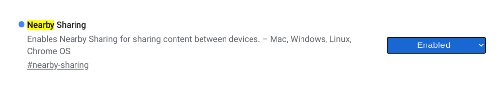
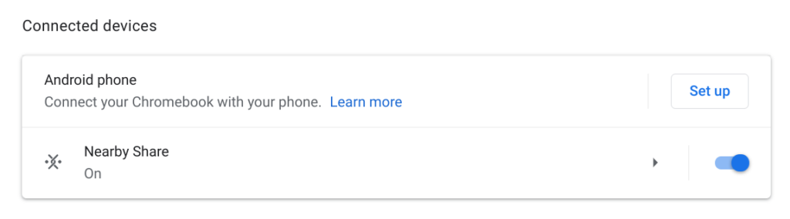
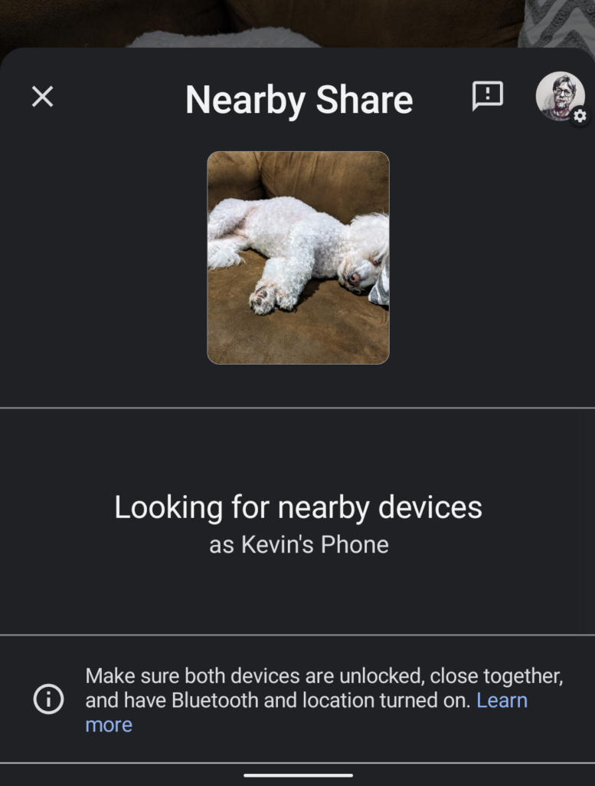

Well, I picked a great time to pull the SIM card from my iPhone and plop it into a Google Pixel 4. [Android devices running 6.0 or better now have a "Nearby Share" feature](https://blog.google/products/android/nearby-share/) that's functionally identical to Apple's AirDrop for iOS and macOS. With it, you can wirelessly share files and photos between two devices.

I tested it on two Pixel phones I have and it works great. But that's not a standard use case, of course.

Beaming a file from one person to another is the typical situation, and as long those two people have Android phones running a supported software version, it will work. I'm more interested in when it Nearby Share arrives on Chromebooks, which is in "the coming months", according to Google.

And by "coming months", I don't expect us to have to wait too long. Last month, [Chrome Story got Nearby Share working between Android and Chrome OS using the Canary channel](https://www.chromestory.com/2020/07/nearby-share/).

https://youtu.be/wfZxCPyLRwc

I'm running Chrome OS 85 Beta Channel and already see bits of Nearby Share on my Chromebook. There's the experimental flag to enable it, for example:

Enabling it and restarting the browser adds Nearby Share to the Settings options as well.

Unfortunately, with this version of Chrome OS 85 Beta Channel, that's as far as I can get.

The Nearby Share option doesn't appear in the right-click menu of Files to actually share the file. And trying to send a photo from my connected Android phone to my Chromebook doesn't yet work either.

Perhaps I'll drop down to the Dev Channel of Chrome OS 86, which is [currently available](https://omahaproxy.appspot.com/), and have more luck.

Either way, I don't see this feature sitting around in the Chromium Team for long.

Even if it's just hidden behind a flag for a bit, I suspect Chrome OS 86 will deliver this functionality.

Regardless, when it does arrive, you'll be able to share files between Android and Chrome OS, either over Bluetooth, WebRTC or peer-to-peer WiFi, whichever the system deems faster and available, making for a slightly more cohesive ecosystem.
