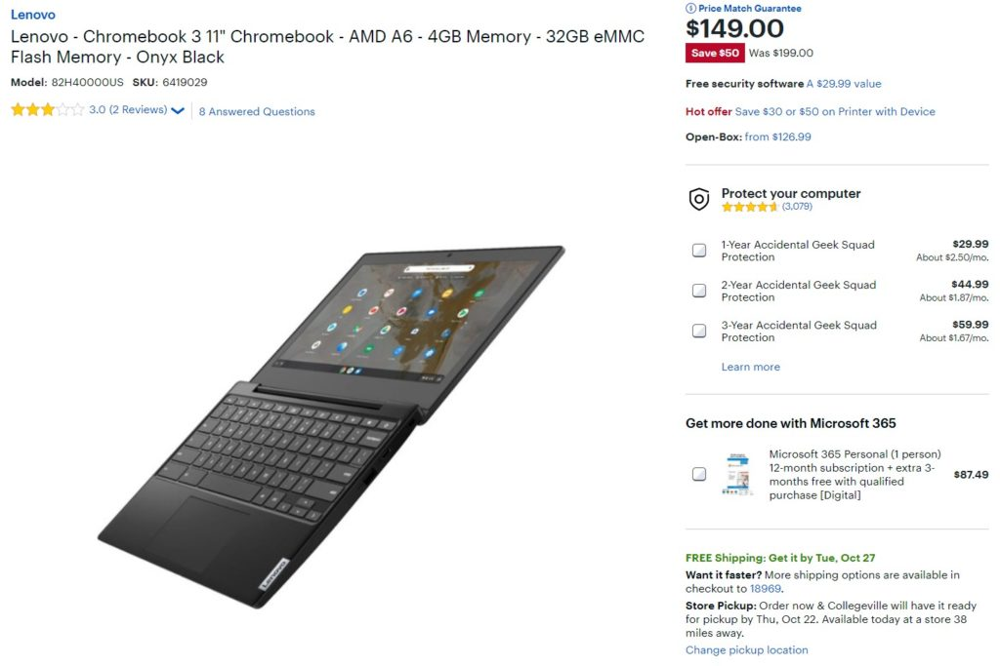
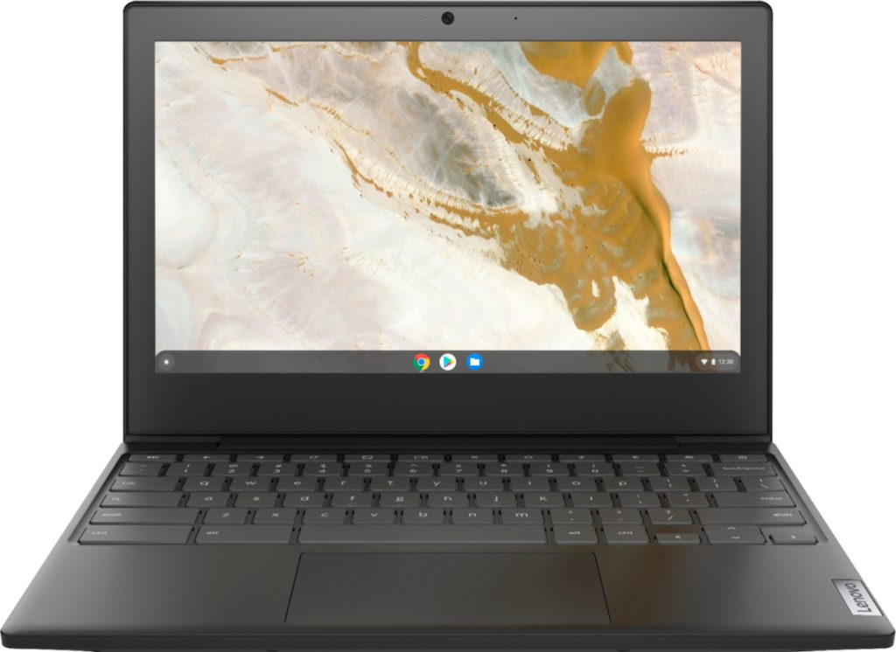

It's still difficult to find a Chromebook in stock since so many schools have turned to remote learning in 2020 and snapped up most of the available inventory. However, there are some viable options, particularly for elementary school students who don't need the [power or performance of a high-end Chromebook for school](https://www.aboutchromebooks.com/news/can-you-learn-to-code-in-a-college-computer-science-program-with-a-chromebook/). Best Buy is currently offering one of them and shipping is only about a week out. The [Lenovo Chromebook 3, normally priced at $199.99 is on sale for $149.99](https://www.bestbuy.com/site/lenovo-chromebook-3-11-chromebook-amd-a6-4gb-memory-32gb-emmc-flash-memory-onyx-black/6419029.p?skuId=6419029).

Obviously, this is a relatively bare-bones entry-level Chromebook. It has 4 GB of memory, 32 GB of local storage which can be expanded with a microSD card, and a small 11.6-inch 720p display with only 250 nits of brightness. And it's powered by an AMD A6 processor with integrated GPU. So you're looking at a Chrome OS laptop with Intel Celeron performance. No, it's not meant [to write code on or to run Linux desktop applications](https://www.aboutchromebooks.com/news/how-my-chromebook-is-getting-me-through-computer-science-college-classes/).

At this price, you're also giving up a touchscreen, backlit keyboard and fully convertible form factor: The hinge design only allows the screen to rotate 180-degrees.

However, it is capable of the occasionally used Android app, running a browser with a handful of open tabs, watching videos and, more importantly, participating in video conferencing calls.

In other words, for not too much money, the Lenovo Chromebook 3 can work just fine for remote learning in an elementary school environment. And it's not lacking USB ports either, in case a young learner needs to connect a printer, mouse, or some other peripheral. There is a USB Type-A and Type-C port on both sides of the chassis. And Google will provide software updates and security patches through June 2026, so it's got quite a bit of life left in it.

Connectivity is in the form of your standard Wi-Fi and Bluetooth radios and Lenovo claims the battery will last up to 10 hours, which is more than a school day. At least I hope it is!

Again, unless you're looking for a cheap basic browsing device or you need a Chromebook to get your kids online for school, this is a pass for most people. But if you're sharing a device so your kids can attend remote classes and you're looking to get them their own, the Lenovo Chromebook 3 should do the trick without busting your budget.

[Get the Lenovo Chromebook 3](https://www.bestbuy.com/site/lenovo-chromebook-3-11-chromebook-amd-a6-4gb-memory-32gb-emmc-flash-memory-onyx-black/6419029.p?skuId=6419029 "Get the Lenovo Chromebook 3")
