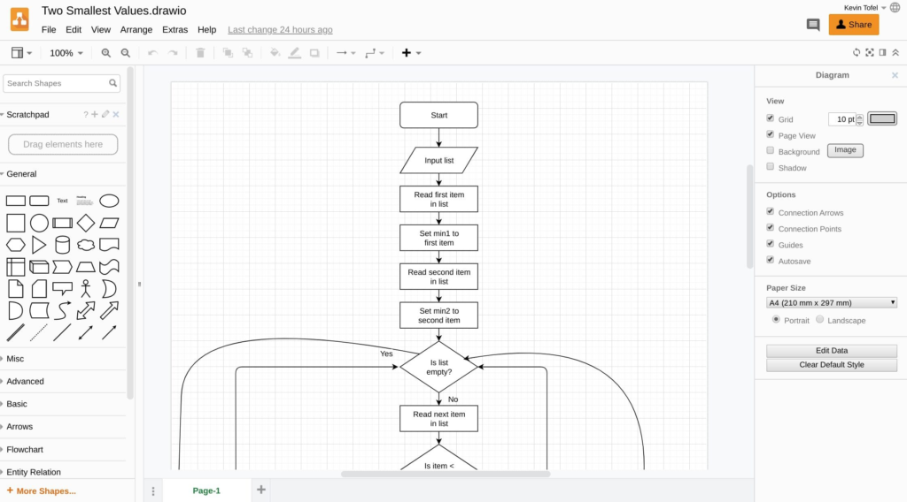
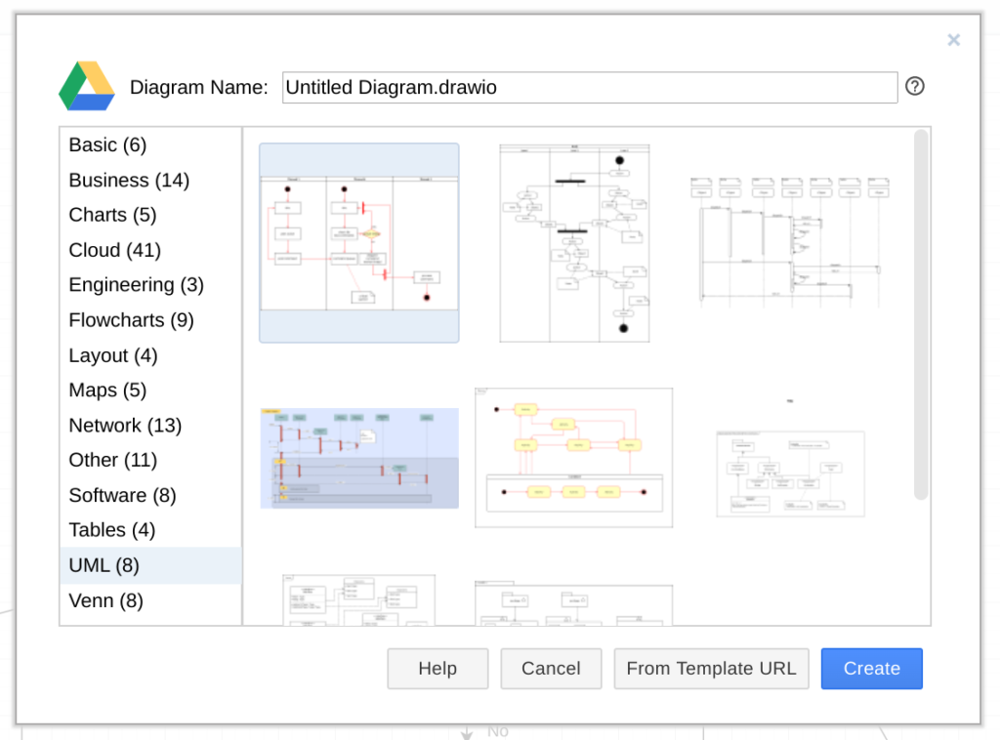

I've been [using a Chromebook for my college Computer Science classes to code for a year now](https://www.aboutchromebooks.com/news/how-to-code-on-a-chromebook-crostini-pixel-slate/). I was using a Pixel Slate but later upgraded to the highest configuration available for the [Acer Chromebook Spin 13 with 16 GB of memory](https://www.aboutchromebooks.com/news/acer-chromebook-spin-13-with-16-gb-ram-should-you-buy-one/).

Thanks to [Linux app support](https://www.aboutchromebooks.com/tag/project-crostini), I have my choice of [integrated development environments](https://www.aboutchromebooks.com/news/android-studio-chrome-os-chromebook-recommendation-google-io-2019/), code editors and other tools. This week, however, I was tasked to create a flowchart for an algorithm and wondered if there was a better online tool than Google Sheets to build it.

I found several different options but eventually settled on [Draw.io, a free browser based diagramming tool](https://about.draw.io/). It integrates with Google Drive as well as Microsoft One Drive and you can save diagrams locally as well.

I find that the available range of elements alone makes Draw.io super useful. And there are plenty of advance options as you can see above as well.

Diagramming isn't just for flowcharts though.

When starting a new diagram, Draw.io offers more than 100 different options and sub-options including Charts, Cloud diagrams, Network maps, and UML or Unified Modeling Language documents; something else I need to create from time to time in my classes.

The Google Drive integration is awesome: I shared a flowchart with one of my classmates via a sharable link. When I changed my diagram, she saw the updates in near real-time. So there's a collaboration aspect that adds value here as well.

Again, there are a number of these types of tools available online. But Draw.io just got added to my Chromebook toolbox because it's easy to use, powerful and has a broad array of diagram options.
