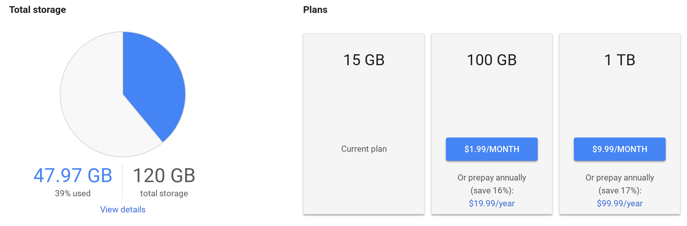

With so many Chromebook and Nexus / Pixel phone purchases in the past, I have yet to pay for Google Drive storage. But all good things come to an end and my 1 TB of free space from the 2015 Chromebook Pixel purchase -- just ran out. Luckily, it's getting cheaper for Drive space thanks to [Google One](https://one.google.com/getupdates).

[Google announced the consumer product rename](https://blog.google/products/google-one/one-simple-way-get-more-out-google/) on Monday, along with cutting some plan prices and adding a new plan. Here's a rundown of the [new Google One storage plans and monthly prices, per TechCrunch](https://techcrunch.com/2018/05/14/say-hello-to-google-one/):

- 100 GB for $1.99
- 200 GB for $2.99 (This is a new plan)
- 2 TB for $9.99 (Was $19.99 prior to Google One)
- 10 TB for $99.99
- 20 TB for $199.99
- 30 TB for $299.99

Google says the new plans will be rolling out over the next few months, starting in the U.S. I'll likely wait for the new pricing because these are my current options on the smaller plans -- I don't need 10 TB or more:

What makes this an even better deal though is an additional sharing feature: With Google One, storage can easily be shared between six people using [Google Families](https://families.google.com/families). And the icing on the cake is included 24/7 Google Experts support for help via chat or phone on any Google consumer product or service.

Clearly, with only 39 percent of my Drive storage currently used, I can wait for the new plans. But once they come online, I'll assess how much storage I and my family need. If possible, the 200 GB for $2.99 a month is what I'm aiming for.

I wish Google had a plan between the 200 GB and 2 TB options, say 1 TB for $4.99 a month because that's likely the sweet spot for me and my three family members. Note that existing 1 TB Drive plans will get upgraded to the new 2 TB plan "at no extra cost". So you'll still pay what you're paying today for 1 TB but Google will be doubling your storage. Essentially, the 1 TB plan is being sunset in favor of the 2 TB tier.
