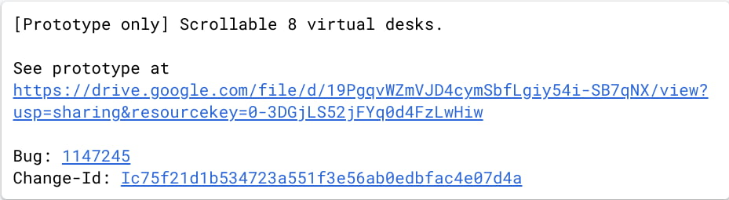

I _love_ me some [virtual desks when using my Chromebook](https://www.aboutchromebooks.com/tag/virtual-desks/). I use one for blog research and writing. One for college coding classes and school email. And one for non-productive activity. That's three out of the four available desks. If you need more than the current four, [Chrome Unboxed notes that you might have a doubling of desks on your Chromebook](https://chromeunboxed.com/chromebooks-virtual-desk-upgrade-8-chrome-os).

The key word here is "might" and not just because some coding efforts for Chrome OS never make it to the general public. The code for this 8-desk feature is specifically tagged as a "prototype".

And if eight isn't enough desks for you, there's even a comment about [designing this code so that it could be doubled yet again to 16](https://chromium-review.googlesource.com/c/chromium/src/+/2564328):

> You don't have to do things the same way, but I hope to design it in such a way that if we decide in the future to move from 8 to 16 desks, the changes are minimal. Happy to discuss more if you want.

Of course, today we see a maximum of four virtual desks across the top of a Chrome OS display. Adding more and seeing up to sixteen might be tricky to see, which is likely why this feature would be scrollable. I'm thinking you'd see a max of eight at one time but could scroll left or right across the virtual desks.

As exciting as this might for a productivity booster, I wonder how many mainstream Chromebook owners actually use virtual desks at all?

Google surely knows, based on telemetry data. Perhaps even if many don't use the feature, the data may show that those who **_do_** often use the maximum of four.

I'm happy with my three-desk set up so I doubt I'd ever need eight, or sixteen, for that matter. Would you? If you had the ability to use even up to eight virtual desks, how would you use them? Maybe you'll convince me I need to adjust my workflow. ;)
