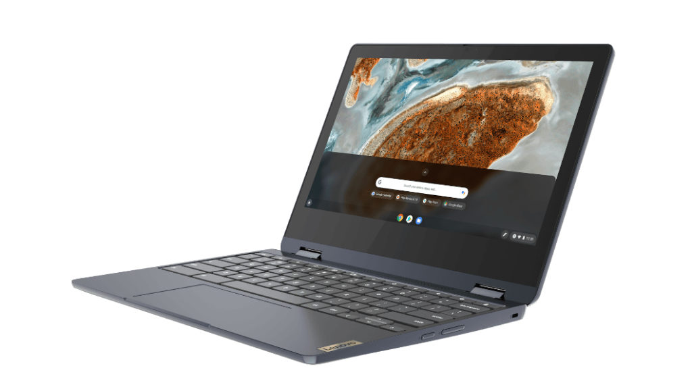
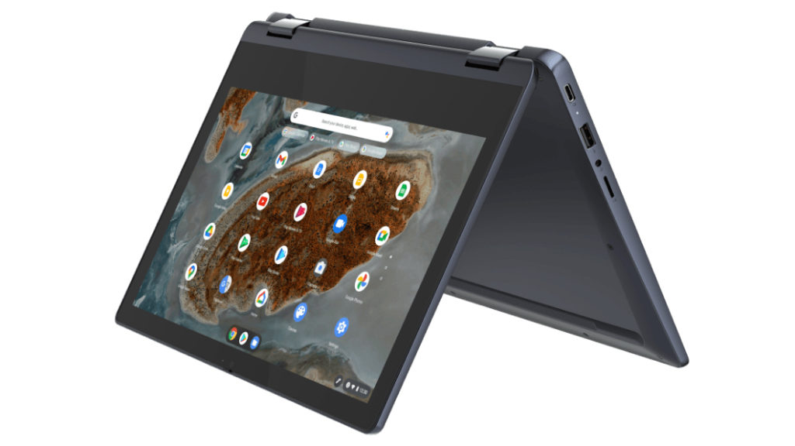

Earlier this week I spotted updated [14-inch Lenovo Chromebooks that swap out the Intel CPUs](https://www.aboutchromebooks.com/news/14-inch-mediatek-powered-lenovo-ideapad-3-cb-chromebook-incoming/) from last year's model. Today I see there's a smaller sibling that you can buy directly from Lenovo. The new [11.6-inch Lenovo Chromebook Flex 3 with MediaTek inside debuts at $319.99](https://www.lenovo.com/us/en/laptops/lenovo/student-chromebooks/IP-Flex-3-Chrome-11M836/p/88IPFC31601).

Interestingly, just today [The Verge reviewed the Flex 3i with a Celeron N4020](https://www.theverge.com/22400085/lenovo-ideapad-flex-3-chromebook-review-price-screen).

They noted that the screen was a bit weak given the 250 nits of brightness and 720p resolution. Sadly, there doesn't seem to be much improvement with regard to the screen of the Lenovo Chromebook Flex 3, priced $10 less than the Intel version.

You still end up fitting the same 1366 x 768 resolution panel in the nearly identical chassis, which is a bit cramped. And yes that bottom chin bezel needs a drastic shave!

Just like with the 14-inch model with MediaTek MT8183, you don't get as many ports, (nor as new) with this processor.

The left side of the chassis has One Type-C and one Type-A, both using older standards. That's all, folks!

As far as the rest of the hardware, it's about what you'd expect for a new Chromebook costing just over $300 these days:

<table><tbody><tr><td>CPU</td><td>MediaTek MT8183 octo-core processor (4 x A73 @ 2 GHz / 4 x A53 @ 2 GHz)</td></tr><tr><td>GPU</td><td>ARM Mali G72 GPU</td></tr><tr><td>Display</td><td>11.6-inch HD (1366 x 768) glossy IPS panel with up to 250 nits brightness, touch support, and 170-degree viewing angle</td></tr><tr><td>Memory</td><td>4 GB LPDDR4 1866MHz</td></tr><tr><td>Storage</td><td>32 or 64 GB eMMC 5.1, microSD card slot</td></tr><tr><td>Connectivity</td><td>802.11 ac Wi-Fi (2 x 2), Bluetooth 4.2</td></tr><tr><td>Input</td><td>Non-backlit keyboard, Buttonless Mylar surface multi-touch touchpad, 720p webcam and privacy shutter</td></tr><tr><td>Ports</td><td>1 USB Type-C 2.0 (with PD 2.0 and DP 1.1a), 1 USB Type-A 2.0, headphone / microphone combination jack, lock slot, 2 x 2W speakers</td></tr><tr><td>Battery</td><td>42 WHr, expected run time up to 16 hours, 45W USB-C charger, supports Rapid Charge (80% in one hour)</td></tr><tr><td>Weight</td><td>2.65 pounds</td></tr><tr><td>Software</td><td>Chrome OS automatic update expiration: June 2028</td></tr></tbody></table>

On the plus side, if this configuration can get you or your kids through the day, you won't likely need to plug it in until bedtime. The MediaTek MT8183 is a decent little chipset that sips electricity.

And you do get the versatility of a 360-degree hinge for tent mode or content consumption. Plus you get that sliding privacy shutter for the webcam; I'm a fan of that.

Any potential takers here for school, the kids or a knock-around browser for the couch?
