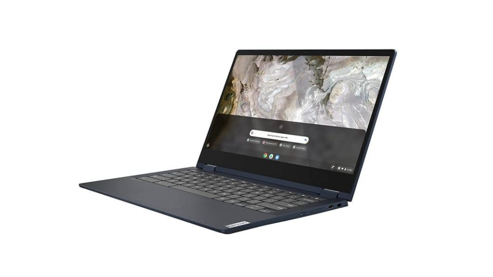
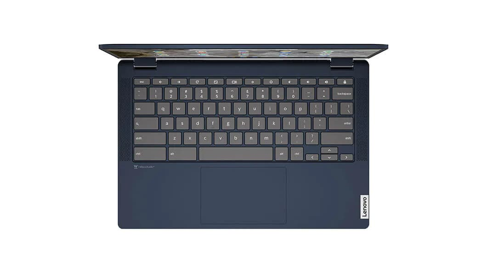

Two weeks ago, I reported that the [11th-gen Core i3 Lenovo Flex 5i Chromebook with 8GB of RAM debuted at $549.99](https://www.aboutchromebooks.com/news/mwc-2021-lenovo-chromebook-5i-and-flex-5i-debut-look-great-on-paper/). That's a Costco deal and a step up from the base model. You can still purchase that configuration from Costco, but if you can get by with less memory and system storage, you can [get the base model for $424.99 directly from Lenovo](https://www.lenovo.com/us/en/laptops/lenovo/student-chromebooks/IdeaPad-Flex-5i-Chromebook-Gen-6/p/WMD00000497).

On the one hand, that's a $115 savings from the $539.99 suggested retail price. On the other hand, you're dropping down to 4 GB of memory and 64 GB of slower eMMC storage. The higher-priced configuration provides 128 GB of faster NVMe local storage.

Here's a refresh of the full specs on this updated 11th-gen Core i3 Lenovo Flex 5i, which is very similar to [last year's model that I really liked as a mid-range choice.](https://www.aboutchromebooks.com/news/lenovo-flex-5-chromebook-hands-on-and-first-impressions/)

<table><tbody><tr><td>CPU</td><td>Dual-core <a href="https://ark.intel.com/content/www/us/en/ark/products/208652/intel-core-i3-1115g4-processor-6m-cache-up-to-4-10-ghz.html" target="_blank" rel="noreferrer noopener">Intel Core i3-1115G4</a> processor</td></tr><tr><td>GPU</td><td>Intel Integrated UHD Graphics</td></tr><tr><td>Display</td><td>13.3-inch IPS 1920 x 1080 touchscreen, 16:9 aspect ratio, 250 nits brightness</td></tr><tr><td>Memory</td><td>4 GB DDR4x-3733MHz memory</td></tr><tr><td>Storage</td><td>64 GB eMMC storage microSD card slot for expansion</td></tr><tr><td>Connectivity</td><td>WiFi6 (802.11ax, 2x2 MIMO), Bluetooth 5.0</td></tr><tr><td>Input</td><td>Spill-resistant backlit keyboard, USI stylus (optional) support, 720p webcam with physical privacy shutter</td></tr><tr><td>Ports</td><td>1 USB Type-A (3.2), 2 USB Type-C (3.2), headphone/microphone combo jack</td></tr><tr><td>Battery</td><td>51 WHr, expected run-time up to 10 hours</td></tr><tr><td>Weight</td><td>2.97 pounds</td></tr><tr><td>Software</td><td>Chrome OS automatic updates through June 2029</td></tr></tbody></table>

All in all, this discounted price isn't a bad deal. The newest 11th-gen Core i3 in the Lenovo Flex 5i Chromebook from packs a decent performance punch. A full HD display is nice even if it's not the brightest in the world. The real choice becomes: can you live with 4GB of memory since you can't upgrade that on your own? To a lesser extent, there is slower storage with less capacity too, but my primary concern would be the memory.

For everyday browsing with a reasonable amount of tabs open -- say 10 or less -- at a time, I don't think the memory limitation will ever rear its ugly head. Once you add more browser tabs, Android and/or Linux apps is when you'll wish for more memory. If that's not the way you work, it's a pretty good deal that should meet your needs!

Keep in mind that you can often get [the 4 GB version of last year's model with 10th-gen Core i3 for even less](https://www.aboutchromebooks.com/news/this-lenovo-chromebook-flex-5-sale-is-almost-as-good-as-the-amazon-prime-day-deal/) than both of the deals. Most recently, I saw that one cost $342. Something to consider...

