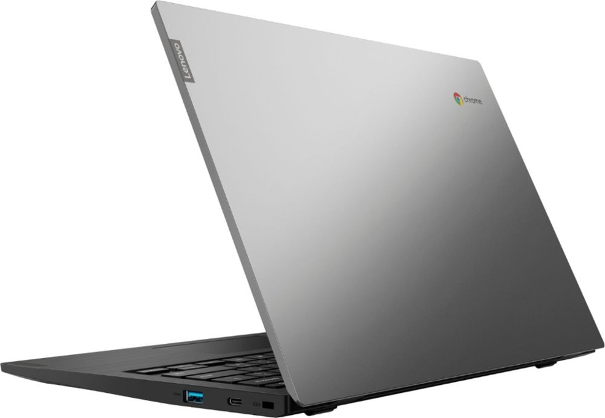

Earlier this month, [Lenovo announced a trio of new Chromebooks in the C340 and S340 model lines](https://www.aboutchromebooks.com/news/lenovo-chromebook-c340-s340-release-date-specs-pricing/), each with different screen sizes but all with Intel processors. It turns out there's actually a _fourth_ variant, the Lenovo Chromebook S345 that runs on AMD's processors.

[Amazon shows the device is currently unavailable](https://amzn.to/30xSZts), however, [Best Buy says I can buy one and have it delivered this weekend](https://www.bestbuy.com/site/lenovo-s345-14ast-14-touch-screen-chromebook-amd-a6-series-4gb-memory-amd-radeon-r5-32gb-emmc-flash-memory-platinum-gray/6361115.p?skuId=6361115&ref=212&loc=1&ref=212&loc=1&ds_rl=1260666&ds_rl=1260576&ds_rl=1266837&ds_rl=1266837&gclid=Cj0KCQjwzozsBRCNARIsAEM9kBMoT9VwFENx2mgQpQ1SXUxf2es2LYRs8scl_4tC6dWOW0ngxsS_Sd4aAubBEALw_wcB&gclsrc=aw.ds) with 4GB of memory and 32 GB of storage for $329.

While the unannounced Lenovo Chromebook S345 looks nearly identical to the S340 model, it's not a 2-in-1 device. This is a clamshell, made evident not only the obvious images but also due to the rear of the chassis: It's squared off by the hinges as compared to the rounded back edge of the S340. You can fold the display back to a full 180-degrees however.

Other than the processor and form-factor changes, just about everything else looks the same or closely shared with the Chromebook S340. Here are the official specs from Lenovo's own product documentation that I found from searching:

Note there are a few other additional details here, indicating some variances in the display configurations:

Again, the design is very similar to the Lenovo Chromebook S340, although some of the ports have been moved around.

- 
    
- 
    
- 
    
- 
    
- 
    
- 
    
- 
    
- 
    

Given that the price of the Intel-powered Lenovo Chromebook S340 starts at $249.99, you'll want to compare the specs of that device with this very similar 14-inch model with the AMD processor if you're in the market.

It's difficult to make that comparison until the S340 actually appears in stores because the official specs don't outline the base model's internals. Instead, the spec list has a lot of "up to...." references when it comes to memory, storage and such.
