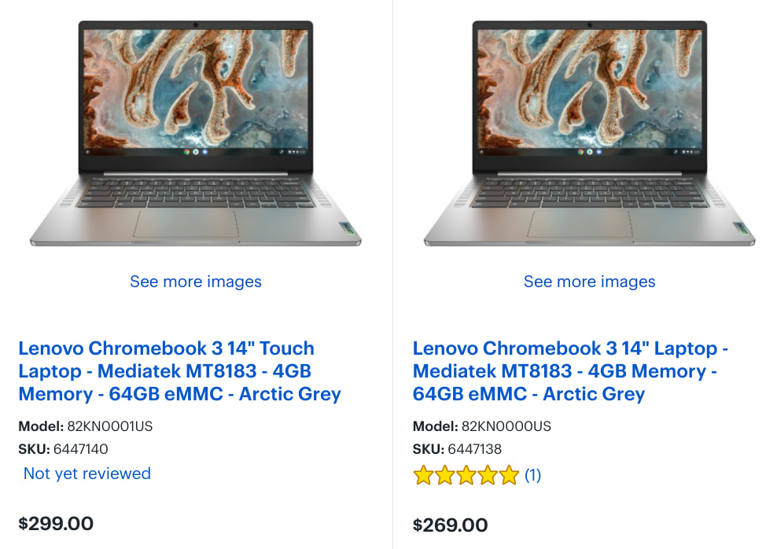
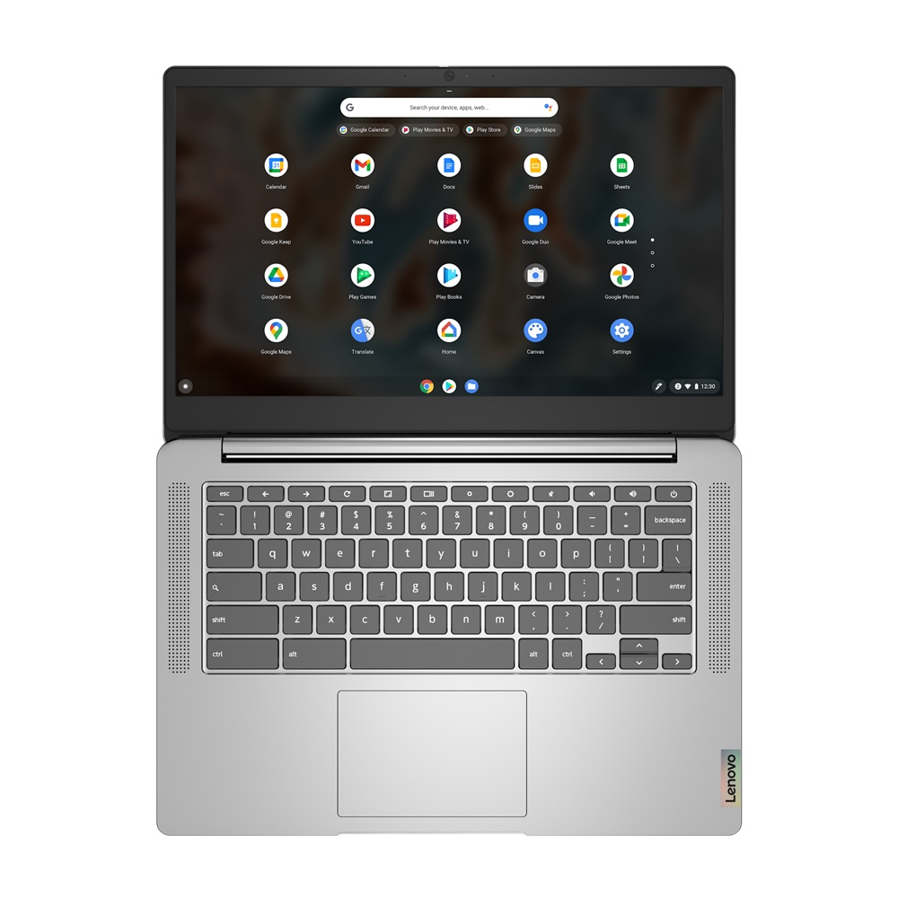
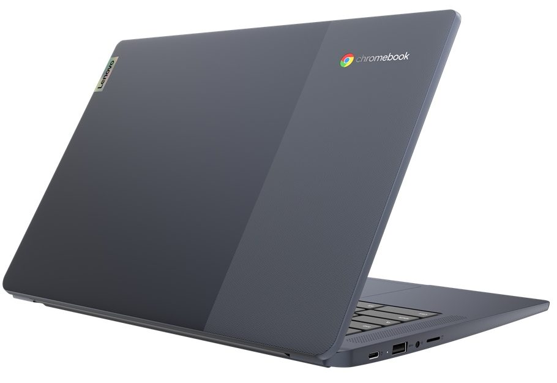

Last month, [I spied a new version of the Lenovo Chromebook 3](https://www.aboutchromebooks.com/news/14-inch-mediatek-powered-lenovo-ideapad-3-cb-chromebook-incoming/) that swaps out the Intel Celeron with a more power-efficient MediaTek processor. Now, just a few weeks later, the updated device has become available with little to no fanfare. The new 14-inch Lenovo Chromebook 3 with MediaTek inside is available, [starting at $269](https://www.bestbuy.com/site/lenovo-chromebook-3-14-laptop-mediatek-mt8183-4gb-memory-64gb-emmc-arctic-grey/6447138.p?skuId=6447138).

The updated model, or should I say models, are available at Best Buy.

Yes, there are two of them and [the base configuration at the $269 cost doesn't include a touchscreen](https://www.bestbuy.com/site/lenovo-chromebook-3-14-laptop-mediatek-mt8183-4gb-memory-64gb-emmc-arctic-grey/6447138.p?skuId=6447138).

I'd say splurge an extra $30 and [get the configuration that does support touch](https://www.bestbuy.com/site/lenovo-chromebook-3-14-touch-laptop-mediatek-mt8183-4gb-memory-64gb-emmc-arctic-grey/6447140.p?skuId=6447140) because everything else about these two devices is identical. Even if you can live without a touchscreen, Lenovo's product reference says the non-touch model isn't as bright and uses a TN panel for the display: Go for the brighter screen with the better viewing angles. Your eyes will thank me!

Here's a rundown on [the specs from Lenovo's reference guide for these model numbers](https://psref.lenovo.com/Product/IdeaPad/IdeaPad_3_CB_14M836) (because Best Buy seems to be off on some), again with the only difference between the options is the display panel:

<table><tbody><tr><td>CPU</td><td>MediaTek MT8183 octo-core processor (4 x A73 @ 2 GHz / 4 x A53 @ 2 GHz)</td></tr><tr><td>GPU</td><td>ARM Mali G72 GPU</td></tr><tr><td>Display</td><td>14-inch FullHD (1920 x 1080) anti-glare TN panel with up to 220 nits brightness, non-touch, 16:9 aspect ratio OR 14-inch FullHD (1920 x 1080) anti-glare IPS panel with up to 300 nits brightness, touch support, 16:9 aspect ratio </td></tr><tr><td>Memory</td><td>4 GB LPDDR4 1866MHz</td></tr><tr><td>Storage</td><td>32 or 64 GB eMMC 5.1, microSD card slot for storage expansion</td></tr><tr><td>Connectivity</td><td>802.11 ac Wi-Fi (2 x 2), Bluetooth 4.2</td></tr><tr><td>Input</td><td>Non-backlit keyboard, Buttonless Mylar surface multi-touch touchpad, 720p webcam</td></tr><tr><td>Ports</td><td>1 USB Type-C 2.0 (with PD 2.0 and DP 1.1a), 1 USB Type-A 2.0, headphone / microphone combination jack, lock slot, 2 x 2W speakers</td></tr><tr><td>Battery</td><td>42 WHr, expected run time up to 16 hours, 45W USB-C charger</td></tr><tr><td>Weight</td><td>2.87 pounds</td></tr><tr><td>Software</td><td>Chrome OS automatic update expiration: TBD but likely June 2028</td></tr></tbody></table>

From a performance perspective, the new Lenovo Chromebook 3 won't compete with a recent Core i3 or better. However, the [MediaTek 8183 is basically the same ARM processor used in last year's Lenovo Duet Chromebook](https://www.mediatek.com/blog/media-love-the-lenovo-chromebook-duet-powered-by-mediatek), which gets you a good bang for your buck.

Expect these devices to be solid everyday browsers for basic activities with a handful of tabs open at most or some light Android app usage and you'll likely be happy.

