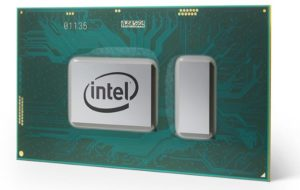

[Acer Next](https://www.acer.com/ac/en/US/content/global-press-conference-2018#_ga=2.54928802.868058875.1527004056-1763315616.1527004056), the company's global press conference, happens today in New York at 11am and will show off a pair of new Chromebooks aimed at the enterprise market. Expect the company to show off the Acer Chromebook Spin 13 and Acer Chromebook 13.

The Chromebook Spin 13 is the more powerful of the two when it comes to processors. You'll get a choice between an 8th-gen [Intel Core i5-8250U](https://www.intel.com/content/www/us/en/products/processors/core/i5-processors/i5-8250u.html) or [Core i3-8130U](https://ark.intel.com/products/137977/Intel-Core-i3-8130U-Processor-4M-Cache-up-to-3_40-GHz) paired with up to 16 GB of memory and up to 128 GB of storage capacity. Processor options for the Chromebook 13 are the same Intel Core i3-8130U, [Pentium 4415U](https://ark.intel.com/products/96508/Intel-Pentium-Processor-4415U-2M-Cache-2_30-GHz) or [Celeron 3865U](https://ark.intel.com/products/96507/Intel-Celeron-Processor-3865U-2M-Cache-1_80-GHz),

Both devices have an aluminum chassis, a Gorilla Glass trackpad and a 13.5-inch IPS touch display running 2256 x 1504 resolution in a 3:2 aspect ratio. Of course, based on the name, the Spin 13 display can completely fold back thanks to the 360-degree hinges. That will be useful since the Spin 13 houses a Wacom EMR stylus pen for handwriting input, notes and drawing.

\[gallery type="slideshow" ids="666,667,668,669"\]

Each also has USB-C ports on the left and right so you can choose which side to plug in the device charger; a feature I've come to love on my Pixelbook. Battery life should be around 10 hours. Both Chromebooks have a standard USB port and microSD memory card slot as well as 2x2 MIMO 802.1ac Wi-Fi and Bluetooth 4.2 radios. Google Play Store support for Android apps will be available on the pair as well.

Tune in below at 11am ET to see these new Chromebooks where we'll hopefully hear more on pricing and availability. Clearly the Chromebook Spin 13 model will command the higher price between the two; I'd expect it to start around $500 while I'm hoping the Chromebook 13 is in the $350-ish range for a base model.

_**Update**_: According to Android Central, [the base Acer Chromebook 13 will cost $399](https://www.androidcentral.com/acer-announces-four-new-chromebooks-two-which-are-2-1s).

\[embed\]https://youtu.be/Q2ZZbMBsJuc\[/embed\]
