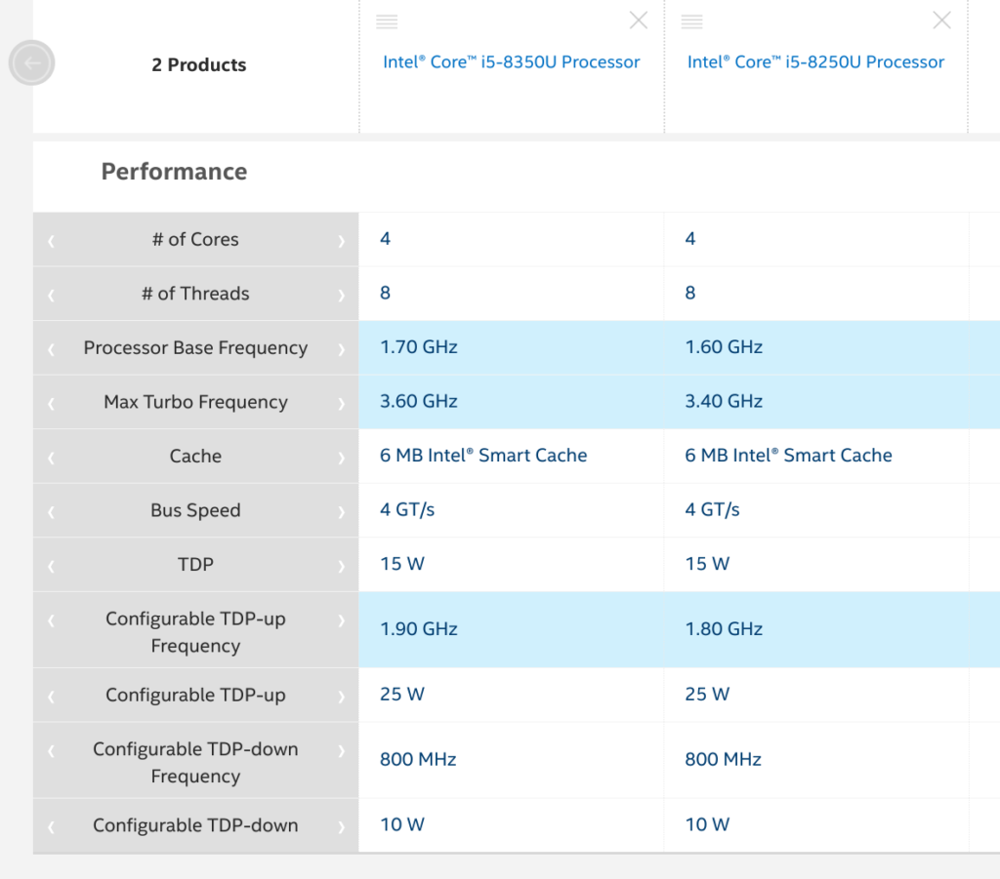

<iframe style="width:120px;height:240px;" align="right" marginwidth="0" marginheight="0" scrolling="no" frameborder="0" src="//ws-na.amazon-adsystem.com/widgets/q?ServiceVersion=20070822&amp;OneJS=1&amp;Operation=GetAdHtml&amp;MarketPlace=US&amp;source=ac&amp;ref=qf_sp_asin_til&amp;ad_type=product_link&amp;tracking_id=aboutchromebo-20&amp;marketplace=amazon&amp;region=US&amp;placement=B07GD4CMDH&amp;asins=B07GD4CMDH&amp;linkId=d8eca73b0ca6b32d17381635d056ade7&amp;show_border=true&amp;link_opens_in_new_window=true&amp;price_color=333333&amp;title_color=0066c0&amp;bg_color=ffffff"></iframe>

Although [I just bought an Acer Chromebook Spin 13 with 16 GB](https://www.aboutchromebooks.com/news/acer-chromebook-spin-13-with-16-gb-ram-should-you-buy-one/), I still hit up Acer's website on a regular basis. You never know when something new is going to appear, [such as that $1,569 model with a Core i7 processor last month](https://www.aboutchromebooks.com/news/acer-chromebook-spin-13-with-core-i7-16-gb-ram/). Today was another surprise: [Two new configurations of the Acer Chromebook Spin 13 priced at $929.99 and $1,049.99](https://www.acer.com/ac/en/US/content/professional-models/laptops/acerchromebookspin13).

These two new configs aren't massively different from the existing models though, all of which are still available. Essentially, Acer bumped the processors from an Intel Core i5-8250U chip to the Core i5-8350U.

If you're thinking these are newer chips, they're actually not. Intel released both the 8250U and 8350U at the same time. There's barely even any performance difference, as shown by [Intel's comparison page](https://ark.intel.com/content/www/us/en/ark/compare.html?productIds=124969,124967):

I'm not sure why Acer added these configurations other than to have a few more higher-end options available: These are still 8th generation processors even though [Intel has already announced newer CPUs](https://www.anandtech.com/show/14782/intel-launches-comet-lakeu-and-comet-lakey-10th-gen-core-for-low-power-laptops), which Dell is using for its latest Windows laptops.

For example, you can buy the previous model with a slightly slower 8250U chip, 8 GB of RAM and 64 GB of storage for $899.99. Switch to the 8350U and you'll pay a $30 premium.

Acer's $999.99 "old" model has the 8250U, 16 GB of memory and 128 GB of storage; that's the one I bought refurbishedfor $819. The same RAM and storage capacities with the 8350U chip will cost you $50 more.

If you're in the market for the Acer Chromebook Spin 13 and want the "best" available chip, I suppose the newer models are the way to go. But if you don't mind a barely slower processor, I'm betting you can find some good deals on the configurations that have [been around for nearly a year](https://www.aboutchromebooks.com/reviews/acer-chromebook-spin-13-review-vs-pixelbook/).
