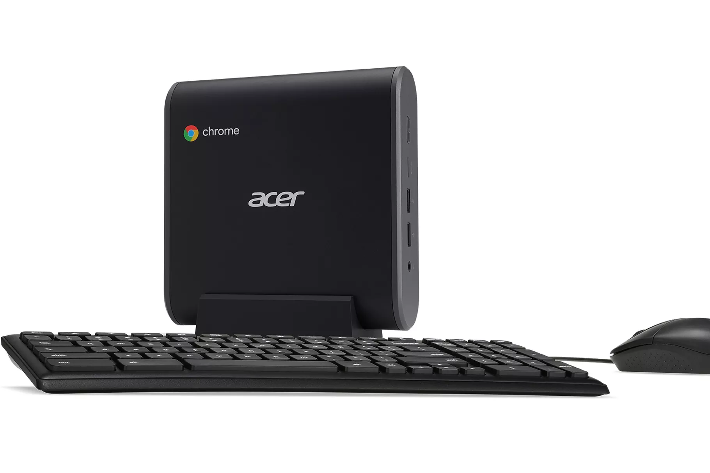

Acer, Asus and HP all introduced new Chromeboxes in January at the Consumer Electronics Show and other events, but it appears Acer will be the first of these vendors to actually ship the new devices. Chrome Unboxed got a tip that [four Acer Chromebox models are now available to pre-order](https://chromeunboxed.com/acer-chromebox-cxi3-available-shipping-april-19) from several retailers with a starting price of $298 and shipping dates of April 19.

Aside from the price differences, the four models vary based on choice of processor, memory and storage options.

For under $300, you'll get an Acer Chromebox running on an Intel Celeron 3865U, paired with 4 GB of memory and 32 GB of SSD storage. Jump up to $470 and the box will use a seventh-gen Intel Core i3, 8GB of memory and 64 GB of local storage. $520 bumps you to a newer eighth-generation Core i5 with the same memory and storage capacities while $745 brings an eighth-gen Core i7 with 16 GB of RAM.

All of the models provide a microSD card slot, a USB-C port, multiple traditional USB ports, HDMI out, Wi-Fi, Bluetooth and Gigabit Ethernet support.

While the two higher-end models might be more than you'd expect for a Chromebox, keep in mind they use Intel's newest processors; not even the $1,000 Pixelbook uses those. Of course, you can spend around the same or less on a Windows PC desktop, the value of Chrome OS is in how light the operating system is, which helps keep it speedy and makes software updates have little to no impact on the user.
