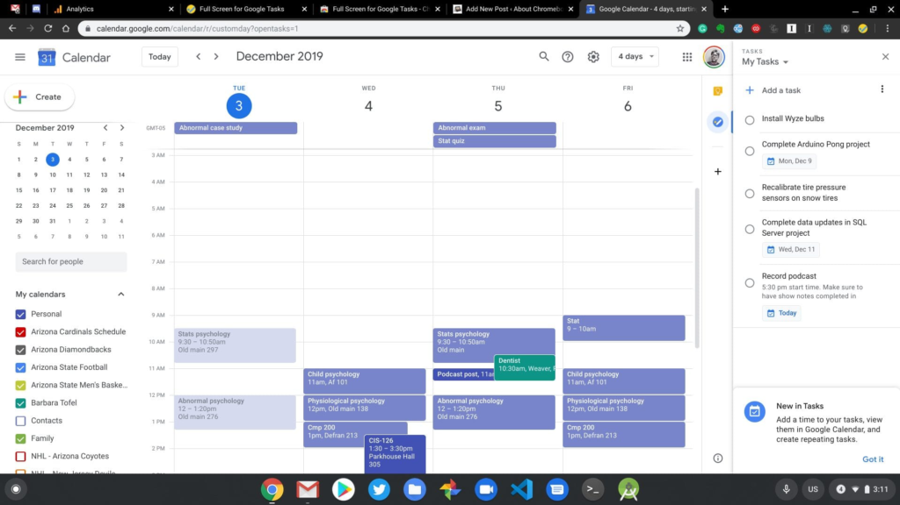
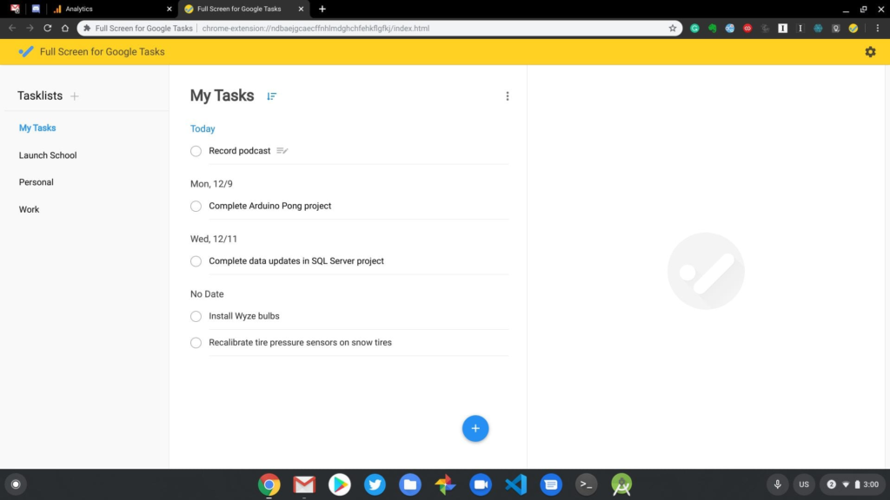
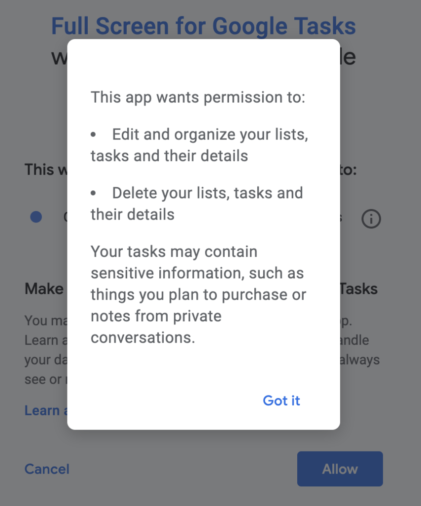

If you're a Google Tasks user, there's a holiday season surprise available to you today. A [new third-party Chrome extension called Full Screen for Google Tasks](https://chrome.google.com/webstore/detail/full-screen-for-google-ta/ndbaejgcaecffnhlmdghchfehkflgfkj) recently launched and although there are some limitations, it's a solid way to manage tasks on your Chromebook.

On Tuesday, [Redditor ZYinMD debuted his extension](https://www.reddit.com/r/chromeos/comments/e5dyqh/a_new_standalone_desktop_app_for_google_tasks/), which he made because he's a coder and he relies heavily on Google Tasks. And although the extension opens up in a new tab, you can actually run it as in standalone mode if you'd like.

I installed it on the Pixelbook Go earlier today and it's so much better than the native Google Tasks functionality built into Google Calendar. Here's a comparison showing how much more room there is to view and manage tasks between the two:

Google Tasks in Google Calendar

Tasks in Full Screen for Google Tasks

You can add dates to your tasks and show your task list in date order if you'd like. Notes can be added to tasks as well.

In terms of limitations, most of them are due to the features that Google doesn't currently allow third-party apps to use. You can't, for example, create a recurring task in the extension, although if you do so natively in Google Tasks, it will be set to recur. Due dates are supported but specific times due are not; again, Google's APIs don't offer that feature to non-native apps.

Bear in mind that like most extensions, Full Screen for Google Tasks will have access to any data you input to the extension. There were no other permissions required when I installed it, but you'll obviously have to decide if you trust the developer or not.

Note too that if you install Full Screen for Google Tasks on your Chromebook and you sync extensions, you'll have this functionality across any device you use when you're signed in to the Chrome browser.
