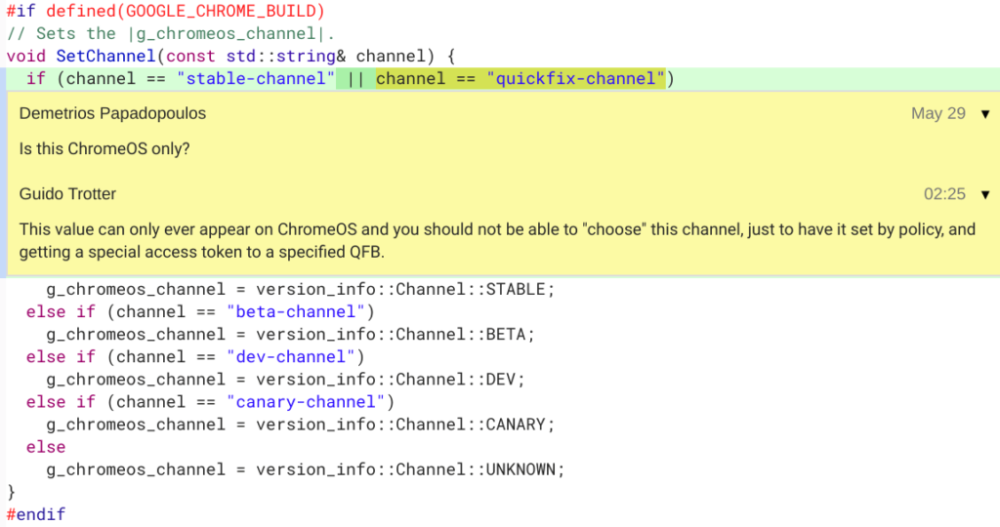

Eagle-eyed Dinsan Francis over at Chrome Story spotted an interesting upcoming change to Chrome OS that will add [another channel to the software platform called Quick Fix](https://www.chromestory.com/2019/05/chrome-os-quick-fix-channel/).

If you're not familiar with Chrome OS channels, there are currently four, so Quick Fix will up this to five. The current four listed in how often they change and/or are more stable are Canary, [Dev](https://www.aboutchromebooks.com/qa/whats-the-difference-between-developer-mode-and-the-dev-channel-on-a-chromebook/), Beta and Stable. Dinsan notes that Quick Fix will live in between the Beta and Stable Channels.

He also wonders what Quick Fix is for and after doing some of my own digging, I think I have a solid guess [based on this comment in the code](https://chromium-review.googlesource.com/c/chromium/src/+/1636189/1/chrome/common/channel_info_chromeos.cc):

The key here is accessing the Quick Fix channel by setting "policy and getting a special access token to a specified QFB." I suspect QFB stands for Quick Fix Branch.

"Policy" is the giveaway as [Chrome OS policies are only set on managed devices](https://support.google.com/chrome/a/answer/1375678?hl=en) typically used in enterprises and the education market. These are managed by a central IT group for security reasons and can limit or allow certain Chrome OS features.

Assuming I'm reading into the comment correctly, Quick Fix would then be specific branches to address an immediate issue or bug that impacts Chromebook users in a business or a school setting. I don't foresee consumer Chromebook users ever being impacted directly by the Quick Fix channel as a result.

So this is very likely great news for managed Chromebooks. Instead of waiting for a bug fix to flow through the standard channels, it could theoretically happen far faster, which is important in a business or in a school where hundreds, if not thousands of Chrome OS users in a single organization could be impacted.
