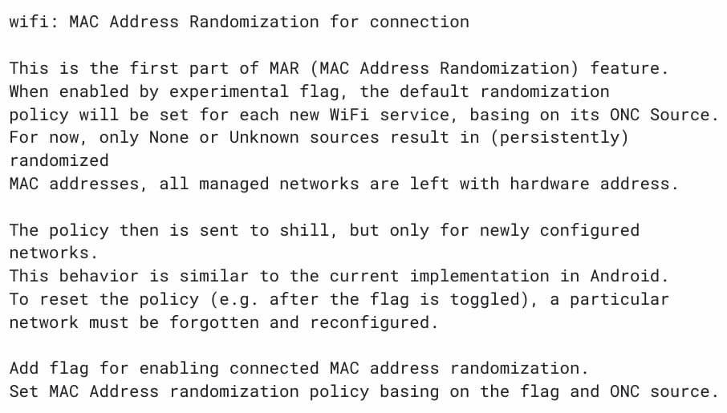

The ability to randomize a Wi-Fi radio's hardware address has been available on most computers for years. This feature increases user data privacy by changing the unique hardware identifier of your wireless radio to a random identifier. As a result, it's far more difficult for any network service to create a user profile of your surfing habits [offering some, but not all of the benefits of a VPN](https://www.aboutchromebooks.com/tag/vpn/). Unfortunately, Chrome OS _doesn't_ support this functionality. But it's being worked on: This new Chromebook privacy feature will bring Chrome OS more on par with other desktop platforms.

If none of this makes sense as to why you would want this Chromebook privacy feature, here's a great high-level explanation. It's actually from Google because it [added MAC hardware randomization](https://source.android.com/devices/tech/connect/wifi-mac-randomization-behavior) to Android a few versions ago:

> MAC addresses are used by devices when connecting to a Wi-Fi network or an access point. Because these MAC addresses are transmitted without encryption, they can be captured and used to potentially track a user's location. Historically, devices use the _factory MAC address_ to associate to a Wi-Fi network. The factory MAC address is globally unique and static, allowing the device to be tracked and individually identified. The MAC randomization feature increases user privacy by using a randomized MAC address when connecting to a Wi-Fi network.

Currently, every time you connect your Chromebook to a wireless network, your device shares the same MAC address with that network. It's basically like wearing a name tag.

So if you're using the same network often, that network can identify you and your web surfing habits. It may not recognize you by name, unless you log in to that network, of course. But it doesn't matter. It knows your Chromebook, in a sense. And it can build a user profile based on the data sent to and from your Chromebook.

The Chromium development team has been working on a [multi-part project to add MAC address randomization](https://chromium-review.googlesource.com/c/chromium/src/+/2912777) to mitigate this and boost your user privacy on a Chromebook.

There's a bunch of in-progress code that you can review but the long and short of it is: Once implemented in Chrome OS, users can enable MAC address randomization with an experimental flag.

At the moment, that flag is expected to be at `chrome://flags#mac-address-randomization`. Don't bother looking for it now in Chrome OS because I don't think it's been added yet; I don't see it in the Chrome OS 97 Dev Channel, for example.

Note that this feature won't be available on enterprise-managed networks. That's likely because enterprises like to ensure they know everything about how their network resources are being used.

And while you could use this Chromebook privacy feature on a home network, it won't gain you too much extra data privacy. Out and about on public Wi-Fi networks though? That's where you'll get the biggest bang for the buck here.
