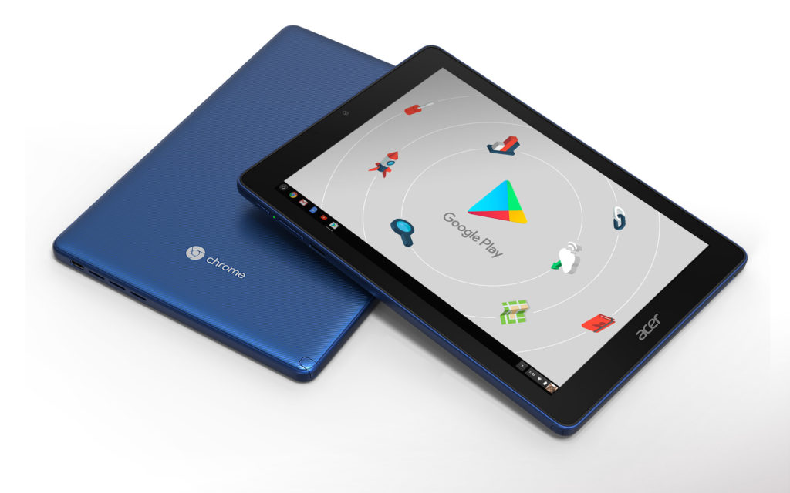
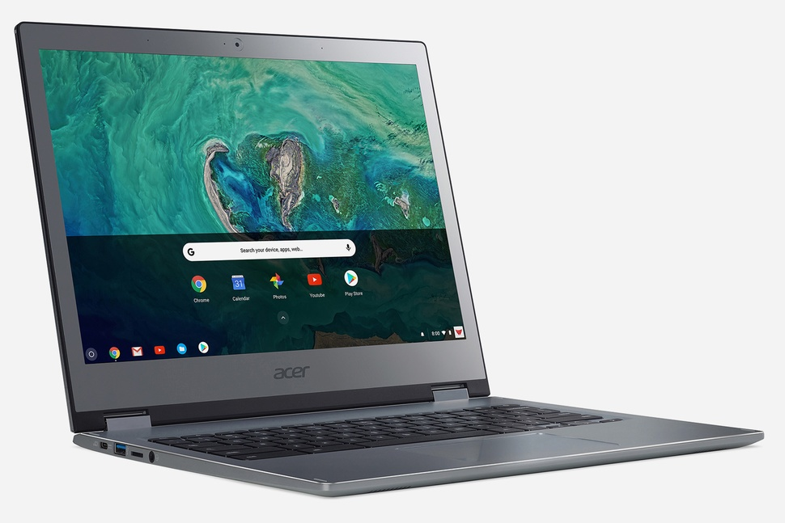
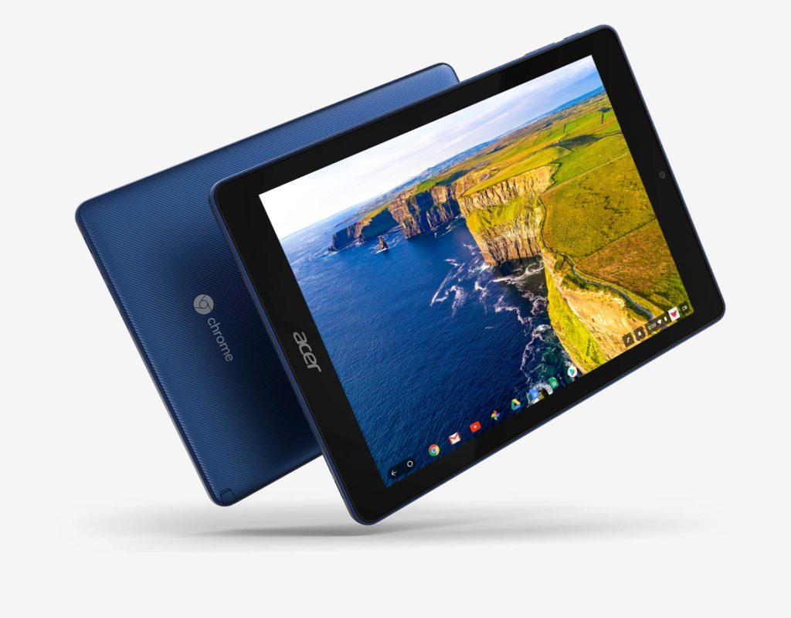

Acer is holding its 2019 Next@Acer event in New York City on April 11 and I'm hoping to use my press invite to make the trip. I have to believe that we'll see new Chrome OS devices simply because I got an invite and I don't cover anything other than Chromebooks and Chrome OS tablets.

I also have a slight inkling on what new devices we might see announced but I'm still researching and checking with some sources, so it's premature to share anything just yet. Stay tuned though.

Last year, Acer announced the first Chrome OS tablet, the Acer Chromebook 10, prior to its 2018 Next@Acer event. However, the company [did have the tablet on hand for demos. So it's possible that Acer announces something new prior to April 11.](https://www.aboutchromebooks.com/news/video-hands-on-shows-off-the-acer-chromebook-tab-10/)

Also at the 2018 event we first saw and heard about four new Chromebooks: [The Acer Chromebook 13 and Chromebook Spin 13](https://www.aboutchromebooks.com/news/new-acer-chromebook-spin-13-chromebook-13-launching-at-acer-next-event/), as well as the [Acer Chromebook 15 and Chromebook 15](https://www.aboutchromebooks.com/news/acer-introduces-chromebook-spin-15-covertible-and-chromebook-15/). Bear in mind that these four Chromebooks weren't available for months after their announcement, so anything that Acer may show off in April isn't likely to be something you can go out and purchase for some time.

<iframe style="width:120px;height:240px;" marginwidth="0" marginheight="0" scrolling="no" frameborder="0" align="right" src="//ws-na.amazon-adsystem.com/widgets/q?ServiceVersion=20070822&amp;OneJS=1&amp;Operation=GetAdHtml&amp;MarketPlace=US&amp;source=ac&amp;ref=qf_sp_asin_til&amp;ad_type=product_link&amp;tracking_id=aboutchromebo-20&amp;marketplace=amazon&amp;region=US&amp;placement=B07GD4CMDH&amp;asins=B07GD4CMDH&amp;linkId=83e7803ae78cbd356bc844d2ada416e7&amp;show_border=true&amp;link_opens_in_new_window=true&amp;price_color=333333&amp;title_color=0066c0&amp;bg_color=ffffff"></iframe>

The Chromebook Spin 13 was well worth the wait in my opinion because it offers [Pixelbook performance for a lower price](https://www.aboutchromebooks.com/reviews/acer-chromebook-spin-13-review-vs-pixelbook/); simply put, there isn't much I didn't like about the device when I reviewed it.

I can't speak to the larger 15-inch models since I haven't used them, but they're even more affordable due to the less-powerful processors inside compared to the 13 and Spin 13.

What are you hoping to see out of Acer come April?

I think the company is in a pretty good place now when it comes to Chromebooks with a range of options for every segment of the market. The only thing I'd really like to see is a refresh of the Acer Chromebook Tab 10 with an updated processor: The OP1 powering the current Chrome OS tablet is old and a bit anemic compared to more current CPU options.

