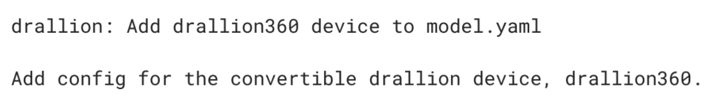
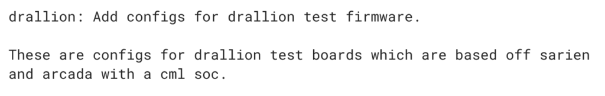

Normally, I don't immediately write up a new Chrome OS system boards until I have a decent amount of information on what to expect. I'm making an exception this time because of what appears to be a reference to Intel Comet Lake processors. I'll explain why that seems odd to me, but first, let's get the basic news out of the way.

[Drallion is a new Chrome OS board added to the Chromium repository about three weeks ago](https://chromium-review.googlesource.com/c/chromiumos/overlays/chromiumos-overlay/+/1688158). I don't yet know what the supported screen resolution or internals will be, other than an Intel Harrison Peak wireless chipset that [is pre-certified for Wi-Fi 6](https://ark.intel.com/content/www/us/en/ark/products/codename/86266/harrison-peak.html) and supports Bluetooth 5.0.

The Wi-Fi 6 capabilities are 160 MHz channels with a theoretical speed of 2.4 Gbps; real-world Wi-Fi speeds will surely be less; still fast, but not that fast. And you'll need a Wi-Fi 6 router for the maximum benefit.

I also noticed two form-factors referenced in the Chromium code: [Drallion will have a standard clamshell option as well as a convertible 2-in-1](https://chromium-review.googlesource.com/c/chromiumos/overlays/board-overlays/+/1726259).

That's all I could glean so far since work for this board is really just getting started; in fact, many code bits are currently referencing [Sarian and Arcada, either as placeholders or as a riff off these two expected Dell Chromebooks](https://www.aboutchromebooks.com/news/dell-sarien-chromebook-lte-support-arcada-whiskey-lake/).

Now back to the odd part: I see a few references to an "Intel cml soc", which I take to be shorthand for an Intel Comet Lake processor.

Here's one example:

**_Officially_**, there is no Comet Lake processor family. Yes, there have been [leaks and rumors just last month of Comet Lake](https://www.extremetech.com/computing/294794-new-leak-intel-10-core-comet-lake-cpus-will-counterattack-ryzen-3000-family) that [appear suspect to some](https://www.pcworld.com/article/3407849/take-that-intel-10th-gen-comet-lake-cpu-leak-with-a-massive-grain-of-salt.html). And [Intel announced its 10th-generation Ice Lake processor family yesterday](https://newsroom.intel.com/news/intel-launches-first-10th-gen-intel-core-processors-redefining-next-era-laptop-experiences/). Here are the first chipsets, in case you missed them:

According to [Wired](https://www.wired.com/story/intel-ice-lake-10-nanometer-processor/), however, there _may_ be Comet Lake information - or clarification - soon:

> There’s been some confusion and a fair number of leaks around another 10th-generation Intel chip, codenamed Comet Lake, but all Intel has shared so far is that it will provide more details on that “later in August.”
> 
> Wired

It could be that I'm reading too much into the "cml" references. But usually, the processor family names are spelled out in code commits. And since Comet Lake processors haven't officially debuted, the devs may be using "cml" until that happens.

Hopefully, we'll hear more from Intel later this month about Comet Lake, which could tip us off more on the potential processors that will power the Drallion Chromebooks. I wouldn't expect them to come to market for at least a year given how early in the process they seem to be at this point.
