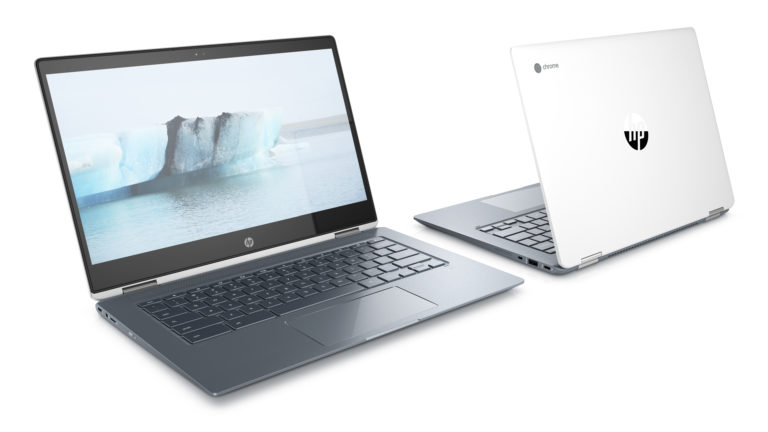

While there are numerous HP Chromebook X360 models across a $1,000 price range, consumers and students are probably most familiar with the [$299 HP Chromebook X360 11](https://store.hp.com/us/en/pdp/hp-chromebook-x360-11-ae010nr). That entry-level device uses an 11.6-inch display with rather large bezels. And it appears to be getting an upgrade, losing some bezel size and gaining a barely larger 12-inch display in the new HP Chromebook X360 12.

This model hasn't been officially announced yet, but it does currently appear on Amazon's site, complete with all of the specifications. [Roland Quandt spied both the product listing](https://twitter.com/rquandt/status/1171742145478352896?s=20) and shared it on Twitter (via [Brandon Lall](https://twitter.com/brandonlall36/status/1171752487772196864?s=20)), as well as [a bevy of official HP Support videos for the HP Chromebook X360 12](https://supportvideos.ext.hp.com/detail/video/6084438034001/how-to-replace-the-system-board-for-hp-chromebook-x360-12-h0000?q=X360%2012-H0000#search/X360%2012-H0000/0).

Here's a full view look at the newly designed HP Chromebook X360 12 with the older model underneath it. The look is far more up to date and you can easily see the diminished bezel size:

HP Chromebook X360 12

HP Chromebook X360 11

The 12-inch model appears sleeker, has a new hinge mechanism for what looks to be a 3:2 display and the B&O logo, indicating tuned speakers if you're into that sort of thing. I'd say that the older Chromebook might be better suited for students as it appears more ruggedized to me. It's possible that HP will sell both models instead of replacing the 11.6-inch Chromebook with one that has a barely bigger display.

The internal specifications that Amazon provides for the HP Chromebook X360 12 don't quite make sense to me. Here's the listing, which I'll follow up with my reasoning for that statement:

- CPU: Dual-Core Intel Celeron N with 2.6 GHz clock speed
- GPU: Intel UHD Graphics 620
- Memory: 4 GB LPDDR4 RAM
- Storage: 32 GB eMMC
- Screen: 12-inches with HD+ resolution and touch support

The processor and GPU combination is what stands out to me as being odd: According to Intel, [the Celeron N4000 would be the dual-core CPU](https://ark.intel.com/content/www/us/en/ark/products/128988/intel-celeron-n4000-processor-4m-cache-up-to-2-60-ghz.html) with that maximum clock speed. But the N4000 uses the Intel UHD Graphics 600 GPU, so that's not lining up. I'm guessing the display is actually 12.3- or 12.5-inches as well.

And frankly, if the display is HD+ as Amazon says, it really doesn't make sense to have a dual-core Celeron from 2017 powering a Chromebook with a higher-end design like this.

My gut says while there may be a low-end configuration with Celeron or Pentium options, as well as HD or FHD display, we'll see models with Intel Core chips, more storage, and RAM as well.

Note that HP does sell a similar looking [HP Chromebook X360 14 model (shown above) with an MSRP of $599](https://store.hp.com/us/en/pdp/hp-chromebook-x360-14-da0021nr). That device is powered by an Intel Core i3-8130U and the previously mentioned Intel UHD Graphics 620, paired with 8 GB of RAM and 64 GB of eMMC storage as well as the B&O tuned speakers.

If the HP Chromebook X360 12 is offered with similar internals, I'd guess an MSRP between $400 and $450 in such a configuration for those that want a nice-looking, solid-performing but more portable 2-in-1 Chromebook.
